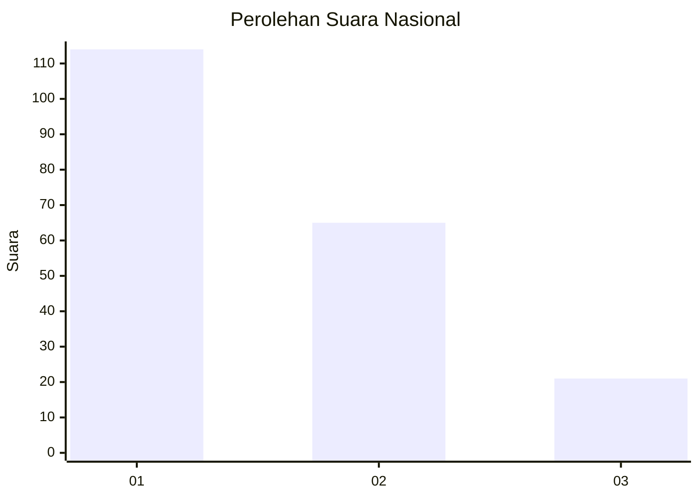
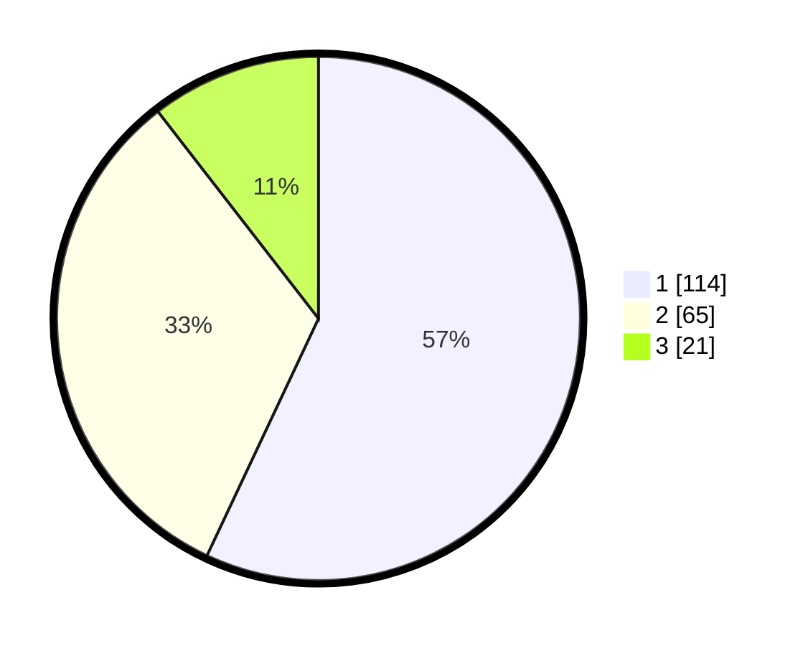

# Hasil

## Grafik

## Tabel

| No.    | Nama Paslon    | Suara | Suara (raw) | Persentase |
|:------ |:-------------- | -----:| -----------:| ----------:|
| 100025 | ANIES MUHAIMIN | 114   | [114][p-1]  | 57,00      |
| 100026 | PRABOWO GIBRAN | 65    | [65][p-2]   | 32,50      |
| 100027 | GANJAR MAHFUD  | 21    | [21][p-3]   | 10,50      |

[p-1]: https://github.com/gigit-pemilu/pemilu-2024/blob/main/pilpres/hitung-suara/sub/31-dki-jakarta/sub/74-jakarta-selatan/sub/04-pasar-minggu/sub/1003-cilandak-timur/sub/048-tps/sub/paslon-1.txt
[p-2]: https://github.com/gigit-pemilu/pemilu-2024/blob/main/pilpres/hitung-suara/sub/31-dki-jakarta/sub/74-jakarta-selatan/sub/04-pasar-minggu/sub/1003-cilandak-timur/sub/048-tps/sub/paslon-2.txt
[p-3]: https://github.com/gigit-pemilu/pemilu-2024/blob/main/pilpres/hitung-suara/sub/31-dki-jakarta/sub/74-jakarta-selatan/sub/04-pasar-minggu/sub/1003-cilandak-timur/sub/048-tps/sub/paslon-3.txt

## Foto C Plano

https://sirekap-obj-formc.kpu.go.id/ed7b/pemilu/ppwp/31/74/04/10/03/3174041003048-20240214-215222--5cf9e43a-e058-49e7-bb4e-30ed00be4afa.jpg

https://sirekap-obj-formc.kpu.go.id/ed7b/pemilu/ppwp/31/74/04/10/03/3174041003048-20240214-202321--25d2a1df-4545-4d65-9aa2-8807693128d1.jpg

https://sirekap-obj-formc.kpu.go.id/ed7b/pemilu/ppwp/31/74/04/10/03/3174041003048-20240214-202434--024cf6d7-bd1c-4ac4-8a68-3753be13546f.jpg

## Metadata

| Key        | Value               |
| ---------- | ------------------- |
| Time Stamp | 2024-02-24 22:31:28 |

