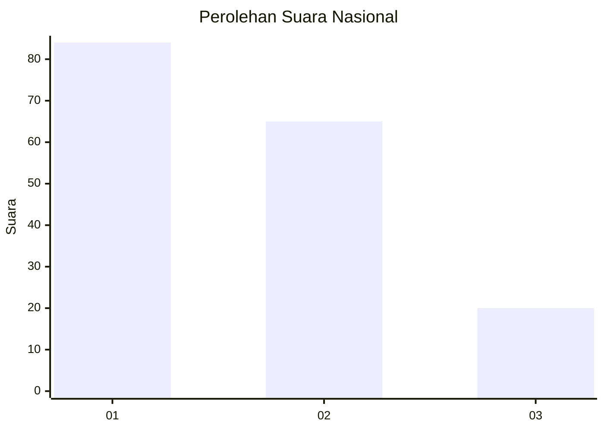
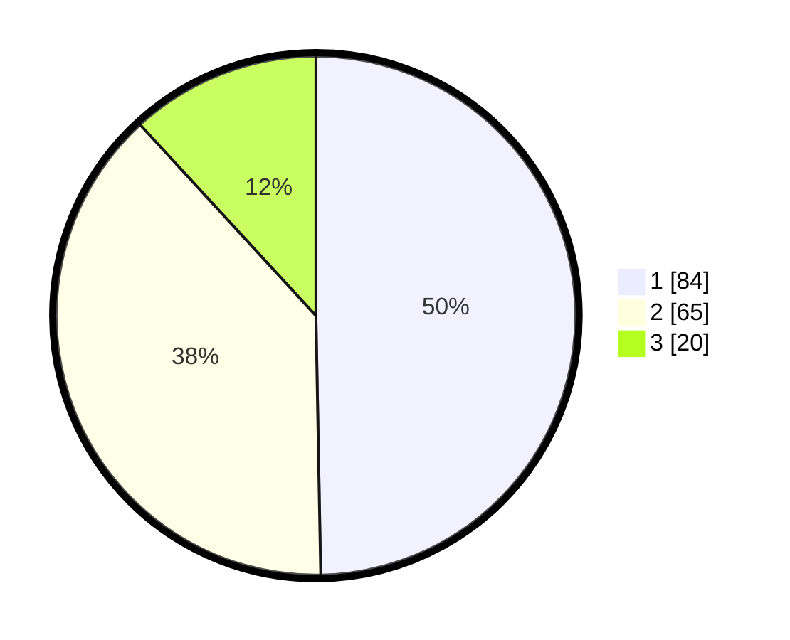

# Hasil

## Grafik

## Tabel

| No.    | Nama Paslon    | Suara | Suara (raw) | Persentase |
|:------ |:-------------- | -----:| -----------:| ----------:|
| 100025 | ANIES MUHAIMIN | 84    | [84][p-1]   | 49,70      |
| 100026 | PRABOWO GIBRAN | 65    | [65][p-2]   | 38,46      |
| 100027 | GANJAR MAHFUD  | 20    | [20][p-3]   | 11,83      |

[p-1]: https://github.com/gigit-pemilu/pemilu-2024/blob/main/pilpres/hitung-suara/sub/31-dki-jakarta/sub/74-jakarta-selatan/sub/04-pasar-minggu/sub/1003-cilandak-timur/sub/055-tps/sub/paslon-1.txt
[p-2]: https://github.com/gigit-pemilu/pemilu-2024/blob/main/pilpres/hitung-suara/sub/31-dki-jakarta/sub/74-jakarta-selatan/sub/04-pasar-minggu/sub/1003-cilandak-timur/sub/055-tps/sub/paslon-2.txt
[p-3]: https://github.com/gigit-pemilu/pemilu-2024/blob/main/pilpres/hitung-suara/sub/31-dki-jakarta/sub/74-jakarta-selatan/sub/04-pasar-minggu/sub/1003-cilandak-timur/sub/055-tps/sub/paslon-3.txt

## Foto C Plano

https://sirekap-obj-formc.kpu.go.id/e49f/pemilu/ppwp/31/74/04/10/03/3174041003055-20240214-195839--6d2d490b-0ccd-4551-a24b-cf3e5aea534c.jpg

https://sirekap-obj-formc.kpu.go.id/e49f/pemilu/ppwp/31/74/04/10/03/3174041003055-20240214-195930--d67b6cf4-ac74-4bed-a23b-2c5ed9bd2e6d.jpg

https://sirekap-obj-formc.kpu.go.id/e49f/pemilu/ppwp/31/74/04/10/03/3174041003055-20240214-200306--9f2f2176-2774-45fe-a39f-652bf1dcae9a.jpg

## Metadata

| Key        | Value               |
| ---------- | ------------------- |
| Time Stamp | 2024-02-24 22:31:28 |

