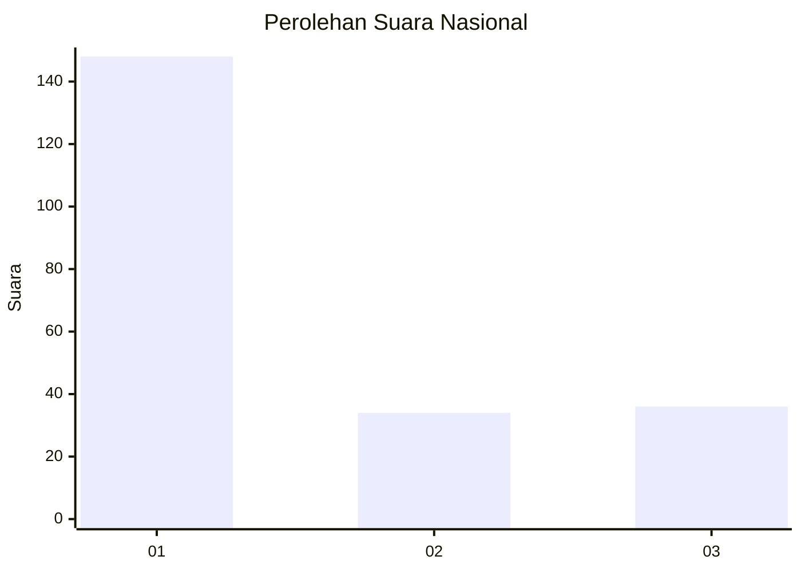
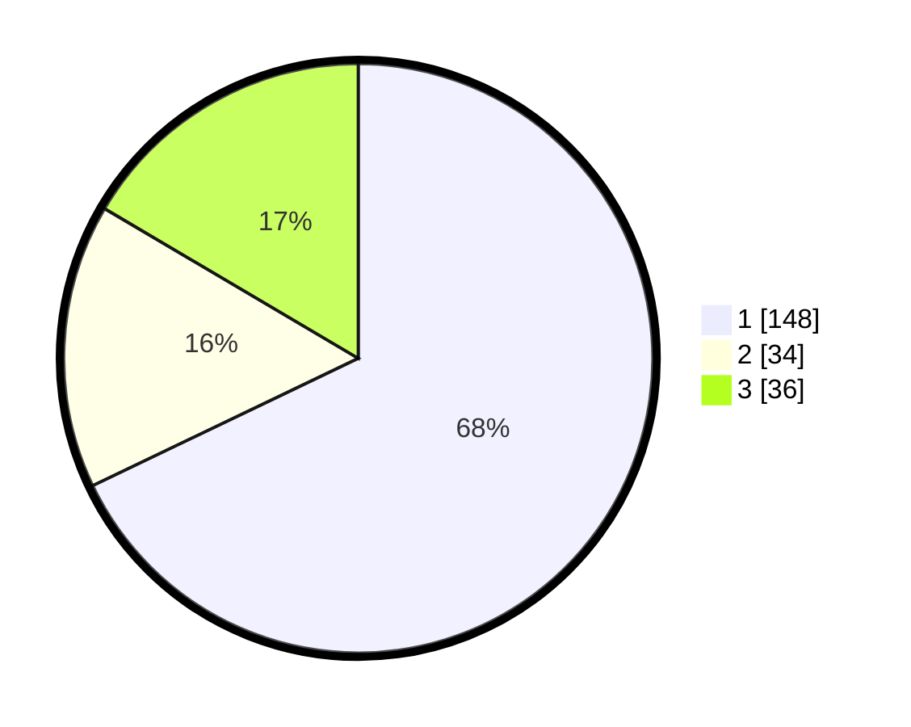

# Hasil

## Grafik

## Tabel

| No. | Nama Paslon    | Suara | Suara (raw) | Persentase |
|:--- |:-------------- | -----:| -----------:| ----------:|
| 1   | ANIES MUHAIMIN | 148   | [148][p-1]  | 67,89      |
| 2   | PRABOWO GIBRAN | 34    | [34][p-2]   | 15,60      |
| 3   | GANJAR MAHFUD  | 36    | [36][p-3]   | 16,51      |

[p-1]: https://github.com/gigit-pemilu/pemilu-2024/blob/main/pilpres/hitung-suara/sub/31-dki-jakarta/sub/74-jakarta-selatan/sub/04-pasar-minggu/sub/1003-cilandak-timur/sub/062-tps/sub/paslon-1.txt
[p-2]: https://github.com/gigit-pemilu/pemilu-2024/blob/main/pilpres/hitung-suara/sub/31-dki-jakarta/sub/74-jakarta-selatan/sub/04-pasar-minggu/sub/1003-cilandak-timur/sub/062-tps/sub/paslon-2.txt
[p-3]: https://github.com/gigit-pemilu/pemilu-2024/blob/main/pilpres/hitung-suara/sub/31-dki-jakarta/sub/74-jakarta-selatan/sub/04-pasar-minggu/sub/1003-cilandak-timur/sub/062-tps/sub/paslon-3.txt

## Foto C Plano

https://sirekap-obj-formc.kpu.go.id/f03f/pemilu/ppwp/31/74/04/10/03/3174041003062-20240214-231511--2d9dccc5-412e-4cfa-ab4b-44f3c8355499.jpg

https://sirekap-obj-formc.kpu.go.id/f03f/pemilu/ppwp/31/74/04/10/03/3174041003062-20240214-231603--4868fe2b-3e93-46e8-8c59-7b2b72e1c7b6.jpg

https://sirekap-obj-formc.kpu.go.id/f03f/pemilu/ppwp/31/74/04/10/03/3174041003062-20240214-232133--a5f3a45d-7a8e-4997-a3a0-86ad9c7cc798.jpg

## Metadata

| Key        | Value               |
| ---------- | ------------------- |
| Time Stamp | 2024-02-24 22:31:28 |

