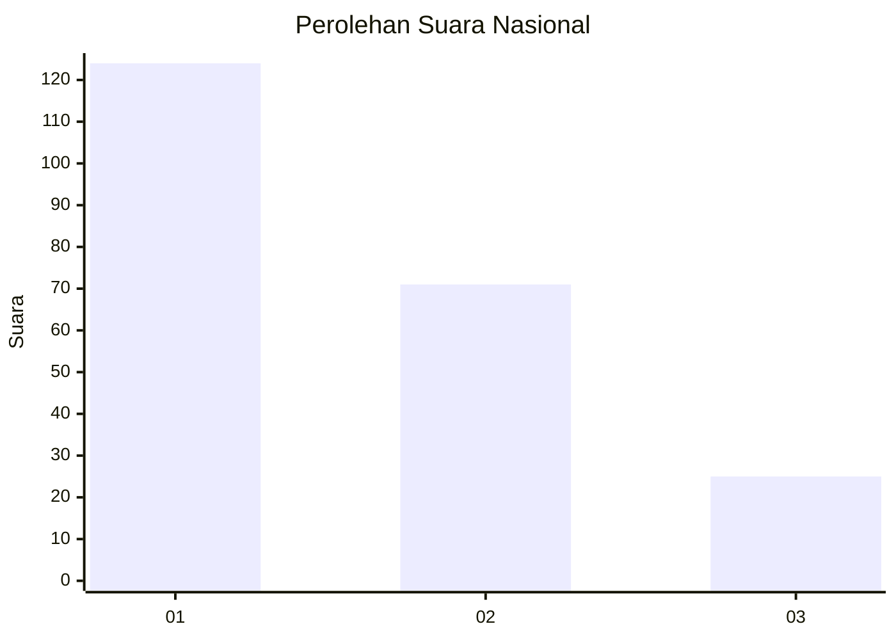
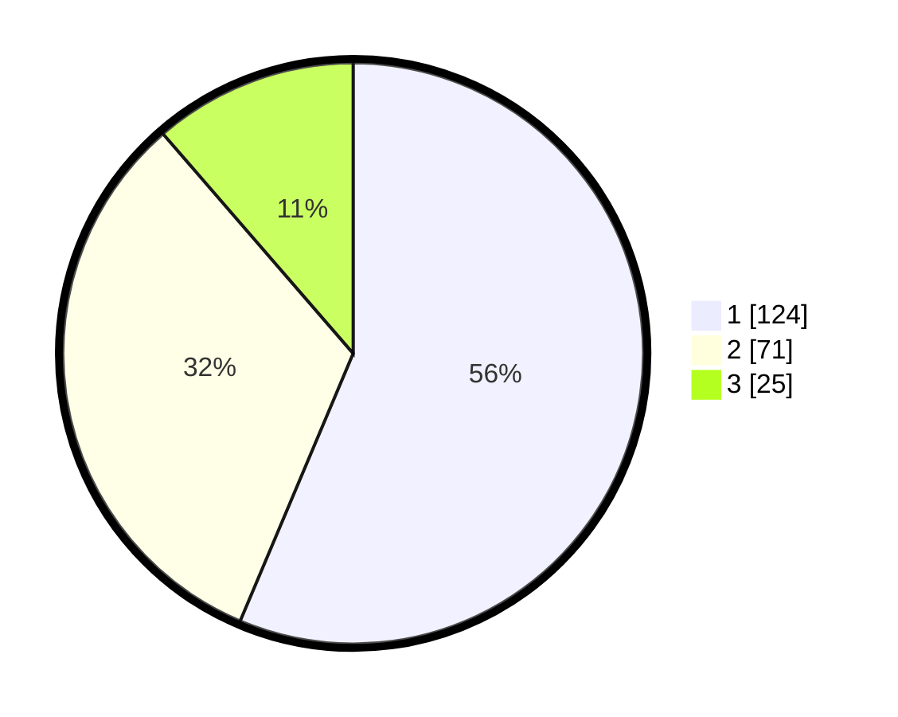

# Hasil

## Grafik

## Tabel

| No.    | Nama Paslon    | Suara | Suara (raw) | Persentase |
|:------ |:-------------- | -----:| -----------:| ----------:|
| 100025 | ANIES MUHAIMIN | 124   | [124][p-1]  | 56,36      |
| 100026 | PRABOWO GIBRAN | 71    | [71][p-2]   | 32,27      |
| 100027 | GANJAR MAHFUD  | 25    | [25][p-3]   | 11,36      |

[p-1]: https://github.com/gigit-pemilu/pemilu-2024/blob/main/pilpres/hitung-suara/sub/31-dki-jakarta/sub/74-jakarta-selatan/sub/04-pasar-minggu/sub/1003-cilandak-timur/sub/064-tps/sub/paslon-1.txt
[p-2]: https://github.com/gigit-pemilu/pemilu-2024/blob/main/pilpres/hitung-suara/sub/31-dki-jakarta/sub/74-jakarta-selatan/sub/04-pasar-minggu/sub/1003-cilandak-timur/sub/064-tps/sub/paslon-2.txt
[p-3]: https://github.com/gigit-pemilu/pemilu-2024/blob/main/pilpres/hitung-suara/sub/31-dki-jakarta/sub/74-jakarta-selatan/sub/04-pasar-minggu/sub/1003-cilandak-timur/sub/064-tps/sub/paslon-3.txt

## Foto C Plano

https://sirekap-obj-formc.kpu.go.id/d831/pemilu/ppwp/31/74/04/10/03/3174041003064-20240214-214218--56d16122-43b0-4e37-9717-9af2db0f8594.jpg

https://sirekap-obj-formc.kpu.go.id/d831/pemilu/ppwp/31/74/04/10/03/3174041003064-20240214-214423--81be2625-b6e6-4737-b20c-c103f4598ef5.jpg

https://sirekap-obj-formc.kpu.go.id/d831/pemilu/ppwp/31/74/04/10/03/3174041003064-20240214-214541--1dd920fd-1fea-4ed3-ba44-d4bcc7416c99.jpg

## Metadata

| Key        | Value               |
| ---------- | ------------------- |
| Time Stamp | 2024-02-24 22:31:28 |

