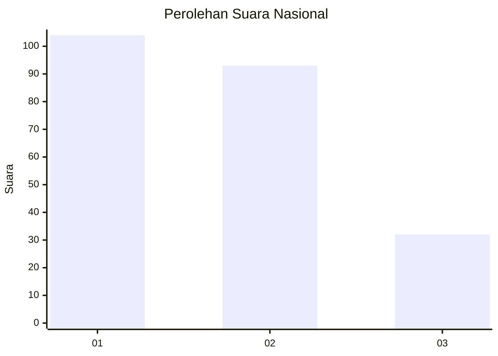
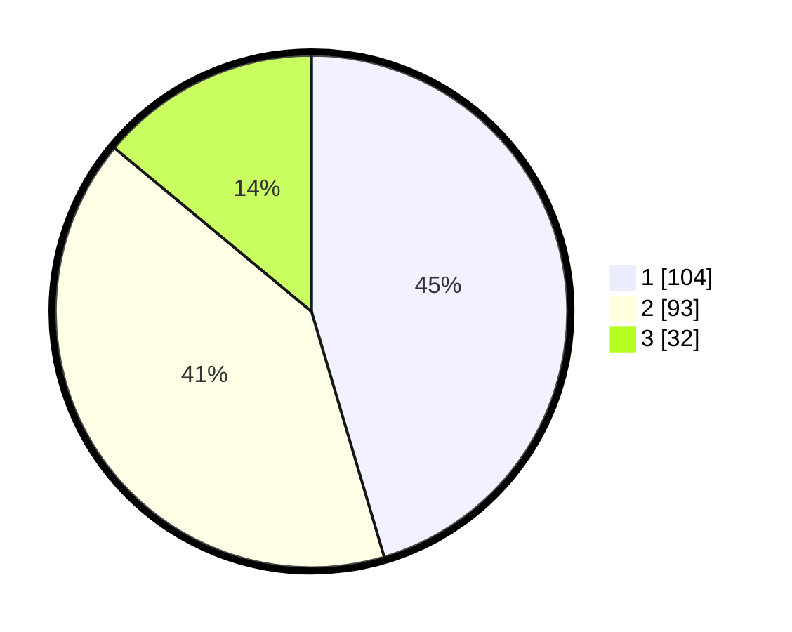

# Hasil

## Grafik

## Tabel

| No.    | Nama Paslon    | Suara | Suara (raw) | Persentase |
|:------ |:-------------- | -----:| -----------:| ----------:|
| 100025 | ANIES MUHAIMIN | 104   | [104][p-1]  | 45,41      |
| 100026 | PRABOWO GIBRAN | 93    | [93][p-2]   | 40,61      |
| 100027 | GANJAR MAHFUD  | 32    | [32][p-3]   | 13,97      |

[p-1]: https://github.com/gigit-pemilu/pemilu-2024/blob/main/pilpres/hitung-suara/sub/31-dki-jakarta/sub/74-jakarta-selatan/sub/04-pasar-minggu/sub/1004-ragunan/sub/002-tps/sub/paslon-1.txt
[p-2]: https://github.com/gigit-pemilu/pemilu-2024/blob/main/pilpres/hitung-suara/sub/31-dki-jakarta/sub/74-jakarta-selatan/sub/04-pasar-minggu/sub/1004-ragunan/sub/002-tps/sub/paslon-2.txt
[p-3]: https://github.com/gigit-pemilu/pemilu-2024/blob/main/pilpres/hitung-suara/sub/31-dki-jakarta/sub/74-jakarta-selatan/sub/04-pasar-minggu/sub/1004-ragunan/sub/002-tps/sub/paslon-3.txt

## Foto C Plano

https://sirekap-obj-formc.kpu.go.id/16b2/pemilu/ppwp/31/74/04/10/04/3174041004002-20240217-123930--781eaa18-6ffb-4c64-8f74-75aa2c1a9bef.jpg

https://sirekap-obj-formc.kpu.go.id/16b2/pemilu/ppwp/31/74/04/10/04/3174041004002-20240217-123228--2741f553-3aea-4839-917f-b94c48fe0167.jpg

https://sirekap-obj-formc.kpu.go.id/16b2/pemilu/ppwp/31/74/04/10/04/3174041004002-20240217-122707--b7a4741a-bc3e-42a0-be8a-2ba8e6cc2457.jpg

## Metadata

| Key        | Value               |
| ---------- | ------------------- |
| Time Stamp | 2024-02-24 22:31:28 |

