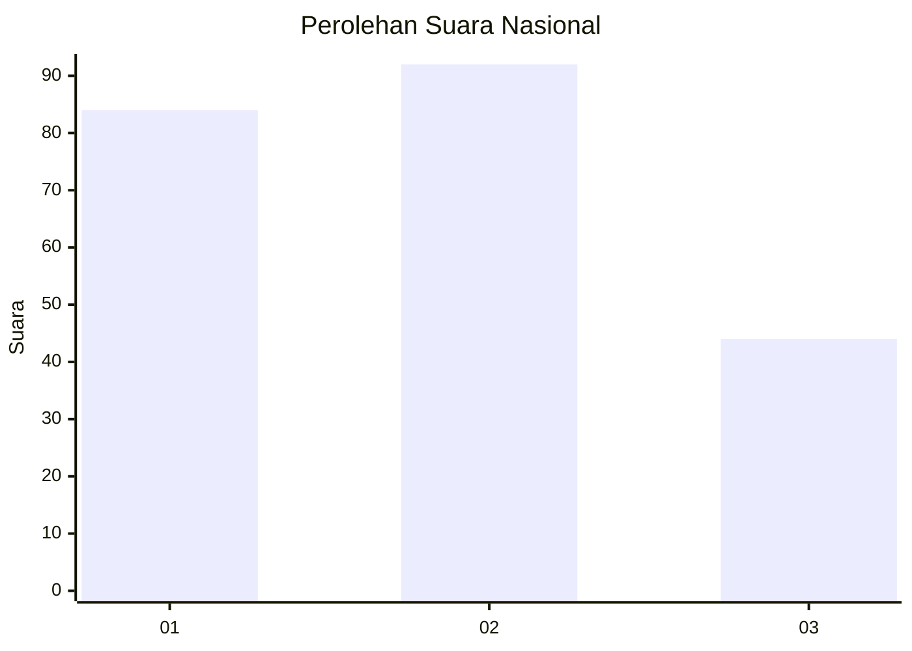
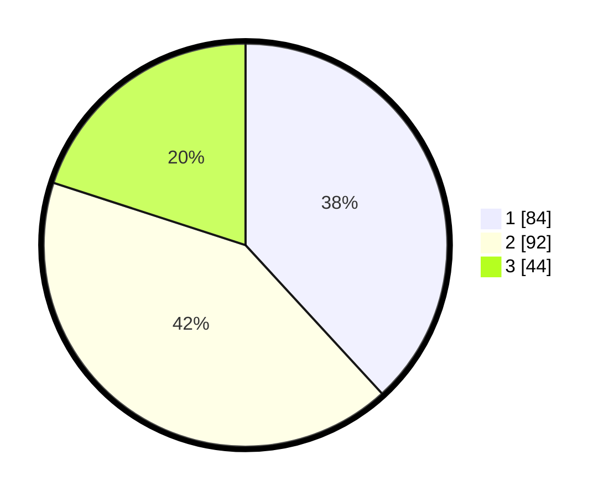

# Hasil

## Grafik

## Tabel

| No.    | Nama Paslon    | Suara | Suara (raw) | Persentase |
|:------ |:-------------- | -----:| -----------:| ----------:|
| 100025 | ANIES MUHAIMIN | 84    | [84][p-1]   | 38,18      |
| 100026 | PRABOWO GIBRAN | 92    | [92][p-2]   | 41,82      |
| 100027 | GANJAR MAHFUD  | 44    | [44][p-3]   | 20,00      |

[p-1]: https://github.com/gigit-pemilu/pemilu-2024/blob/main/pilpres/hitung-suara/sub/31-dki-jakarta/sub/74-jakarta-selatan/sub/04-pasar-minggu/sub/1004-ragunan/sub/011-tps/sub/paslon-1.txt
[p-2]: https://github.com/gigit-pemilu/pemilu-2024/blob/main/pilpres/hitung-suara/sub/31-dki-jakarta/sub/74-jakarta-selatan/sub/04-pasar-minggu/sub/1004-ragunan/sub/011-tps/sub/paslon-2.txt
[p-3]: https://github.com/gigit-pemilu/pemilu-2024/blob/main/pilpres/hitung-suara/sub/31-dki-jakarta/sub/74-jakarta-selatan/sub/04-pasar-minggu/sub/1004-ragunan/sub/011-tps/sub/paslon-3.txt

## Foto C Plano

https://sirekap-obj-formc.kpu.go.id/2857/pemilu/ppwp/31/74/04/10/04/3174041004011-20240215-012803--9e809033-3797-4412-9042-d60747635d78.jpg

https://sirekap-obj-formc.kpu.go.id/2857/pemilu/ppwp/31/74/04/10/04/3174041004011-20240215-012810--92f5ec45-03d6-4d6d-8b97-59669e498f15.jpg

https://sirekap-obj-formc.kpu.go.id/2857/pemilu/ppwp/31/74/04/10/04/3174041004011-20240215-012819--0395b184-4df8-4a0a-a508-f65c7748a13b.jpg

## Metadata

| Key        | Value               |
| ---------- | ------------------- |
| Time Stamp | 2024-02-24 22:31:28 |

