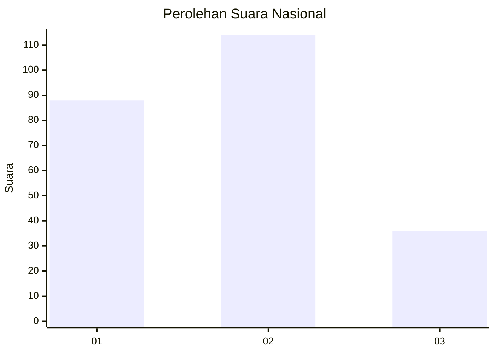
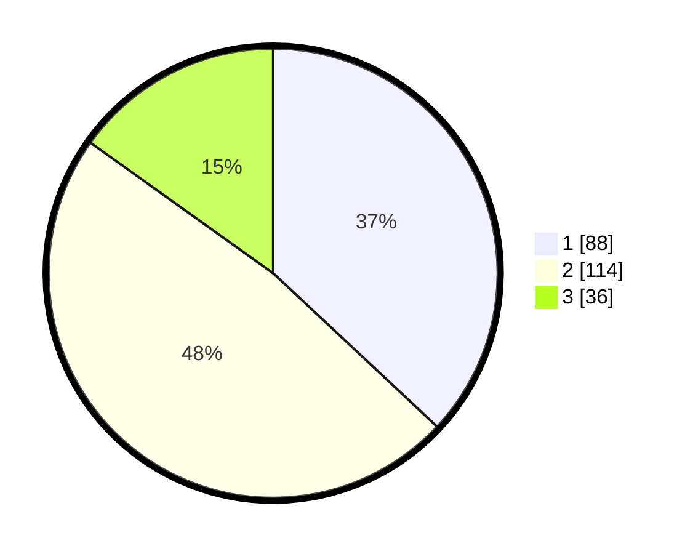

# Hasil

## Grafik

## Tabel

| No.    | Nama Paslon    | Suara | Suara (raw) | Persentase |
|:------ |:-------------- | -----:| -----------:| ----------:|
| 100025 | ANIES MUHAIMIN | 88    | [88][p-1]   | 36,97      |
| 100026 | PRABOWO GIBRAN | 114   | [114][p-2]  | 47,90      |
| 100027 | GANJAR MAHFUD  | 36    | [36][p-3]   | 15,13      |

[p-1]: https://github.com/gigit-pemilu/pemilu-2024/blob/main/pilpres/hitung-suara/sub/31-dki-jakarta/sub/74-jakarta-selatan/sub/04-pasar-minggu/sub/1004-ragunan/sub/012-tps/sub/paslon-1.txt
[p-2]: https://github.com/gigit-pemilu/pemilu-2024/blob/main/pilpres/hitung-suara/sub/31-dki-jakarta/sub/74-jakarta-selatan/sub/04-pasar-minggu/sub/1004-ragunan/sub/012-tps/sub/paslon-2.txt
[p-3]: https://github.com/gigit-pemilu/pemilu-2024/blob/main/pilpres/hitung-suara/sub/31-dki-jakarta/sub/74-jakarta-selatan/sub/04-pasar-minggu/sub/1004-ragunan/sub/012-tps/sub/paslon-3.txt

## Foto C Plano

https://sirekap-obj-formc.kpu.go.id/ebee/pemilu/ppwp/31/74/04/10/04/3174041004012-20240214-223535--c1290ab5-a862-41cc-858e-df78df81a433.jpg

https://sirekap-obj-formc.kpu.go.id/ebee/pemilu/ppwp/31/74/04/10/04/3174041004012-20240214-223639--d2c2a3bd-a5f8-414b-bff3-93781a264ab3.jpg

https://sirekap-obj-formc.kpu.go.id/ebee/pemilu/ppwp/31/74/04/10/04/3174041004012-20240214-223737--69527d86-7f5c-4d45-af52-4ddc8fe1f8ed.jpg

## Metadata

| Key        | Value               |
| ---------- | ------------------- |
| Time Stamp | 2024-02-24 22:31:28 |

