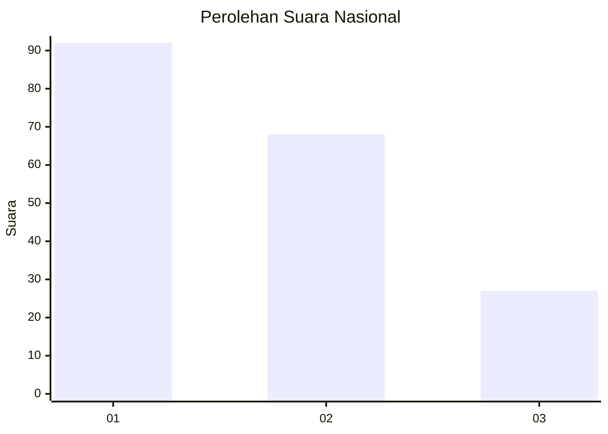
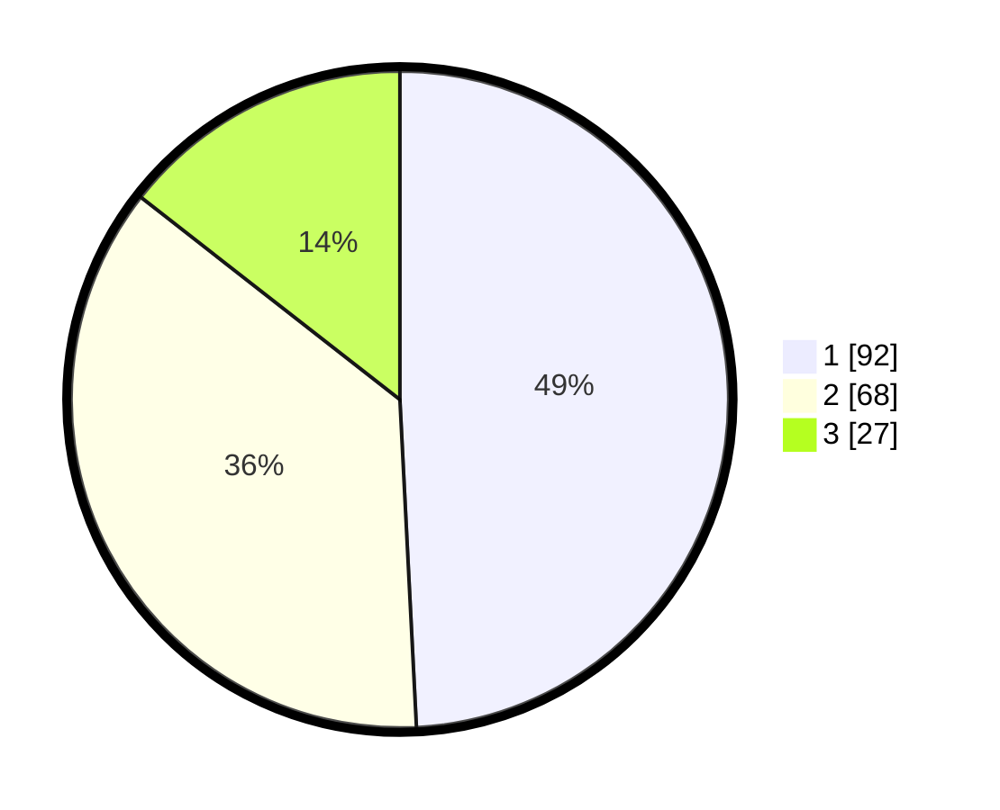

# Hasil

## Grafik

## Tabel

| No.    | Nama Paslon    | Suara | Suara (raw) | Persentase |
|:------ |:-------------- | -----:| -----------:| ----------:|
| 100025 | ANIES MUHAIMIN | 92    | [92][p-1]   | 49,20      |
| 100026 | PRABOWO GIBRAN | 68    | [68][p-2]   | 36,36      |
| 100027 | GANJAR MAHFUD  | 27    | [27][p-3]   | 14,44      |

[p-1]: https://github.com/gigit-pemilu/pemilu-2024/blob/main/pilpres/hitung-suara/sub/31-dki-jakarta/sub/74-jakarta-selatan/sub/04-pasar-minggu/sub/1004-ragunan/sub/032-tps/sub/paslon-1.txt
[p-2]: https://github.com/gigit-pemilu/pemilu-2024/blob/main/pilpres/hitung-suara/sub/31-dki-jakarta/sub/74-jakarta-selatan/sub/04-pasar-minggu/sub/1004-ragunan/sub/032-tps/sub/paslon-2.txt
[p-3]: https://github.com/gigit-pemilu/pemilu-2024/blob/main/pilpres/hitung-suara/sub/31-dki-jakarta/sub/74-jakarta-selatan/sub/04-pasar-minggu/sub/1004-ragunan/sub/032-tps/sub/paslon-3.txt

## Foto C Plano

https://sirekap-obj-formc.kpu.go.id/a6e5/pemilu/ppwp/31/74/04/10/04/3174041004032-20240214-205411--27a4ab5f-275b-4157-a161-ca371ba5c1ca.jpg

https://sirekap-obj-formc.kpu.go.id/a6e5/pemilu/ppwp/31/74/04/10/04/3174041004032-20240214-210048--9541e8d5-111d-4598-91e6-4ce403cf98a2.jpg

https://sirekap-obj-formc.kpu.go.id/a6e5/pemilu/ppwp/31/74/04/10/04/3174041004032-20240214-210650--09053b63-e2c8-442f-8321-6a610faa7dd4.jpg

## Metadata

| Key        | Value               |
| ---------- | ------------------- |
| Time Stamp | 2024-02-25 12:00:00 |

