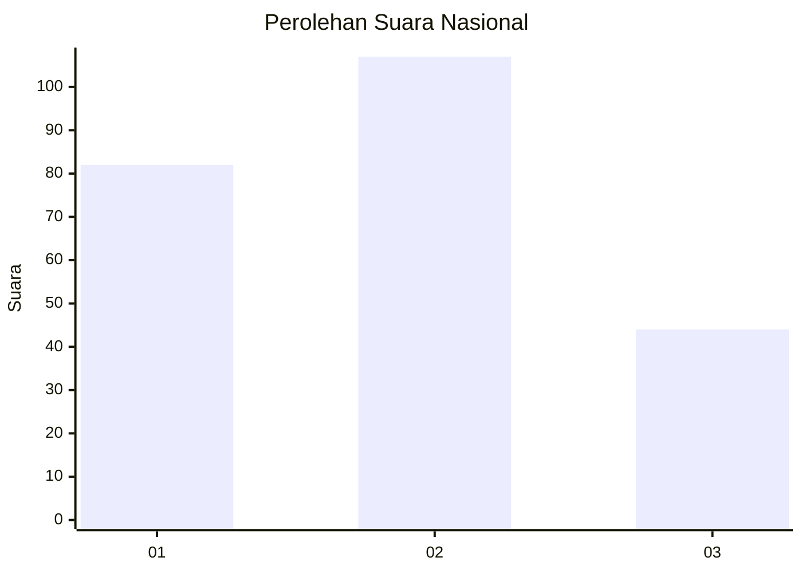
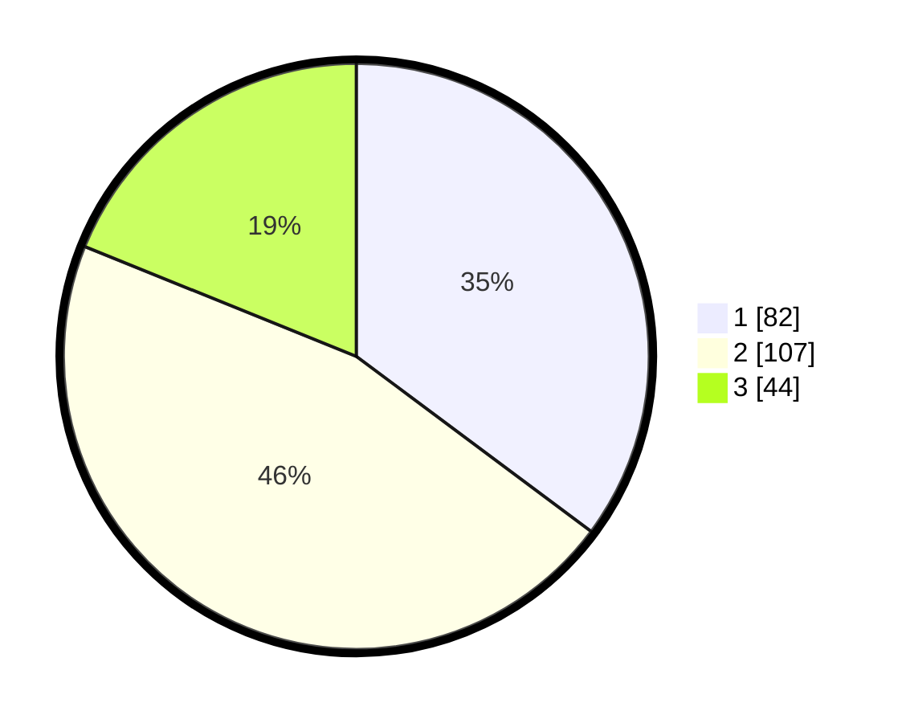

# Hasil

## Grafik

## Tabel

| No.    | Nama Paslon    | Suara | Suara (raw) | Persentase |
|:------ |:-------------- | -----:| -----------:| ----------:|
| 100025 | ANIES MUHAIMIN | 82    | [82][p-1]   | 35,19      |
| 100026 | PRABOWO GIBRAN | 107   | [107][p-2]  | 45,92      |
| 100027 | GANJAR MAHFUD  | 44    | [44][p-3]   | 18,88      |

[p-1]: https://github.com/gigit-pemilu/pemilu-2024/blob/main/pilpres/hitung-suara/sub/31-dki-jakarta/sub/74-jakarta-selatan/sub/04-pasar-minggu/sub/1004-ragunan/sub/035-tps/sub/paslon-1.txt
[p-2]: https://github.com/gigit-pemilu/pemilu-2024/blob/main/pilpres/hitung-suara/sub/31-dki-jakarta/sub/74-jakarta-selatan/sub/04-pasar-minggu/sub/1004-ragunan/sub/035-tps/sub/paslon-2.txt
[p-3]: https://github.com/gigit-pemilu/pemilu-2024/blob/main/pilpres/hitung-suara/sub/31-dki-jakarta/sub/74-jakarta-selatan/sub/04-pasar-minggu/sub/1004-ragunan/sub/035-tps/sub/paslon-3.txt

## Foto C Plano

https://sirekap-obj-formc.kpu.go.id/9679/pemilu/ppwp/31/74/04/10/04/3174041004035-20240215-023756--7f348778-7b3b-4232-923a-99c2fc33dac1.jpg

https://sirekap-obj-formc.kpu.go.id/9679/pemilu/ppwp/31/74/04/10/04/3174041004035-20240215-023844--a9261bac-2d30-405e-9b47-2191bd8c3738.jpg

https://sirekap-obj-formc.kpu.go.id/9679/pemilu/ppwp/31/74/04/10/04/3174041004035-20240215-023926--32fc0631-dab4-4ab3-84ae-8724e26e51b8.jpg

## Metadata

| Key        | Value               |
| ---------- | ------------------- |
| Time Stamp | 2024-02-24 22:31:28 |

