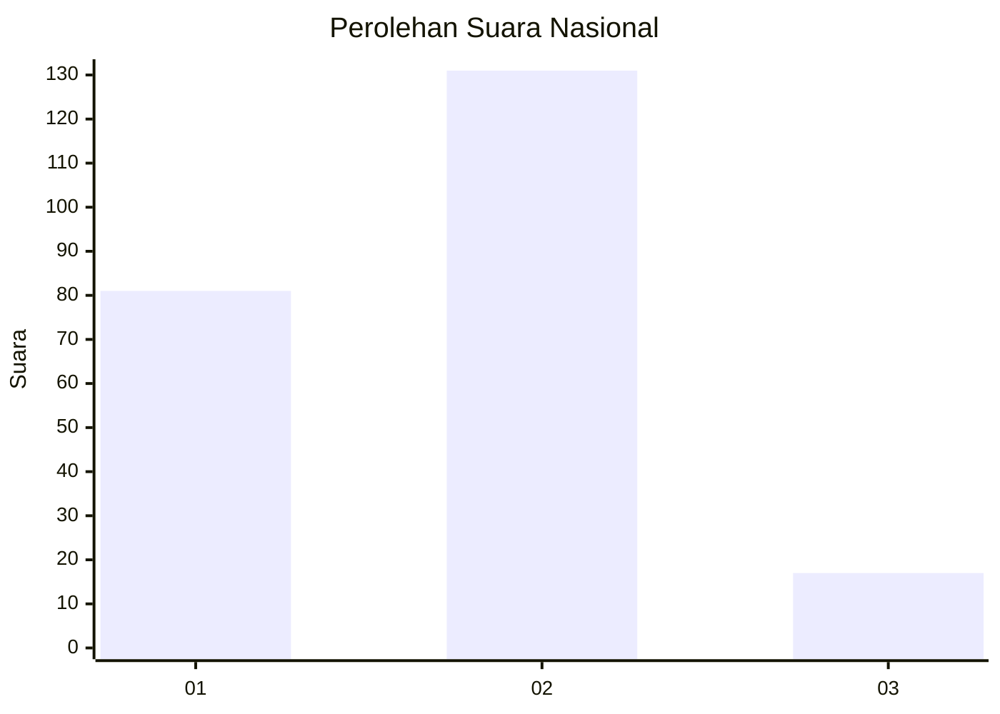
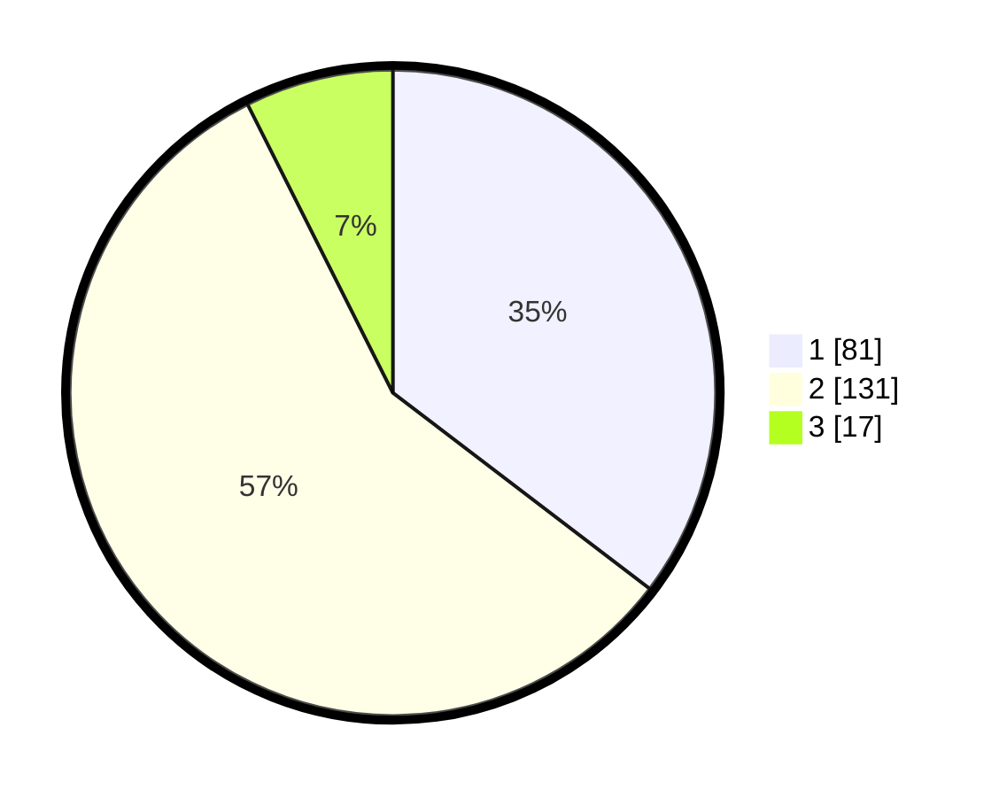

# Hasil

## Grafik

## Tabel

| No.    | Nama Paslon    | Suara | Suara (raw) | Persentase |
|:------ |:-------------- | -----:| -----------:| ----------:|
| 100025 | ANIES MUHAIMIN | 81    | [81][p-1]   | 35,37      |
| 100026 | PRABOWO GIBRAN | 131   | [131][p-2]  | 57,21      |
| 100027 | GANJAR MAHFUD  | 17    | [17][p-3]   | 7,42       |

[p-1]: https://github.com/gigit-pemilu/pemilu-2024/blob/main/pilpres/hitung-suara/sub/31-dki-jakarta/sub/74-jakarta-selatan/sub/04-pasar-minggu/sub/1004-ragunan/sub/036-tps/sub/paslon-1.txt
[p-2]: https://github.com/gigit-pemilu/pemilu-2024/blob/main/pilpres/hitung-suara/sub/31-dki-jakarta/sub/74-jakarta-selatan/sub/04-pasar-minggu/sub/1004-ragunan/sub/036-tps/sub/paslon-2.txt
[p-3]: https://github.com/gigit-pemilu/pemilu-2024/blob/main/pilpres/hitung-suara/sub/31-dki-jakarta/sub/74-jakarta-selatan/sub/04-pasar-minggu/sub/1004-ragunan/sub/036-tps/sub/paslon-3.txt

## Foto C Plano

https://sirekap-obj-formc.kpu.go.id/8050/pemilu/ppwp/31/74/04/10/04/3174041004036-20240216-144344--b6789b46-255d-4e0d-8345-1186a86efa76.jpg

https://sirekap-obj-formc.kpu.go.id/8050/pemilu/ppwp/31/74/04/10/04/3174041004036-20240214-220059--20651f91-e737-404e-beee-607eb74fbcf6.jpg

https://sirekap-obj-formc.kpu.go.id/8050/pemilu/ppwp/31/74/04/10/04/3174041004036-20240214-220259--a7b1a0f7-d178-4d01-8447-582b209a906b.jpg

## Metadata

| Key        | Value               |
| ---------- | ------------------- |
| Time Stamp | 2024-02-24 22:31:28 |

