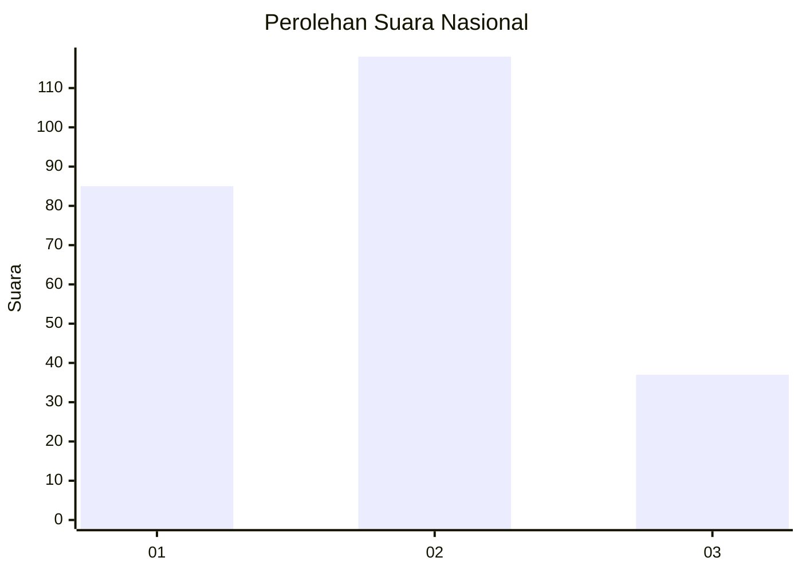
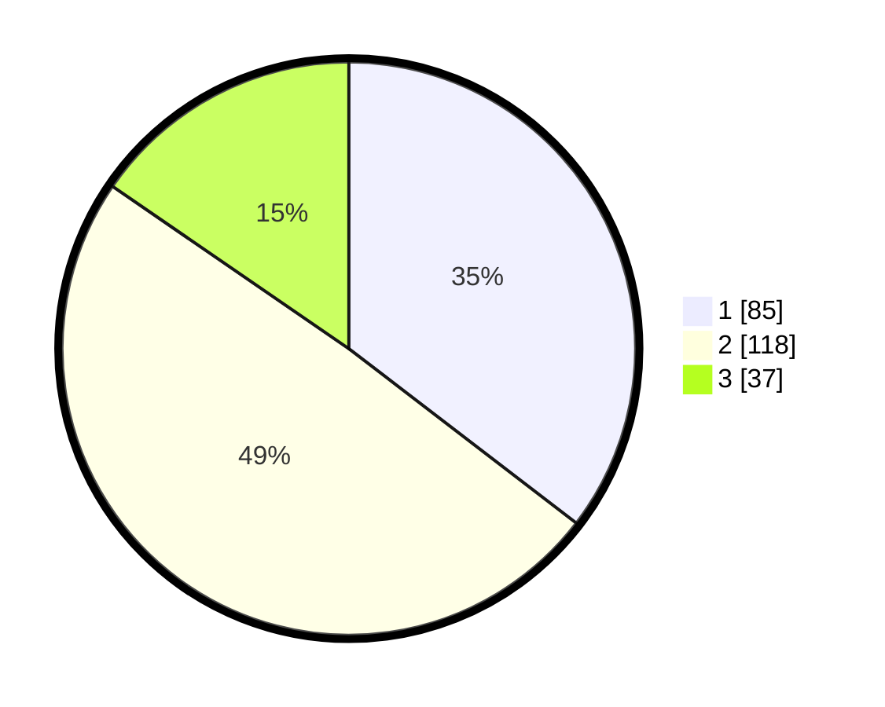

# Hasil

## Grafik

## Tabel

| No.    | Nama Paslon    | Suara | Suara (raw) | Persentase |
|:------ |:-------------- | -----:| -----------:| ----------:|
| 100025 | ANIES MUHAIMIN | 85    | [85][p-1]   | 35,42      |
| 100026 | PRABOWO GIBRAN | 118   | [118][p-2]  | 49,17      |
| 100027 | GANJAR MAHFUD  | 37    | [37][p-3]   | 15,42      |

[p-1]: https://github.com/gigit-pemilu/pemilu-2024/blob/main/pilpres/hitung-suara/sub/31-dki-jakarta/sub/74-jakarta-selatan/sub/04-pasar-minggu/sub/1004-ragunan/sub/037-tps/sub/paslon-1.txt
[p-2]: https://github.com/gigit-pemilu/pemilu-2024/blob/main/pilpres/hitung-suara/sub/31-dki-jakarta/sub/74-jakarta-selatan/sub/04-pasar-minggu/sub/1004-ragunan/sub/037-tps/sub/paslon-2.txt
[p-3]: https://github.com/gigit-pemilu/pemilu-2024/blob/main/pilpres/hitung-suara/sub/31-dki-jakarta/sub/74-jakarta-selatan/sub/04-pasar-minggu/sub/1004-ragunan/sub/037-tps/sub/paslon-3.txt

## Foto C Plano

https://sirekap-obj-formc.kpu.go.id/03f8/pemilu/ppwp/31/74/04/10/04/3174041004037-20240217-081610--1e0ae160-bac6-4813-a095-fa49349b76bc.jpg

https://sirekap-obj-formc.kpu.go.id/03f8/pemilu/ppwp/31/74/04/10/04/3174041004037-20240216-215508--b9dc166c-fab0-40ac-8360-88396d2ef6d5.jpg

https://sirekap-obj-formc.kpu.go.id/03f8/pemilu/ppwp/31/74/04/10/04/3174041004037-20240217-145600--6de0eb3c-28a6-4a2c-9c47-581a312ea87d.jpg

## Metadata

| Key        | Value               |
| ---------- | ------------------- |
| Time Stamp | 2024-02-25 10:00:00 |

