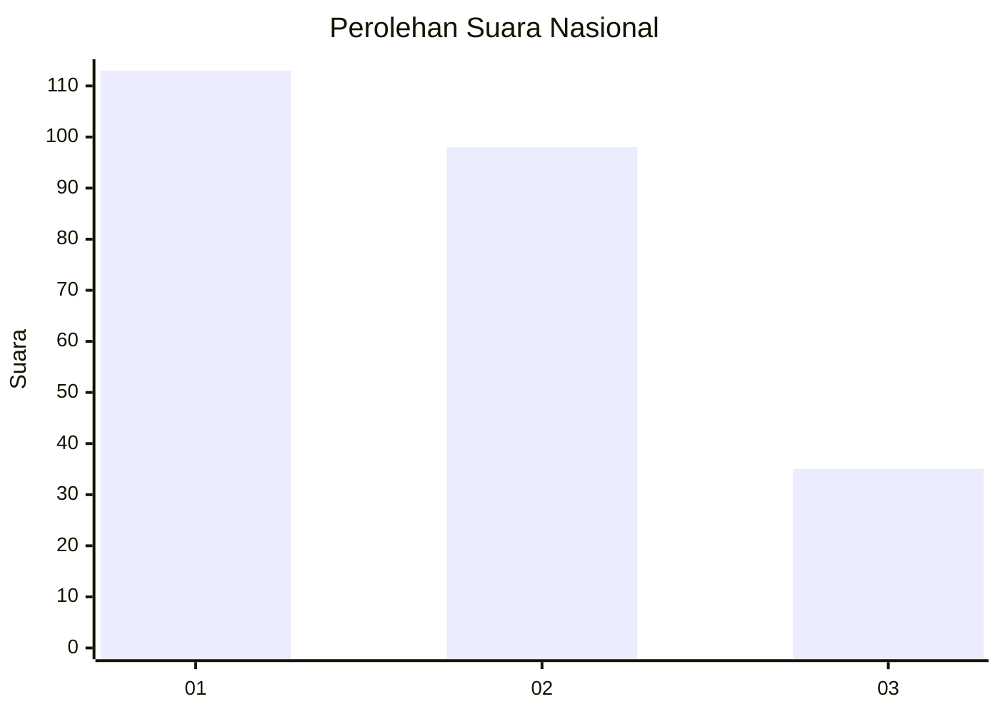
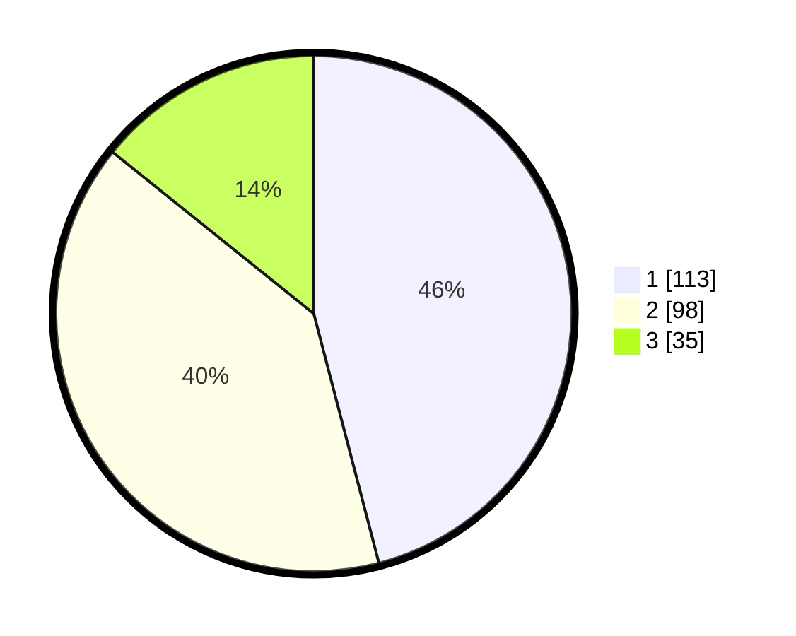

# Hasil

## Grafik

## Tabel

| No.    | Nama Paslon    | Suara | Suara (raw) | Persentase |
|:------ |:-------------- | -----:| -----------:| ----------:|
| 100025 | ANIES MUHAIMIN | 113   | [113][p-1]  | 45,93      |
| 100026 | PRABOWO GIBRAN | 98    | [98][p-2]   | 39,84      |
| 100027 | GANJAR MAHFUD  | 35    | [35][p-3]   | 14,23      |

[p-1]: https://github.com/gigit-pemilu/pemilu-2024/blob/main/pilpres/hitung-suara/sub/31-dki-jakarta/sub/74-jakarta-selatan/sub/04-pasar-minggu/sub/1004-ragunan/sub/039-tps/sub/paslon-1.txt
[p-2]: https://github.com/gigit-pemilu/pemilu-2024/blob/main/pilpres/hitung-suara/sub/31-dki-jakarta/sub/74-jakarta-selatan/sub/04-pasar-minggu/sub/1004-ragunan/sub/039-tps/sub/paslon-2.txt
[p-3]: https://github.com/gigit-pemilu/pemilu-2024/blob/main/pilpres/hitung-suara/sub/31-dki-jakarta/sub/74-jakarta-selatan/sub/04-pasar-minggu/sub/1004-ragunan/sub/039-tps/sub/paslon-3.txt

## Foto C Plano

https://sirekap-obj-formc.kpu.go.id/8bc5/pemilu/ppwp/31/74/04/10/04/3174041004039-20240215-000319--c9627fa4-da06-476b-b3f9-57c70ddc4290.jpg

https://sirekap-obj-formc.kpu.go.id/8bc5/pemilu/ppwp/31/74/04/10/04/3174041004039-20240215-000349--fbf71880-d768-4fa1-9dc4-0e5381beff20.jpg

https://sirekap-obj-formc.kpu.go.id/8bc5/pemilu/ppwp/31/74/04/10/04/3174041004039-20240215-000458--facc4f44-d70c-4af2-b3ed-a404b9f497bb.jpg

## Metadata

| Key        | Value               |
| ---------- | ------------------- |
| Time Stamp | 2024-02-24 22:31:28 |

