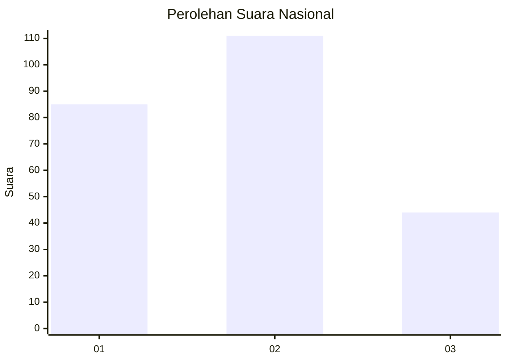
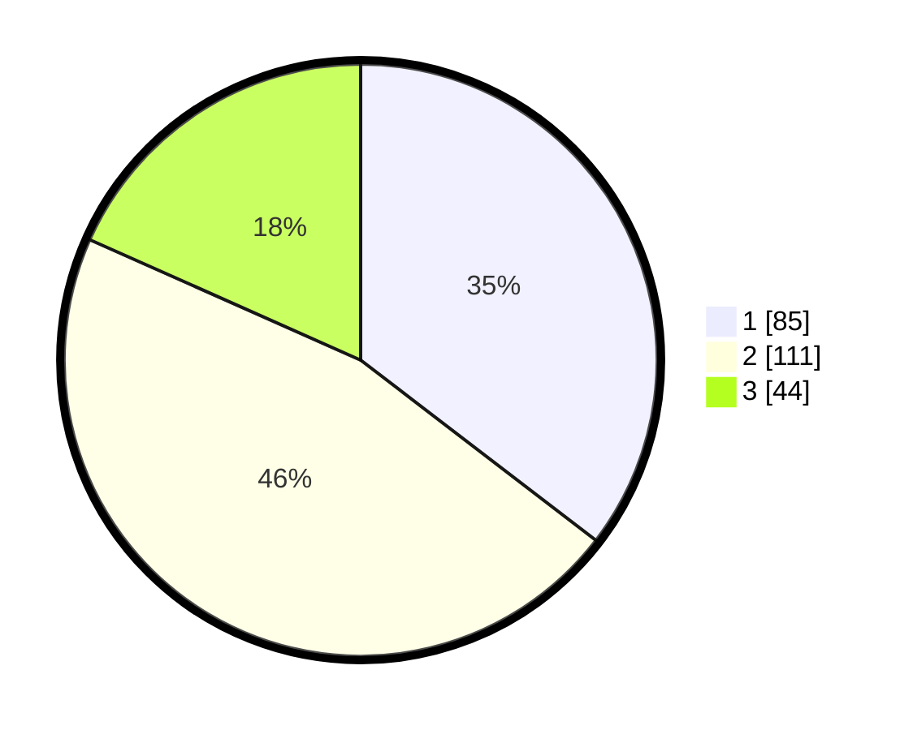

# Hasil

## Grafik

## Tabel

| No.    | Nama Paslon    | Suara | Suara (raw) | Persentase |
|:------ |:-------------- | -----:| -----------:| ----------:|
| 100025 | ANIES MUHAIMIN | 85    | [85][p-1]   | 35,42      |
| 100026 | PRABOWO GIBRAN | 111   | [111][p-2]  | 46,25      |
| 100027 | GANJAR MAHFUD  | 44    | [44][p-3]   | 18,33      |

[p-1]: https://github.com/gigit-pemilu/pemilu-2024/blob/main/pilpres/hitung-suara/sub/31-dki-jakarta/sub/74-jakarta-selatan/sub/04-pasar-minggu/sub/1004-ragunan/sub/040-tps/sub/paslon-1.txt
[p-2]: https://github.com/gigit-pemilu/pemilu-2024/blob/main/pilpres/hitung-suara/sub/31-dki-jakarta/sub/74-jakarta-selatan/sub/04-pasar-minggu/sub/1004-ragunan/sub/040-tps/sub/paslon-2.txt
[p-3]: https://github.com/gigit-pemilu/pemilu-2024/blob/main/pilpres/hitung-suara/sub/31-dki-jakarta/sub/74-jakarta-selatan/sub/04-pasar-minggu/sub/1004-ragunan/sub/040-tps/sub/paslon-3.txt

## Foto C Plano

https://sirekap-obj-formc.kpu.go.id/53fc/pemilu/ppwp/31/74/04/10/04/3174041004040-20240214-235025--09663c4b-7aa6-42b8-8a4d-8c4d38c76b4f.jpg

https://sirekap-obj-formc.kpu.go.id/53fc/pemilu/ppwp/31/74/04/10/04/3174041004040-20240214-235230--47d250af-bc9b-420c-9cd0-c41a9d70be82.jpg

https://sirekap-obj-formc.kpu.go.id/53fc/pemilu/ppwp/31/74/04/10/04/3174041004040-20240214-191027--c56c869d-6658-43b4-aff6-03545a35627d.jpg

## Metadata

| Key        | Value               |
| ---------- | ------------------- |
| Time Stamp | 2024-02-25 11:00:00 |

