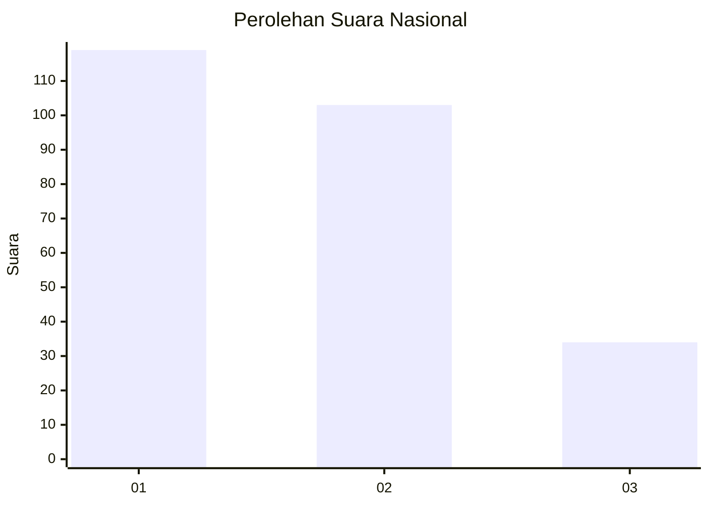
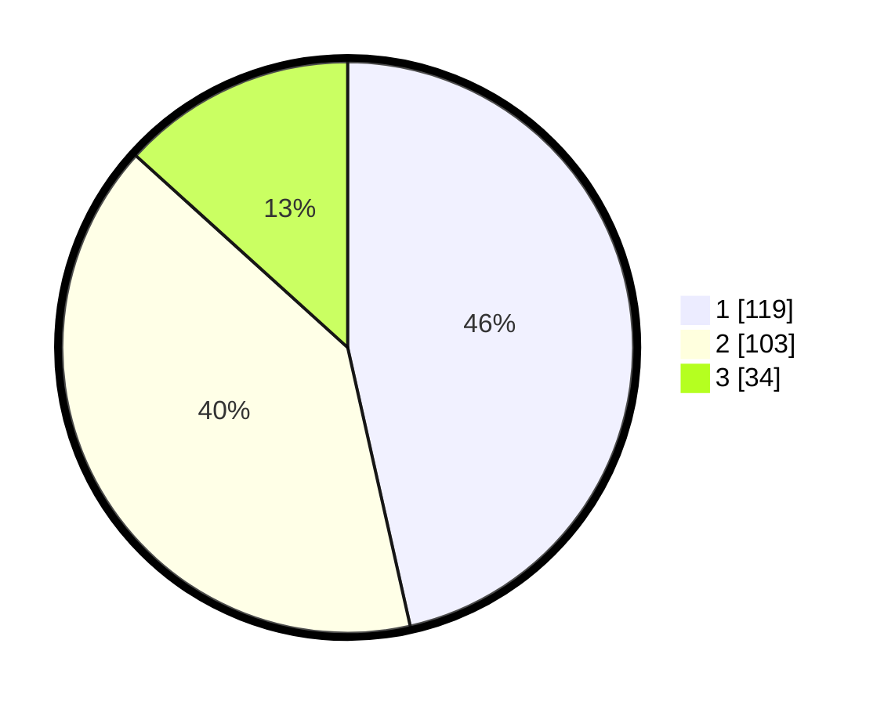

# Hasil

## Grafik

## Tabel

| No. | Nama Paslon    | Suara | Suara (raw) | Persentase |
|:--- |:-------------- | -----:| -----------:| ----------:|
| 1   | ANIES MUHAIMIN | 119   | [119][p-1]  | 46,48      |
| 2   | PRABOWO GIBRAN | 103   | [103][p-2]  | 40,23      |
| 3   | GANJAR MAHFUD  | 34    | [34][p-3]   | 13,28      |

[p-1]: https://github.com/gigit-pemilu/pemilu-2024/blob/main/pilpres/hitung-suara/sub/31-dki-jakarta/sub/74-jakarta-selatan/sub/04-pasar-minggu/sub/1004-ragunan/sub/047-tps/sub/paslon-1.txt
[p-2]: https://github.com/gigit-pemilu/pemilu-2024/blob/main/pilpres/hitung-suara/sub/31-dki-jakarta/sub/74-jakarta-selatan/sub/04-pasar-minggu/sub/1004-ragunan/sub/047-tps/sub/paslon-2.txt
[p-3]: https://github.com/gigit-pemilu/pemilu-2024/blob/main/pilpres/hitung-suara/sub/31-dki-jakarta/sub/74-jakarta-selatan/sub/04-pasar-minggu/sub/1004-ragunan/sub/047-tps/sub/paslon-3.txt

## Foto C Plano

https://sirekap-obj-formc.kpu.go.id/3fd9/pemilu/ppwp/31/74/04/10/04/3174041004047-20240215-174514--38f4899f-ddc7-410a-84b4-cd7c2b4f07e8.jpg

https://sirekap-obj-formc.kpu.go.id/3fd9/pemilu/ppwp/31/74/04/10/04/3174041004047-20240215-174856--e7193181-ddf2-442d-be7d-8deaec12e933.jpg

https://sirekap-obj-formc.kpu.go.id/3fd9/pemilu/ppwp/31/74/04/10/04/3174041004047-20240215-174656--708ce184-de82-4e41-bb8d-5fc0e53d3c41.jpg

## Metadata

| Key        | Value               |
| ---------- | ------------------- |
| Time Stamp | 2024-02-24 22:31:28 |

