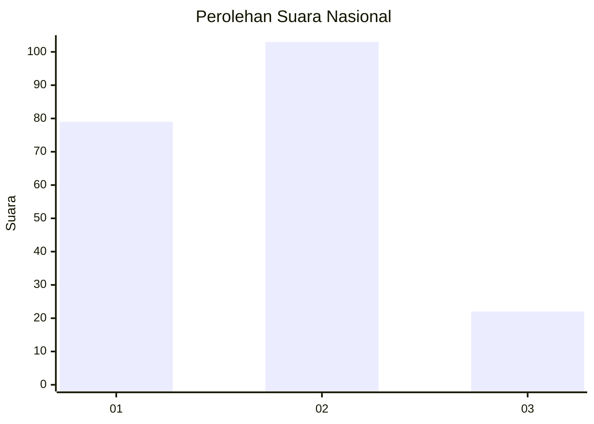
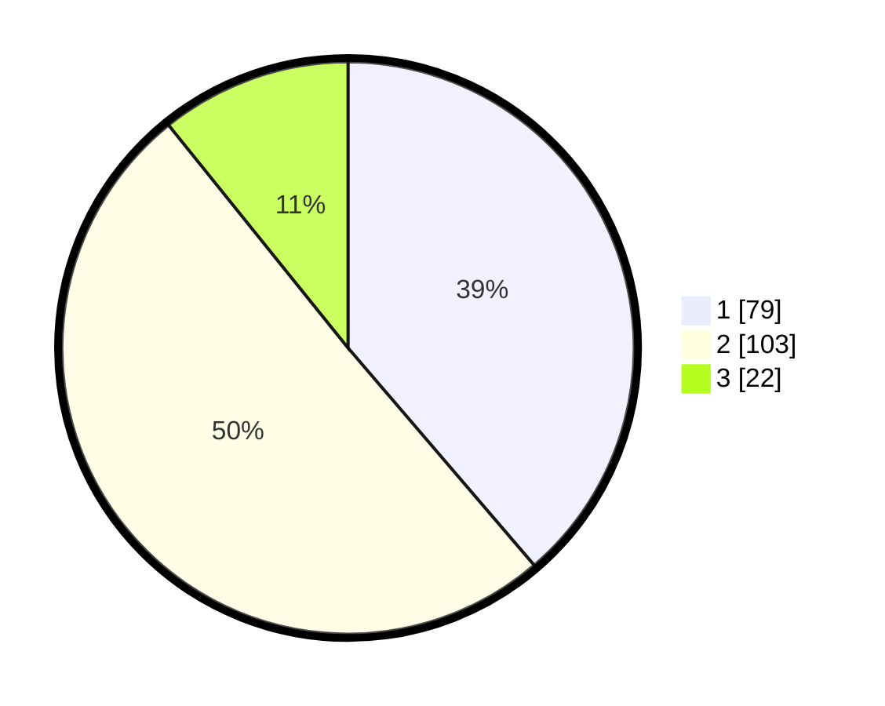

# Hasil

## Grafik

## Tabel

| No.    | Nama Paslon    | Suara | Suara (raw) | Persentase |
|:------ |:-------------- | -----:| -----------:| ----------:|
| 100025 | ANIES MUHAIMIN | 79    | [79][p-1]   | 38,73      |
| 100026 | PRABOWO GIBRAN | 103   | [103][p-2]  | 50,49      |
| 100027 | GANJAR MAHFUD  | 22    | [22][p-3]   | 10,78      |

[p-1]: https://github.com/gigit-pemilu/pemilu-2024/blob/main/pilpres/hitung-suara/sub/31-dki-jakarta/sub/74-jakarta-selatan/sub/04-pasar-minggu/sub/1004-ragunan/sub/049-tps/sub/paslon-1.txt
[p-2]: https://github.com/gigit-pemilu/pemilu-2024/blob/main/pilpres/hitung-suara/sub/31-dki-jakarta/sub/74-jakarta-selatan/sub/04-pasar-minggu/sub/1004-ragunan/sub/049-tps/sub/paslon-2.txt
[p-3]: https://github.com/gigit-pemilu/pemilu-2024/blob/main/pilpres/hitung-suara/sub/31-dki-jakarta/sub/74-jakarta-selatan/sub/04-pasar-minggu/sub/1004-ragunan/sub/049-tps/sub/paslon-3.txt

## Foto C Plano

https://sirekap-obj-formc.kpu.go.id/cf3a/pemilu/ppwp/31/74/04/10/04/3174041004049-20240214-221947--cfe1aec9-6c08-4255-adb0-b57a6337a71c.jpg

https://sirekap-obj-formc.kpu.go.id/cf3a/pemilu/ppwp/31/74/04/10/04/3174041004049-20240214-222047--1c6f1b90-2420-4fca-bbfe-d83b8d9c5212.jpg

https://sirekap-obj-formc.kpu.go.id/cf3a/pemilu/ppwp/31/74/04/10/04/3174041004049-20240214-222333--8dba66d0-473a-45ac-9bbe-904cfa0bfb92.jpg

## Metadata

| Key        | Value               |
| ---------- | ------------------- |
| Time Stamp | 2024-02-24 22:31:28 |

