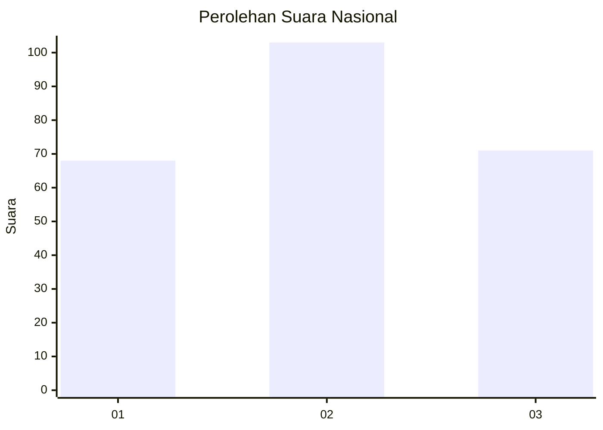
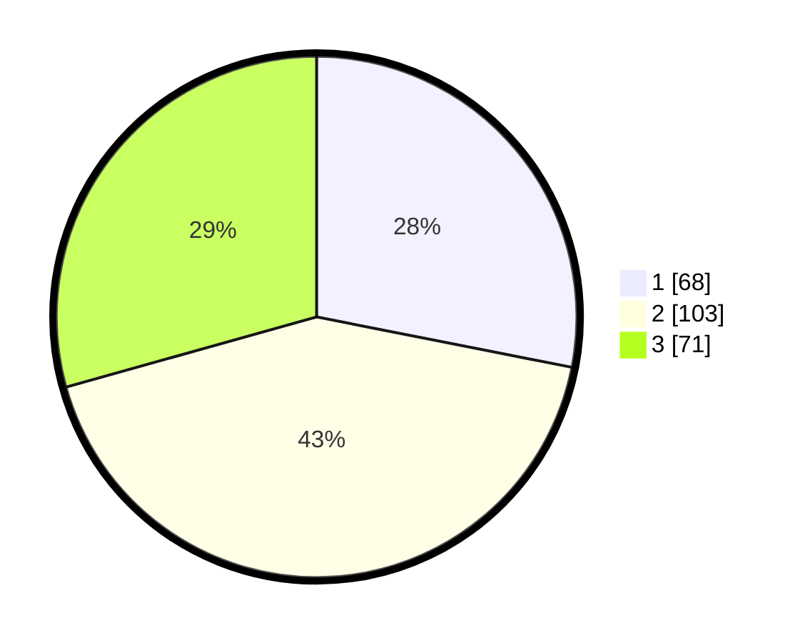

# Hasil

## Grafik

## Tabel

| No.    | Nama Paslon    | Suara | Suara (raw) | Persentase |
|:------ |:-------------- | -----:| -----------:| ----------:|
| 100025 | ANIES MUHAIMIN | 68    | [68][p-1]   | 28,10      |
| 100026 | PRABOWO GIBRAN | 103   | [103][p-2]  | 42,56      |
| 100027 | GANJAR MAHFUD  | 71    | [71][p-3]   | 29,34      |

[p-1]: https://github.com/gigit-pemilu/pemilu-2024/blob/main/pilpres/hitung-suara/sub/31-dki-jakarta/sub/74-jakarta-selatan/sub/04-pasar-minggu/sub/1004-ragunan/sub/057-tps/sub/paslon-1.txt
[p-2]: https://github.com/gigit-pemilu/pemilu-2024/blob/main/pilpres/hitung-suara/sub/31-dki-jakarta/sub/74-jakarta-selatan/sub/04-pasar-minggu/sub/1004-ragunan/sub/057-tps/sub/paslon-2.txt
[p-3]: https://github.com/gigit-pemilu/pemilu-2024/blob/main/pilpres/hitung-suara/sub/31-dki-jakarta/sub/74-jakarta-selatan/sub/04-pasar-minggu/sub/1004-ragunan/sub/057-tps/sub/paslon-3.txt

## Foto C Plano

https://sirekap-obj-formc.kpu.go.id/8e9e/pemilu/ppwp/31/74/04/10/04/3174041004057-20240214-192031--6a995ced-51a5-4431-b754-a52e4a13d7ab.jpg

https://sirekap-obj-formc.kpu.go.id/8e9e/pemilu/ppwp/31/74/04/10/04/3174041004057-20240214-193708--e51a5200-36d8-474c-8dd0-b4d3c05a5896.jpg

https://sirekap-obj-formc.kpu.go.id/8e9e/pemilu/ppwp/31/74/04/10/04/3174041004057-20240214-191936--2cdad0cd-38be-40e3-82b7-351b866935ab.jpg

## Metadata

| Key        | Value               |
| ---------- | ------------------- |
| Time Stamp | 2024-02-25 12:00:00 |

