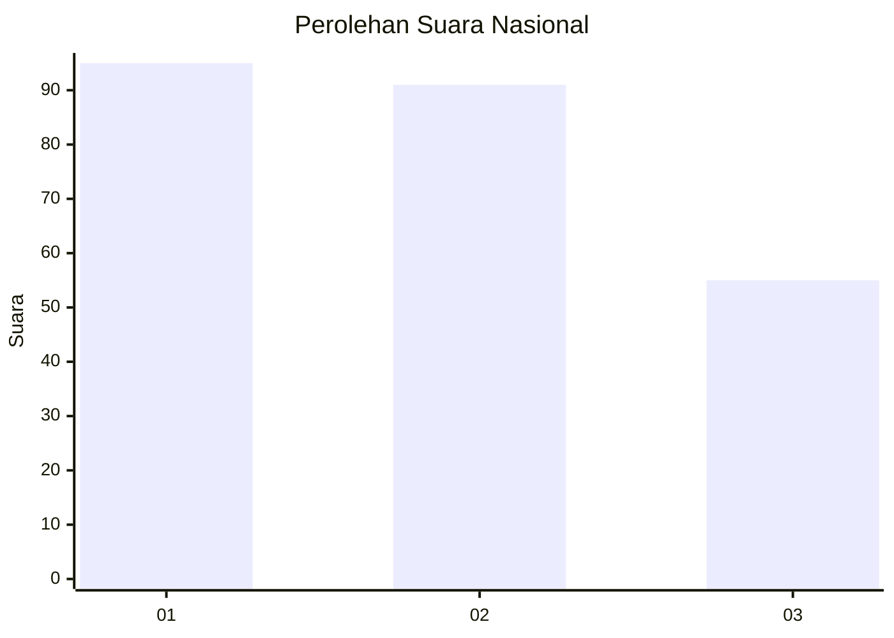
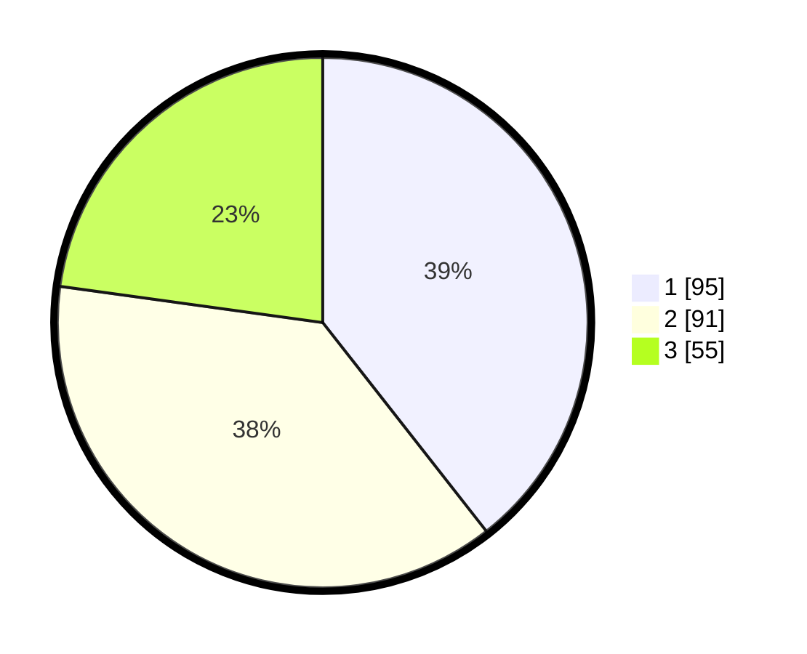

# Hasil

## Grafik

## Tabel

| No.    | Nama Paslon    | Suara | Suara (raw) | Persentase |
|:------ |:-------------- | -----:| -----------:| ----------:|
| 100025 | ANIES MUHAIMIN | 95    | [95][p-1]   | 39,42      |
| 100026 | PRABOWO GIBRAN | 91    | [91][p-2]   | 37,76      |
| 100027 | GANJAR MAHFUD  | 55    | [55][p-3]   | 22,82      |

[p-1]: https://github.com/gigit-pemilu/pemilu-2024/blob/main/pilpres/hitung-suara/sub/31-dki-jakarta/sub/74-jakarta-selatan/sub/04-pasar-minggu/sub/1004-ragunan/sub/062-tps/sub/paslon-1.txt
[p-2]: https://github.com/gigit-pemilu/pemilu-2024/blob/main/pilpres/hitung-suara/sub/31-dki-jakarta/sub/74-jakarta-selatan/sub/04-pasar-minggu/sub/1004-ragunan/sub/062-tps/sub/paslon-2.txt
[p-3]: https://github.com/gigit-pemilu/pemilu-2024/blob/main/pilpres/hitung-suara/sub/31-dki-jakarta/sub/74-jakarta-selatan/sub/04-pasar-minggu/sub/1004-ragunan/sub/062-tps/sub/paslon-3.txt

## Foto C Plano

https://sirekap-obj-formc.kpu.go.id/c4b3/pemilu/ppwp/31/74/04/10/04/3174041004062-20240215-011542--8d22ffd4-4032-41dc-a46e-399ca86f2d47.jpg

https://sirekap-obj-formc.kpu.go.id/c4b3/pemilu/ppwp/31/74/04/10/04/3174041004062-20240215-011628--adf0095a-2c47-42b3-9132-a2434b4da323.jpg

https://sirekap-obj-formc.kpu.go.id/c4b3/pemilu/ppwp/31/74/04/10/04/3174041004062-20240215-011813--4780ecb8-d123-4c60-b454-2a6e45e1db00.jpg

## Metadata

| Key        | Value               |
| ---------- | ------------------- |
| Time Stamp | 2024-02-25 12:00:00 |

