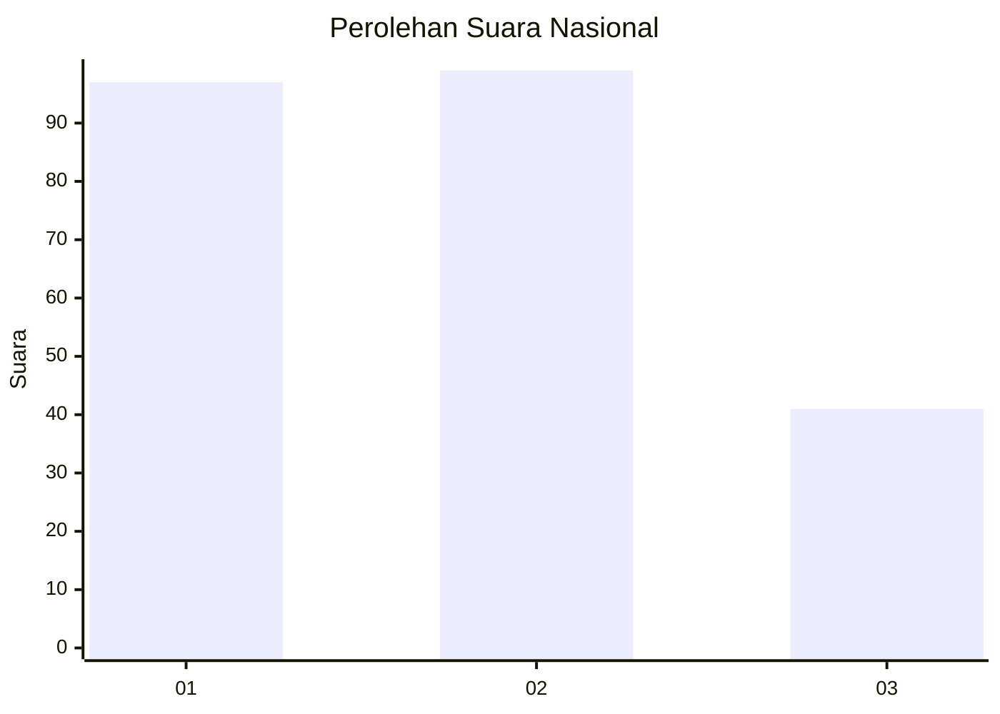
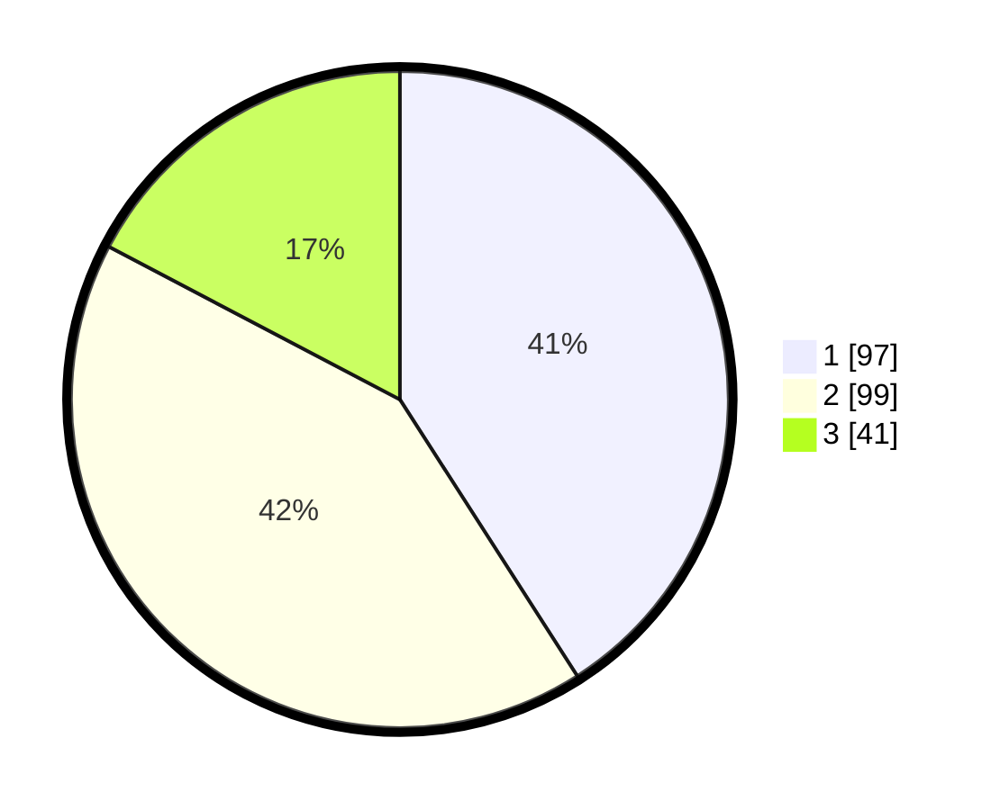

# Hasil

## Grafik

## Tabel

| No.    | Nama Paslon    | Suara | Suara (raw) | Persentase |
|:------ |:-------------- | -----:| -----------:| ----------:|
| 100025 | ANIES MUHAIMIN | 97    | [97][p-1]   | 40,93      |
| 100026 | PRABOWO GIBRAN | 99    | [99][p-2]   | 41,77      |
| 100027 | GANJAR MAHFUD  | 41    | [41][p-3]   | 17,30      |

[p-1]: https://github.com/gigit-pemilu/pemilu-2024/blob/main/pilpres/hitung-suara/sub/31-dki-jakarta/sub/74-jakarta-selatan/sub/04-pasar-minggu/sub/1004-ragunan/sub/063-tps/sub/paslon-1.txt
[p-2]: https://github.com/gigit-pemilu/pemilu-2024/blob/main/pilpres/hitung-suara/sub/31-dki-jakarta/sub/74-jakarta-selatan/sub/04-pasar-minggu/sub/1004-ragunan/sub/063-tps/sub/paslon-2.txt
[p-3]: https://github.com/gigit-pemilu/pemilu-2024/blob/main/pilpres/hitung-suara/sub/31-dki-jakarta/sub/74-jakarta-selatan/sub/04-pasar-minggu/sub/1004-ragunan/sub/063-tps/sub/paslon-3.txt

## Foto C Plano

https://sirekap-obj-formc.kpu.go.id/8b26/pemilu/ppwp/31/74/04/10/04/3174041004063-20240214-220616--38d95d3d-1035-4368-a23b-99803ef7b557.jpg

https://sirekap-obj-formc.kpu.go.id/8b26/pemilu/ppwp/31/74/04/10/04/3174041004063-20240214-221447--b3686209-917b-492c-ad99-7d9d9083759a.jpg

https://sirekap-obj-formc.kpu.go.id/8b26/pemilu/ppwp/31/74/04/10/04/3174041004063-20240214-220234--7998079c-84d6-4ce0-87b4-072d11720065.jpg

## Metadata

| Key        | Value               |
| ---------- | ------------------- |
| Time Stamp | 2024-02-25 15:00:00 |

