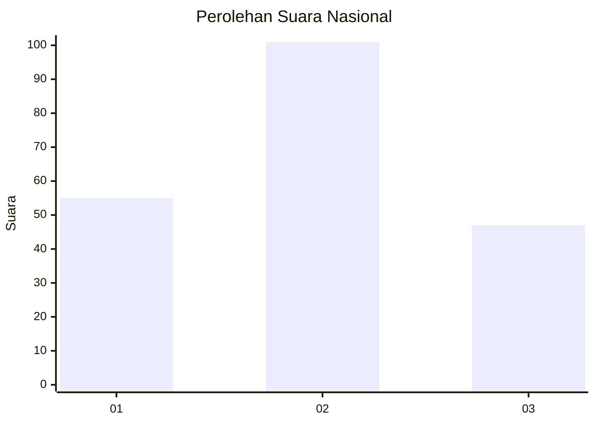
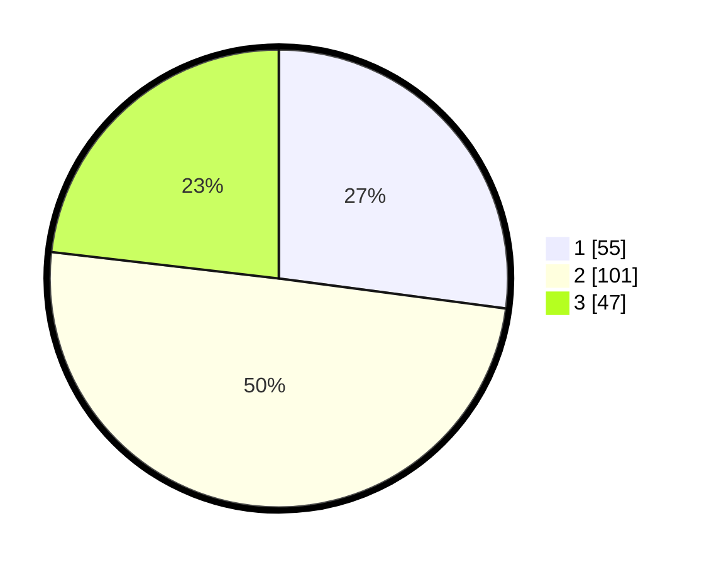

# Hasil

## Grafik

## Tabel

| No.    | Nama Paslon    | Suara | Suara (raw) | Persentase |
|:------ |:-------------- | -----:| -----------:| ----------:|
| 100025 | ANIES MUHAIMIN | 55    | [55][p-1]   | 27,09      |
| 100026 | PRABOWO GIBRAN | 101   | [101][p-2]  | 49,75      |
| 100027 | GANJAR MAHFUD  | 47    | [47][p-3]   | 23,15      |

[p-1]: https://github.com/gigit-pemilu/pemilu-2024/blob/main/pilpres/hitung-suara/sub/31-dki-jakarta/sub/74-jakarta-selatan/sub/04-pasar-minggu/sub/1004-ragunan/sub/071-tps/sub/paslon-1.txt
[p-2]: https://github.com/gigit-pemilu/pemilu-2024/blob/main/pilpres/hitung-suara/sub/31-dki-jakarta/sub/74-jakarta-selatan/sub/04-pasar-minggu/sub/1004-ragunan/sub/071-tps/sub/paslon-2.txt
[p-3]: https://github.com/gigit-pemilu/pemilu-2024/blob/main/pilpres/hitung-suara/sub/31-dki-jakarta/sub/74-jakarta-selatan/sub/04-pasar-minggu/sub/1004-ragunan/sub/071-tps/sub/paslon-3.txt

## Foto C Plano

https://sirekap-obj-formc.kpu.go.id/0e3d/pemilu/ppwp/31/74/04/10/04/3174041004071-20240219-184249--2b523bfa-6125-4275-8648-fcee19770a68.jpg

https://sirekap-obj-formc.kpu.go.id/0e3d/pemilu/ppwp/31/74/04/10/04/3174041004071-20240219-184451--8ac82b75-f08e-4145-a1f6-fe2d4edf7f5c.jpg

https://sirekap-obj-formc.kpu.go.id/0e3d/pemilu/ppwp/31/74/04/10/04/3174041004071-20240217-090452--5b09f876-b8a3-4453-8f43-e66c37cc77f9.jpg

## Metadata

| Key        | Value               |
| ---------- | ------------------- |
| Time Stamp | 2024-02-25 14:00:00 |

