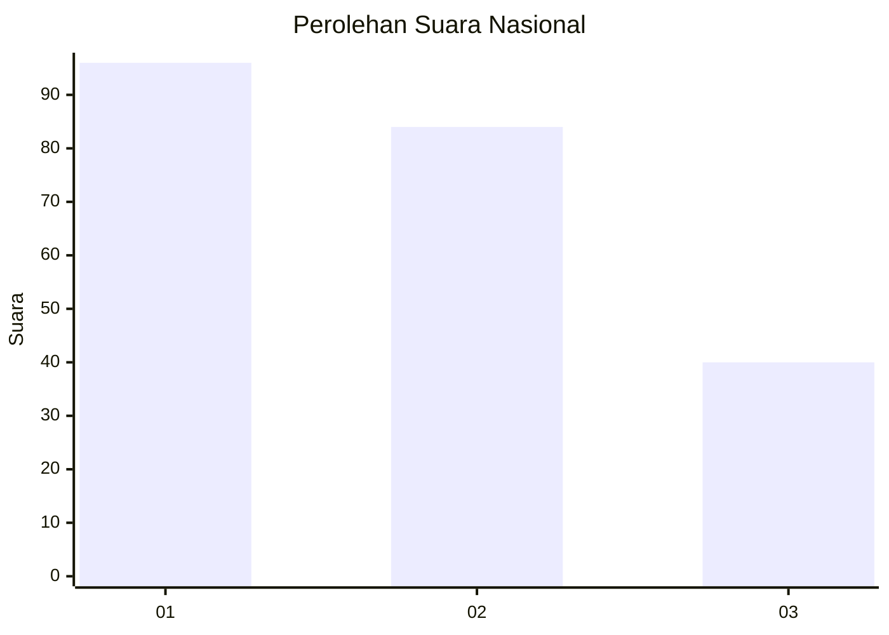
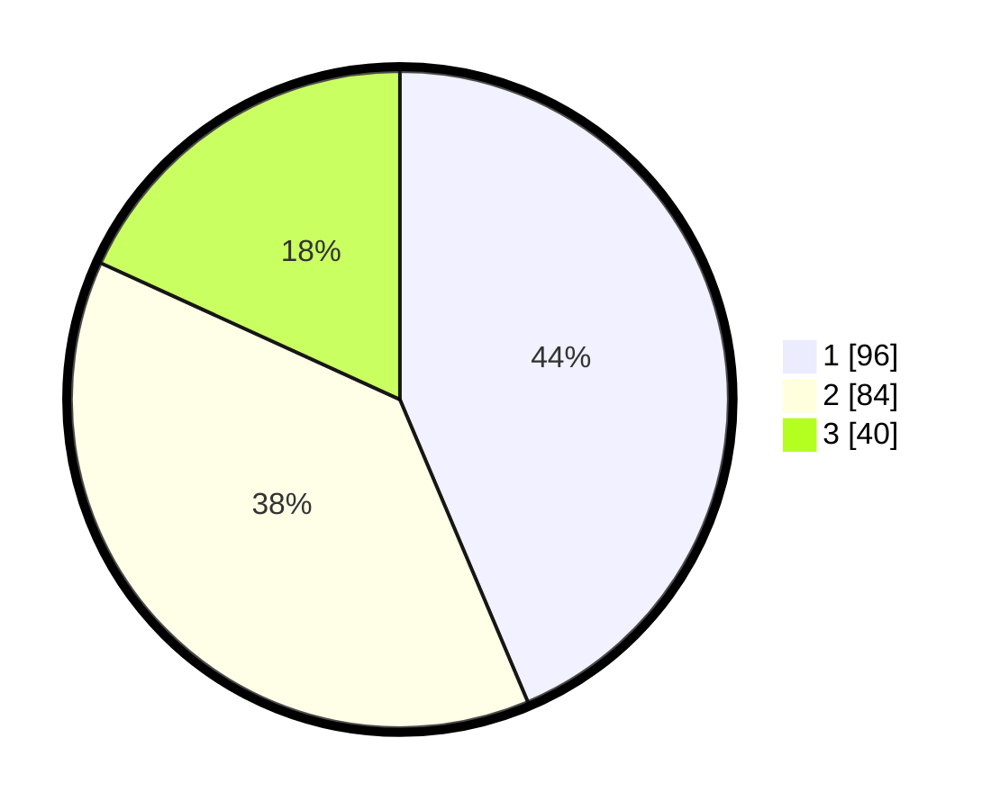

# Hasil

## Grafik

## Tabel

| No.    | Nama Paslon    | Suara | Suara (raw) | Persentase |
|:------ |:-------------- | -----:| -----------:| ----------:|
| 100025 | ANIES MUHAIMIN | 96    | [96][p-1]   | 43,64      |
| 100026 | PRABOWO GIBRAN | 84    | [84][p-2]   | 38,18      |
| 100027 | GANJAR MAHFUD  | 40    | [40][p-3]   | 18,18      |

[p-1]: https://github.com/gigit-pemilu/pemilu-2024/blob/main/pilpres/hitung-suara/sub/31-dki-jakarta/sub/74-jakarta-selatan/sub/04-pasar-minggu/sub/1004-ragunan/sub/073-tps/sub/paslon-1.txt
[p-2]: https://github.com/gigit-pemilu/pemilu-2024/blob/main/pilpres/hitung-suara/sub/31-dki-jakarta/sub/74-jakarta-selatan/sub/04-pasar-minggu/sub/1004-ragunan/sub/073-tps/sub/paslon-2.txt
[p-3]: https://github.com/gigit-pemilu/pemilu-2024/blob/main/pilpres/hitung-suara/sub/31-dki-jakarta/sub/74-jakarta-selatan/sub/04-pasar-minggu/sub/1004-ragunan/sub/073-tps/sub/paslon-3.txt

## Foto C Plano

https://sirekap-obj-formc.kpu.go.id/b71d/pemilu/ppwp/31/74/04/10/04/3174041004073-20240214-224714--b404eaf6-0e08-4f2c-b089-b46c4d998847.jpg

https://sirekap-obj-formc.kpu.go.id/b71d/pemilu/ppwp/31/74/04/10/04/3174041004073-20240214-224905--c81b7c55-9397-4d8c-b3e3-21d1ab9c60d2.jpg

https://sirekap-obj-formc.kpu.go.id/b71d/pemilu/ppwp/31/74/04/10/04/3174041004073-20240214-203813--353b9fc8-780e-414f-84b3-8edcaaa4d099.jpg

## Metadata

| Key        | Value               |
| ---------- | ------------------- |
| Time Stamp | 2024-02-24 22:31:28 |

