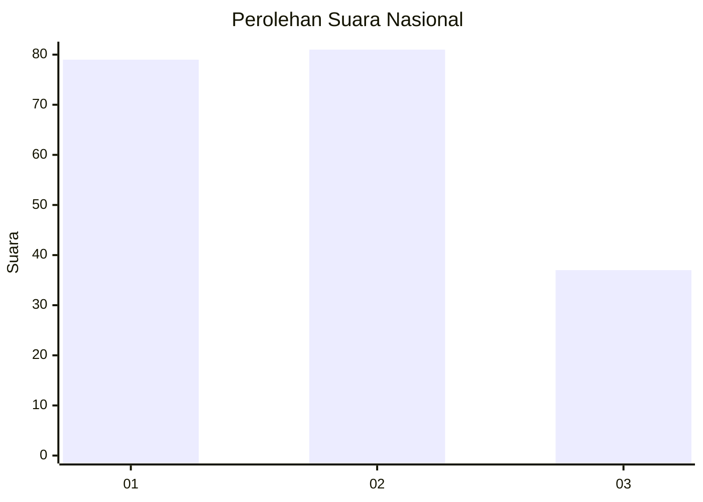
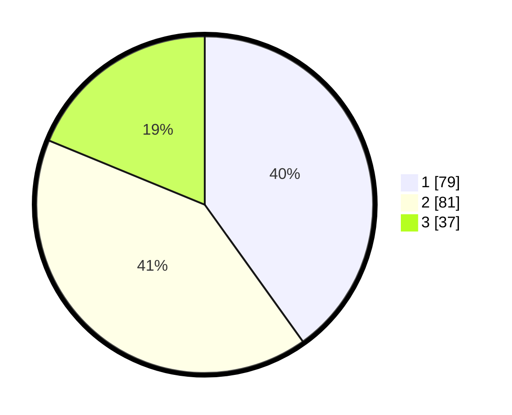

# Hasil

## Grafik

## Tabel

| No.    | Nama Paslon    | Suara | Suara (raw) | Persentase |
|:------ |:-------------- | -----:| -----------:| ----------:|
| 100025 | ANIES MUHAIMIN | 79    | [79][p-1]   | 40,10      |
| 100026 | PRABOWO GIBRAN | 81    | [81][p-2]   | 41,12      |
| 100027 | GANJAR MAHFUD  | 37    | [37][p-3]   | 18,78      |

[p-1]: https://github.com/gigit-pemilu/pemilu-2024/blob/main/pilpres/hitung-suara/sub/31-dki-jakarta/sub/74-jakarta-selatan/sub/04-pasar-minggu/sub/1004-ragunan/sub/074-tps/sub/paslon-1.txt
[p-2]: https://github.com/gigit-pemilu/pemilu-2024/blob/main/pilpres/hitung-suara/sub/31-dki-jakarta/sub/74-jakarta-selatan/sub/04-pasar-minggu/sub/1004-ragunan/sub/074-tps/sub/paslon-2.txt
[p-3]: https://github.com/gigit-pemilu/pemilu-2024/blob/main/pilpres/hitung-suara/sub/31-dki-jakarta/sub/74-jakarta-selatan/sub/04-pasar-minggu/sub/1004-ragunan/sub/074-tps/sub/paslon-3.txt

## Foto C Plano

https://sirekap-obj-formc.kpu.go.id/7c42/pemilu/ppwp/31/74/04/10/04/3174041004074-20240214-202659--876f978f-0fac-4636-b68b-d40d2237064e.jpg

https://sirekap-obj-formc.kpu.go.id/7c42/pemilu/ppwp/31/74/04/10/04/3174041004074-20240214-202848--5f0962c5-b167-4c79-a6e0-de31b531f7c9.jpg

https://sirekap-obj-formc.kpu.go.id/7c42/pemilu/ppwp/31/74/04/10/04/3174041004074-20240214-203021--f044a2a3-528c-4fd3-becc-8382fd42eefe.jpg

## Metadata

| Key        | Value               |
| ---------- | ------------------- |
| Time Stamp | 2024-02-25 11:00:00 |

