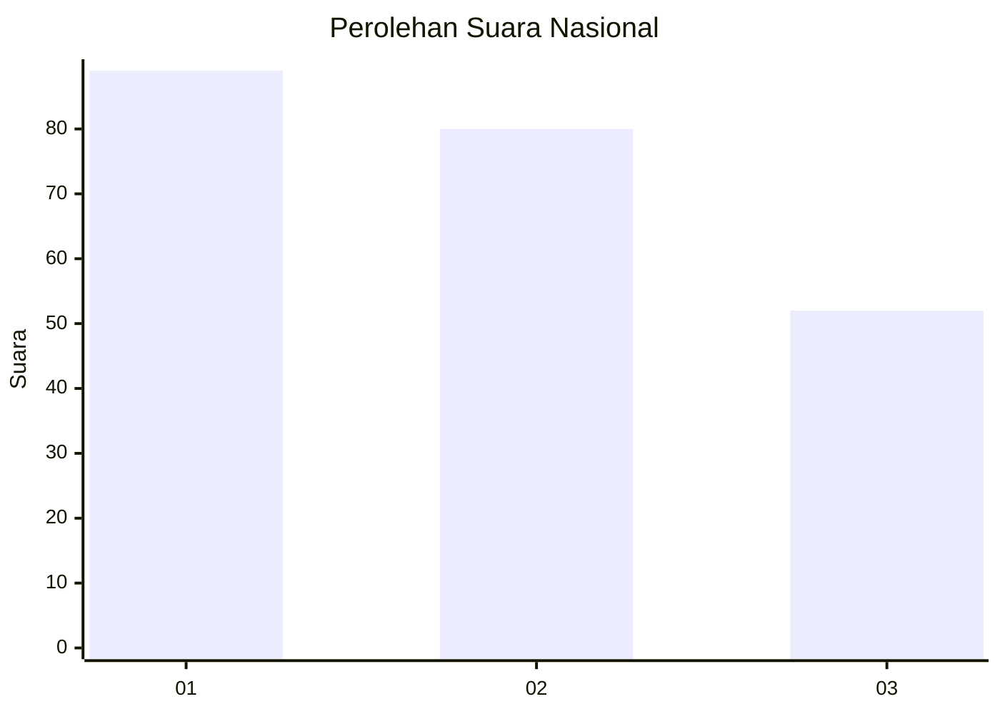
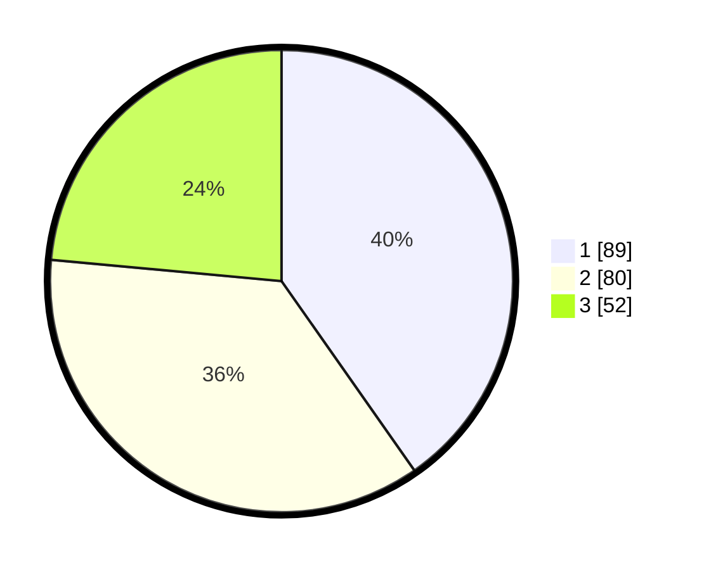

# Hasil

## Grafik

## Tabel

| No.    | Nama Paslon    | Suara | Suara (raw) | Persentase |
|:------ |:-------------- | -----:| -----------:| ----------:|
| 100025 | ANIES MUHAIMIN | 89    | [89][p-1]   | 40,27      |
| 100026 | PRABOWO GIBRAN | 80    | [80][p-2]   | 36,20      |
| 100027 | GANJAR MAHFUD  | 52    | [52][p-3]   | 23,53      |

[p-1]: https://github.com/gigit-pemilu/pemilu-2024/blob/main/pilpres/hitung-suara/sub/31-dki-jakarta/sub/74-jakarta-selatan/sub/04-pasar-minggu/sub/1004-ragunan/sub/076-tps/sub/paslon-1.txt
[p-2]: https://github.com/gigit-pemilu/pemilu-2024/blob/main/pilpres/hitung-suara/sub/31-dki-jakarta/sub/74-jakarta-selatan/sub/04-pasar-minggu/sub/1004-ragunan/sub/076-tps/sub/paslon-2.txt
[p-3]: https://github.com/gigit-pemilu/pemilu-2024/blob/main/pilpres/hitung-suara/sub/31-dki-jakarta/sub/74-jakarta-selatan/sub/04-pasar-minggu/sub/1004-ragunan/sub/076-tps/sub/paslon-3.txt

## Foto C Plano

https://sirekap-obj-formc.kpu.go.id/7462/pemilu/ppwp/31/74/04/10/04/3174041004076-20240215-170326--845cf7f9-3354-4e48-bbd8-1aa75358ae9b.jpg

https://sirekap-obj-formc.kpu.go.id/7462/pemilu/ppwp/31/74/04/10/04/3174041004076-20240215-124605--ac03cbe7-00bd-4bca-b33b-802e2e8cca36.jpg

https://sirekap-obj-formc.kpu.go.id/7462/pemilu/ppwp/31/74/04/10/04/3174041004076-20240215-124800--150edd89-f4a9-449f-895c-ee2c1fbff426.jpg

## Metadata

| Key        | Value               |
| ---------- | ------------------- |
| Time Stamp | 2024-02-24 22:31:28 |

