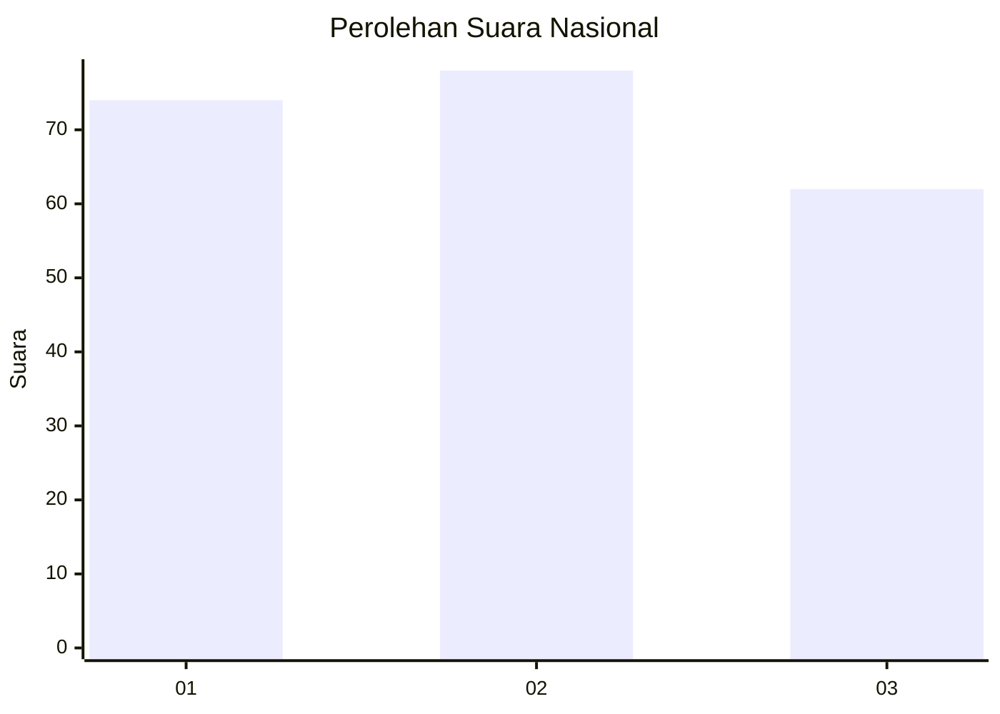
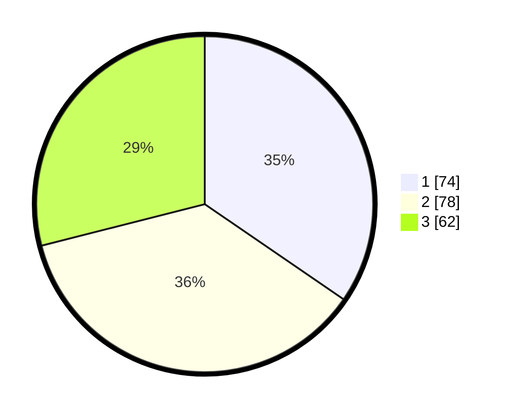

# Hasil

## Grafik

## Tabel

| No.    | Nama Paslon    | Suara | Suara (raw) | Persentase |
|:------ |:-------------- | -----:| -----------:| ----------:|
| 100025 | ANIES MUHAIMIN | 74    | [74][p-1]   | 34,58      |
| 100026 | PRABOWO GIBRAN | 78    | [78][p-2]   | 36,45      |
| 100027 | GANJAR MAHFUD  | 62    | [62][p-3]   | 28,97      |

[p-1]: https://github.com/gigit-pemilu/pemilu-2024/blob/main/pilpres/hitung-suara/sub/31-dki-jakarta/sub/74-jakarta-selatan/sub/04-pasar-minggu/sub/1004-ragunan/sub/078-tps/sub/paslon-1.txt
[p-2]: https://github.com/gigit-pemilu/pemilu-2024/blob/main/pilpres/hitung-suara/sub/31-dki-jakarta/sub/74-jakarta-selatan/sub/04-pasar-minggu/sub/1004-ragunan/sub/078-tps/sub/paslon-2.txt
[p-3]: https://github.com/gigit-pemilu/pemilu-2024/blob/main/pilpres/hitung-suara/sub/31-dki-jakarta/sub/74-jakarta-selatan/sub/04-pasar-minggu/sub/1004-ragunan/sub/078-tps/sub/paslon-3.txt

## Foto C Plano

https://sirekap-obj-formc.kpu.go.id/4bae/pemilu/ppwp/31/74/04/10/04/3174041004078-20240214-212341--9bf098a4-0b2b-4f4e-b277-7682fca1fa5f.jpg

https://sirekap-obj-formc.kpu.go.id/4bae/pemilu/ppwp/31/74/04/10/04/3174041004078-20240214-155041--0662afda-74d7-4d09-b716-cd10c73cda76.jpg

https://sirekap-obj-formc.kpu.go.id/4bae/pemilu/ppwp/31/74/04/10/04/3174041004078-20240214-212503--c42e70ec-c3e3-43f5-8b40-fb07b2818f80.jpg

## Metadata

| Key        | Value               |
| ---------- | ------------------- |
| Time Stamp | 2024-02-15 00:41:44 |

