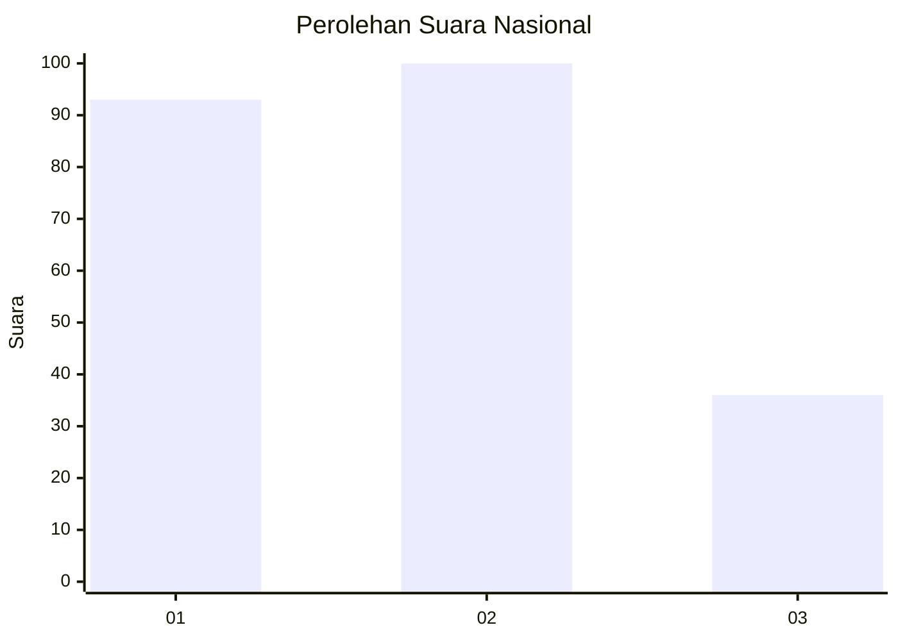
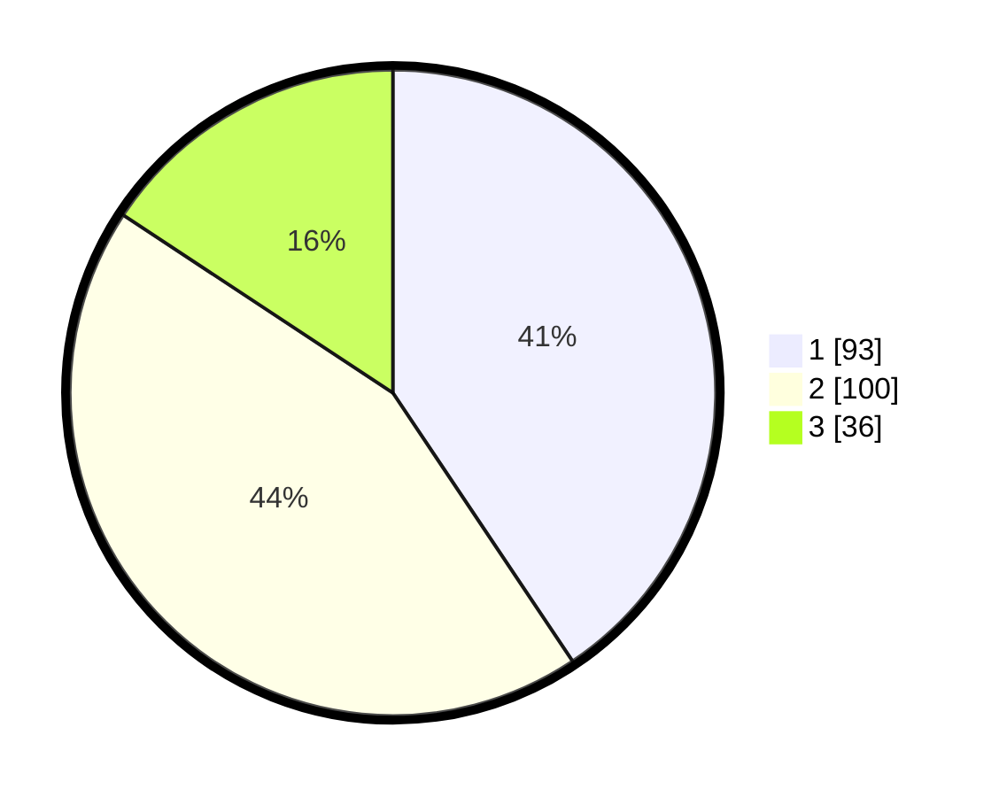

# Hasil

## Grafik

## Tabel

| No.    | Nama Paslon    | Suara | Suara (raw) | Persentase |
|:------ |:-------------- | -----:| -----------:| ----------:|
| 100025 | ANIES MUHAIMIN | 93    | [93][p-1]   | 40,61      |
| 100026 | PRABOWO GIBRAN | 100   | [100][p-2]  | 43,67      |
| 100027 | GANJAR MAHFUD  | 36    | [36][p-3]   | 15,72      |

[p-1]: https://github.com/gigit-pemilu/pemilu-2024/blob/main/pilpres/hitung-suara/sub/31-dki-jakarta/sub/74-jakarta-selatan/sub/04-pasar-minggu/sub/1004-ragunan/sub/096-tps/sub/paslon-1.txt
[p-2]: https://github.com/gigit-pemilu/pemilu-2024/blob/main/pilpres/hitung-suara/sub/31-dki-jakarta/sub/74-jakarta-selatan/sub/04-pasar-minggu/sub/1004-ragunan/sub/096-tps/sub/paslon-2.txt
[p-3]: https://github.com/gigit-pemilu/pemilu-2024/blob/main/pilpres/hitung-suara/sub/31-dki-jakarta/sub/74-jakarta-selatan/sub/04-pasar-minggu/sub/1004-ragunan/sub/096-tps/sub/paslon-3.txt

## Foto C Plano

https://sirekap-obj-formc.kpu.go.id/a539/pemilu/ppwp/31/74/04/10/04/3174041004096-20240214-203218--fe780d60-0c3f-4500-85a6-358e7fb143d5.jpg

https://sirekap-obj-formc.kpu.go.id/a539/pemilu/ppwp/31/74/04/10/04/3174041004096-20240214-194208--004e960c-0daa-4239-84c4-cbc111bf4705.jpg

https://sirekap-obj-formc.kpu.go.id/a539/pemilu/ppwp/31/74/04/10/04/3174041004096-20240214-194307--9ca053e9-cd39-458f-afef-8bb99a4899ed.jpg

## Metadata

| Key        | Value               |
| ---------- | ------------------- |
| Time Stamp | 2024-02-24 22:31:28 |

