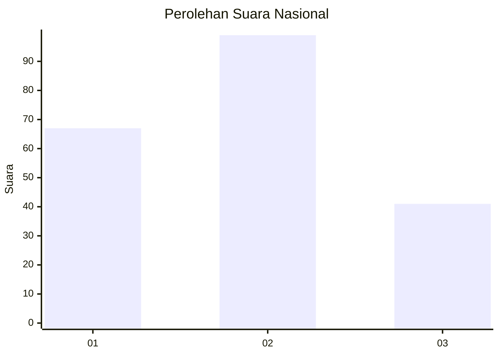
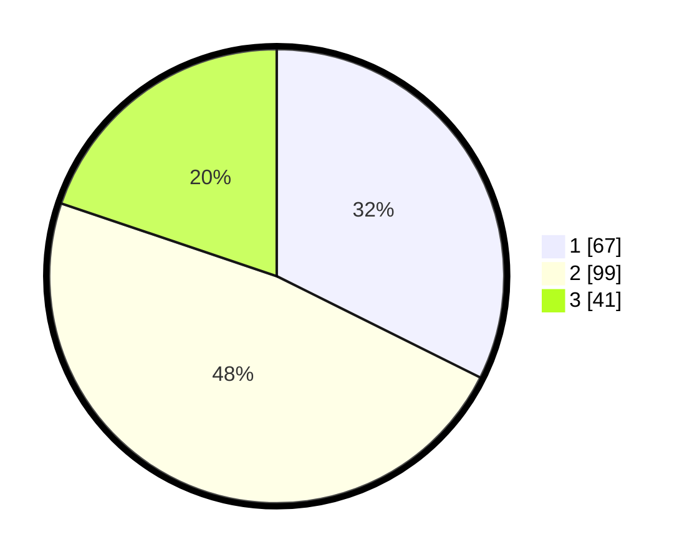

# Hasil

## Grafik

## Tabel

| No.    | Nama Paslon    | Suara | Suara (raw) | Persentase |
|:------ |:-------------- | -----:| -----------:| ----------:|
| 100025 | ANIES MUHAIMIN | 67    | [67][p-1]   | 32,37      |
| 100026 | PRABOWO GIBRAN | 99    | [99][p-2]   | 47,83      |
| 100027 | GANJAR MAHFUD  | 41    | [41][p-3]   | 19,81      |

[p-1]: https://github.com/gigit-pemilu/pemilu-2024/blob/main/pilpres/hitung-suara/sub/31-dki-jakarta/sub/74-jakarta-selatan/sub/04-pasar-minggu/sub/1004-ragunan/sub/097-tps/sub/paslon-1.txt
[p-2]: https://github.com/gigit-pemilu/pemilu-2024/blob/main/pilpres/hitung-suara/sub/31-dki-jakarta/sub/74-jakarta-selatan/sub/04-pasar-minggu/sub/1004-ragunan/sub/097-tps/sub/paslon-2.txt
[p-3]: https://github.com/gigit-pemilu/pemilu-2024/blob/main/pilpres/hitung-suara/sub/31-dki-jakarta/sub/74-jakarta-selatan/sub/04-pasar-minggu/sub/1004-ragunan/sub/097-tps/sub/paslon-3.txt

## Foto C Plano

https://sirekap-obj-formc.kpu.go.id/c03f/pemilu/ppwp/31/74/04/10/04/3174041004097-20240214-203959--5fb66f14-fedc-4df1-92dd-211f6e6af8aa.jpg

https://sirekap-obj-formc.kpu.go.id/c03f/pemilu/ppwp/31/74/04/10/04/3174041004097-20240214-204139--40c466d8-2197-4fff-bf5c-0c415f7d5528.jpg

https://sirekap-obj-formc.kpu.go.id/c03f/pemilu/ppwp/31/74/04/10/04/3174041004097-20240214-204330--f36af160-0f44-49ca-97ff-aeda6e9b6d00.jpg

## Metadata

| Key        | Value               |
| ---------- | ------------------- |
| Time Stamp | 2024-02-25 22:00:00 |

