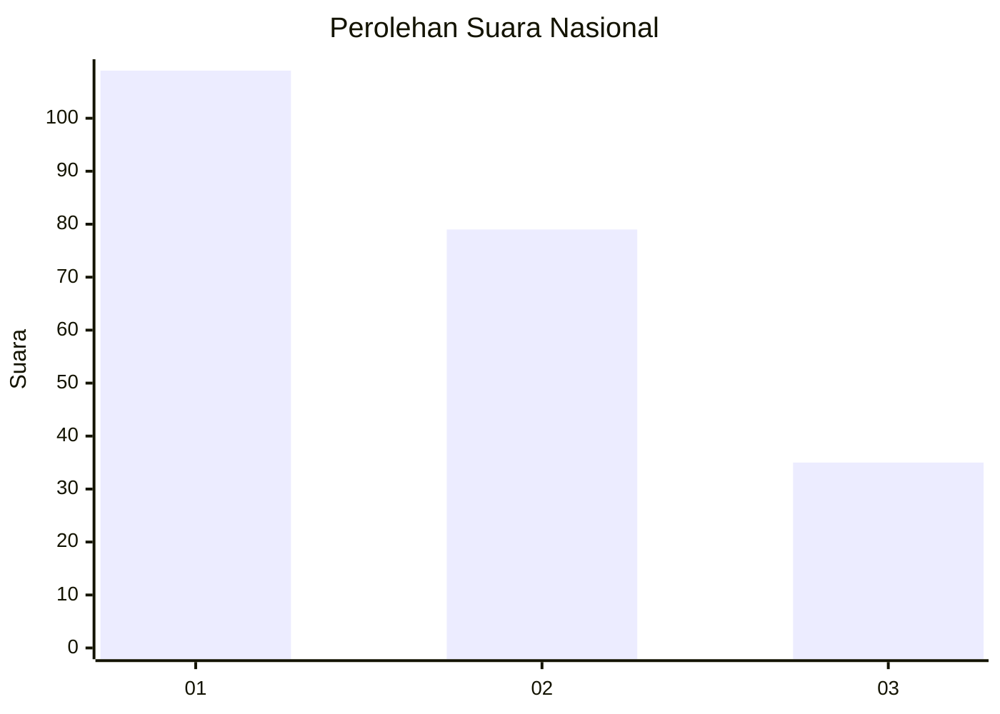
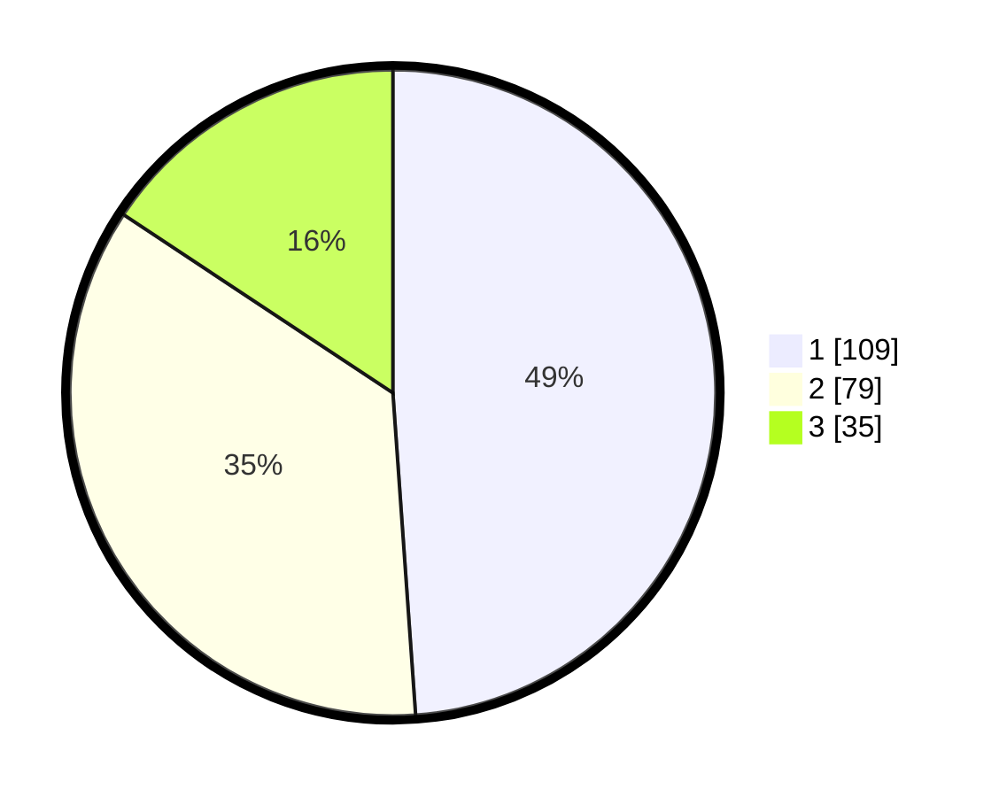

# Hasil

## Grafik

## Tabel

| No.    | Nama Paslon    | Suara | Suara (raw) | Persentase |
|:------ |:-------------- | -----:| -----------:| ----------:|
| 100025 | ANIES MUHAIMIN | 109   | [109][p-1]  | 48,88      |
| 100026 | PRABOWO GIBRAN | 79    | [79][p-2]   | 35,43      |
| 100027 | GANJAR MAHFUD  | 35    | [35][p-3]   | 15,70      |

[p-1]: https://github.com/gigit-pemilu/pemilu-2024/blob/main/pilpres/hitung-suara/sub/31-dki-jakarta/sub/74-jakarta-selatan/sub/04-pasar-minggu/sub/1004-ragunan/sub/108-tps/sub/paslon-1.txt
[p-2]: https://github.com/gigit-pemilu/pemilu-2024/blob/main/pilpres/hitung-suara/sub/31-dki-jakarta/sub/74-jakarta-selatan/sub/04-pasar-minggu/sub/1004-ragunan/sub/108-tps/sub/paslon-2.txt
[p-3]: https://github.com/gigit-pemilu/pemilu-2024/blob/main/pilpres/hitung-suara/sub/31-dki-jakarta/sub/74-jakarta-selatan/sub/04-pasar-minggu/sub/1004-ragunan/sub/108-tps/sub/paslon-3.txt

## Foto C Plano

https://sirekap-obj-formc.kpu.go.id/d270/pemilu/ppwp/31/74/04/10/04/3174041004108-20240214-212811--e919b8f8-ee1e-47b8-8b80-8a09b0463e83.jpg

https://sirekap-obj-formc.kpu.go.id/d270/pemilu/ppwp/31/74/04/10/04/3174041004108-20240214-212856--11b4735e-ae4a-4588-872b-e79dbffb1f72.jpg

https://sirekap-obj-formc.kpu.go.id/d270/pemilu/ppwp/31/74/04/10/04/3174041004108-20240214-212916--25909837-0231-4e89-9f29-3118dc1d183d.jpg

## Metadata

| Key        | Value               |
| ---------- | ------------------- |
| Time Stamp | 2024-02-24 22:31:28 |

