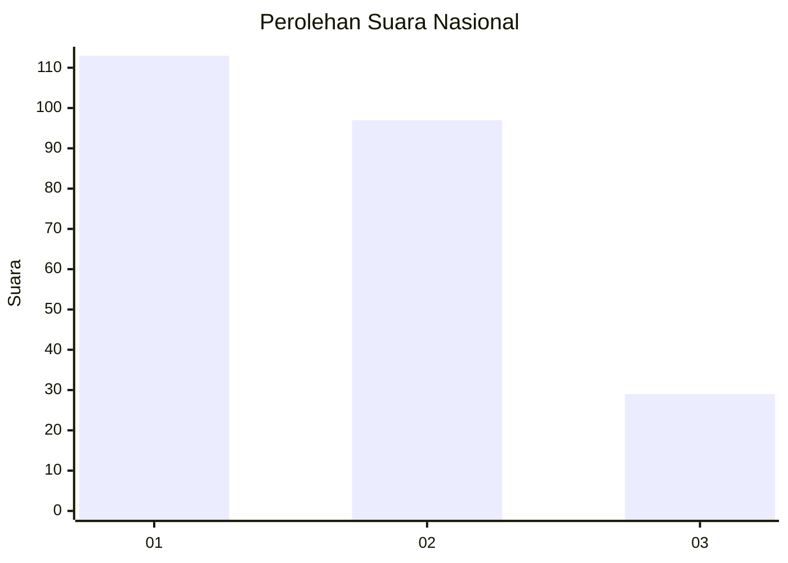
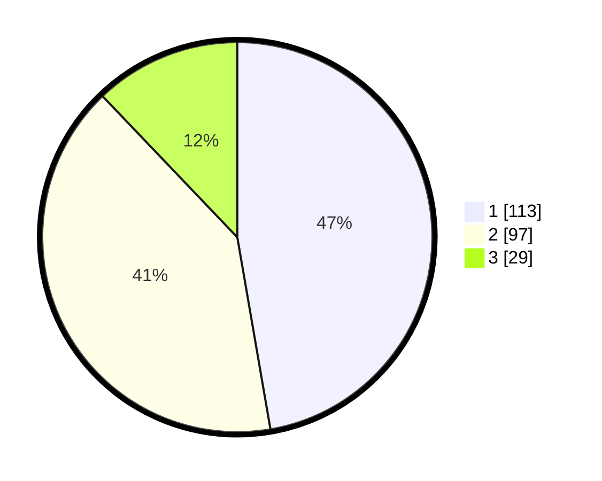

# Hasil

## Grafik

## Tabel

| No.    | Nama Paslon    | Suara | Suara (raw) | Persentase |
|:------ |:-------------- | -----:| -----------:| ----------:|
| 100025 | ANIES MUHAIMIN | 113   | [113][p-1]  | 47,28      |
| 100026 | PRABOWO GIBRAN | 97    | [97][p-2]   | 40,59      |
| 100027 | GANJAR MAHFUD  | 29    | [29][p-3]   | 12,13      |

[p-1]: https://github.com/gigit-pemilu/pemilu-2024/blob/main/pilpres/hitung-suara/sub/31-dki-jakarta/sub/74-jakarta-selatan/sub/04-pasar-minggu/sub/1004-ragunan/sub/112-tps/sub/paslon-1.txt
[p-2]: https://github.com/gigit-pemilu/pemilu-2024/blob/main/pilpres/hitung-suara/sub/31-dki-jakarta/sub/74-jakarta-selatan/sub/04-pasar-minggu/sub/1004-ragunan/sub/112-tps/sub/paslon-2.txt
[p-3]: https://github.com/gigit-pemilu/pemilu-2024/blob/main/pilpres/hitung-suara/sub/31-dki-jakarta/sub/74-jakarta-selatan/sub/04-pasar-minggu/sub/1004-ragunan/sub/112-tps/sub/paslon-3.txt

## Foto C Plano

https://sirekap-obj-formc.kpu.go.id/5fdb/pemilu/ppwp/31/74/04/10/04/3174041004112-20240214-211957--ea09439a-2cd1-4e1a-a616-35d28fc2cfb6.jpg

https://sirekap-obj-formc.kpu.go.id/5fdb/pemilu/ppwp/31/74/04/10/04/3174041004112-20240214-212306--33bcdd94-6500-45ad-ab30-cad56efb8563.jpg

https://sirekap-obj-formc.kpu.go.id/5fdb/pemilu/ppwp/31/74/04/10/04/3174041004112-20240214-212502--31dd2239-cea1-4fe4-9a72-168bc40949fd.jpg

## Metadata

| Key        | Value               |
| ---------- | ------------------- |
| Time Stamp | 2024-02-24 22:31:28 |

