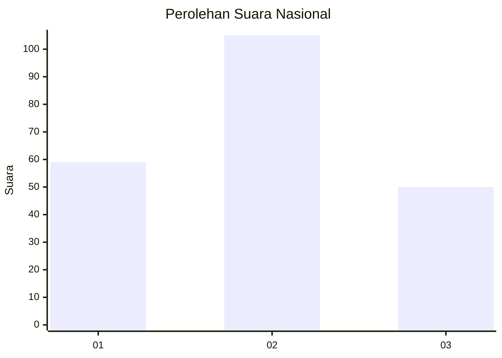
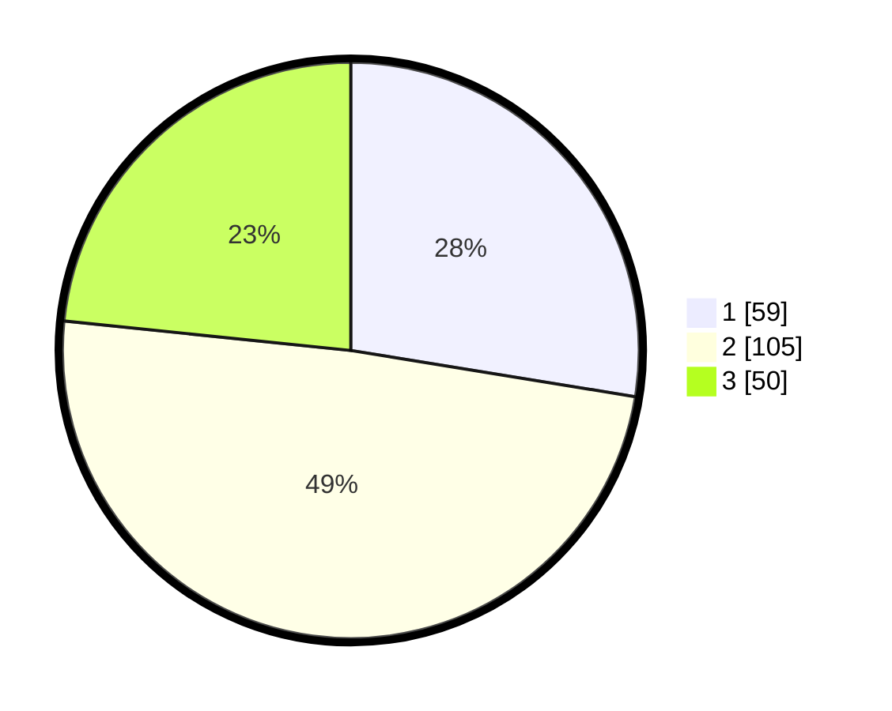

# Hasil

## Grafik

## Tabel

| No.    | Nama Paslon    | Suara | Suara (raw) | Persentase |
|:------ |:-------------- | -----:| -----------:| ----------:|
| 100025 | ANIES MUHAIMIN | 59    | [59][p-1]   | 27,57      |
| 100026 | PRABOWO GIBRAN | 105   | [105][p-2]  | 49,07      |
| 100027 | GANJAR MAHFUD  | 50    | [50][p-3]   | 23,36      |

[p-1]: https://github.com/gigit-pemilu/pemilu-2024/blob/main/pilpres/hitung-suara/sub/31-dki-jakarta/sub/74-jakarta-selatan/sub/04-pasar-minggu/sub/1004-ragunan/sub/115-tps/sub/paslon-1.txt
[p-2]: https://github.com/gigit-pemilu/pemilu-2024/blob/main/pilpres/hitung-suara/sub/31-dki-jakarta/sub/74-jakarta-selatan/sub/04-pasar-minggu/sub/1004-ragunan/sub/115-tps/sub/paslon-2.txt
[p-3]: https://github.com/gigit-pemilu/pemilu-2024/blob/main/pilpres/hitung-suara/sub/31-dki-jakarta/sub/74-jakarta-selatan/sub/04-pasar-minggu/sub/1004-ragunan/sub/115-tps/sub/paslon-3.txt

## Foto C Plano

https://sirekap-obj-formc.kpu.go.id/fa3f/pemilu/ppwp/31/74/04/10/04/3174041004115-20240214-224200--ccc0fd1b-9110-48a0-ae48-e7f4b8516c25.jpg

https://sirekap-obj-formc.kpu.go.id/fa3f/pemilu/ppwp/31/74/04/10/04/3174041004115-20240214-221313--4bc45eb0-b6c0-43d1-a37e-e5a6e5d6393a.jpg

https://sirekap-obj-formc.kpu.go.id/fa3f/pemilu/ppwp/31/74/04/10/04/3174041004115-20240214-221606--ee1d899f-ee5e-4509-8976-06e7eb452eb0.jpg

## Metadata

| Key        | Value               |
| ---------- | ------------------- |
| Time Stamp | 2024-02-24 22:31:28 |

