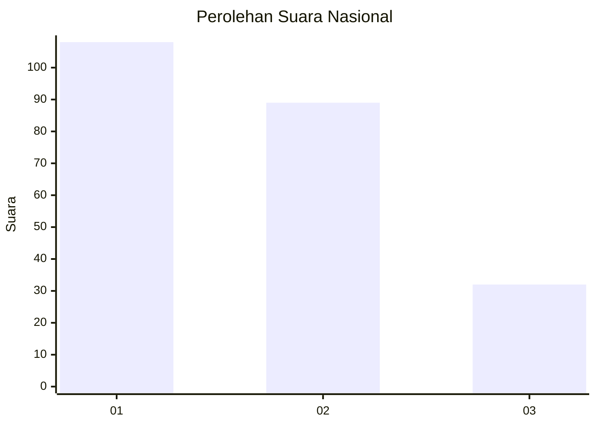
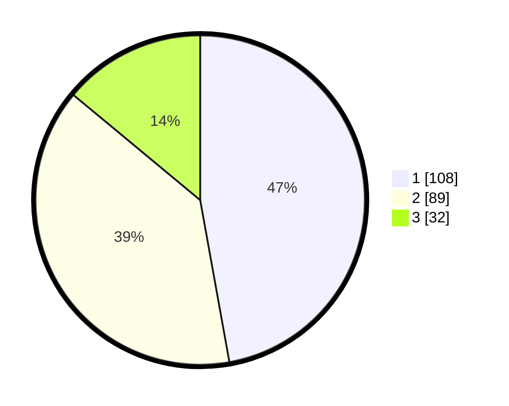

# Hasil

## Grafik

## Tabel

| No.    | Nama Paslon    | Suara | Suara (raw) | Persentase |
|:------ |:-------------- | -----:| -----------:| ----------:|
| 100025 | ANIES MUHAIMIN | 108   | [108][p-1]  | 47,16      |
| 100026 | PRABOWO GIBRAN | 89    | [89][p-2]   | 38,86      |
| 100027 | GANJAR MAHFUD  | 32    | [32][p-3]   | 13,97      |

[p-1]: https://github.com/gigit-pemilu/pemilu-2024/blob/main/pilpres/hitung-suara/sub/31-dki-jakarta/sub/74-jakarta-selatan/sub/04-pasar-minggu/sub/1004-ragunan/sub/123-tps/sub/paslon-1.txt
[p-2]: https://github.com/gigit-pemilu/pemilu-2024/blob/main/pilpres/hitung-suara/sub/31-dki-jakarta/sub/74-jakarta-selatan/sub/04-pasar-minggu/sub/1004-ragunan/sub/123-tps/sub/paslon-2.txt
[p-3]: https://github.com/gigit-pemilu/pemilu-2024/blob/main/pilpres/hitung-suara/sub/31-dki-jakarta/sub/74-jakarta-selatan/sub/04-pasar-minggu/sub/1004-ragunan/sub/123-tps/sub/paslon-3.txt

## Foto C Plano

https://sirekap-obj-formc.kpu.go.id/0246/pemilu/ppwp/31/74/04/10/04/3174041004123-20240214-214700--7d342559-c82b-400c-91b1-8b28c7154646.jpg

https://sirekap-obj-formc.kpu.go.id/0246/pemilu/ppwp/31/74/04/10/04/3174041004123-20240215-060037--7f15edf4-7941-4f3a-8a61-7af0e46ba49a.jpg

https://sirekap-obj-formc.kpu.go.id/0246/pemilu/ppwp/31/74/04/10/04/3174041004123-20240214-193454--cf7a346a-f4f7-4737-be64-9bc2a947e777.jpg

## Metadata

| Key        | Value               |
| ---------- | ------------------- |
| Time Stamp | 2024-02-24 22:31:28 |

