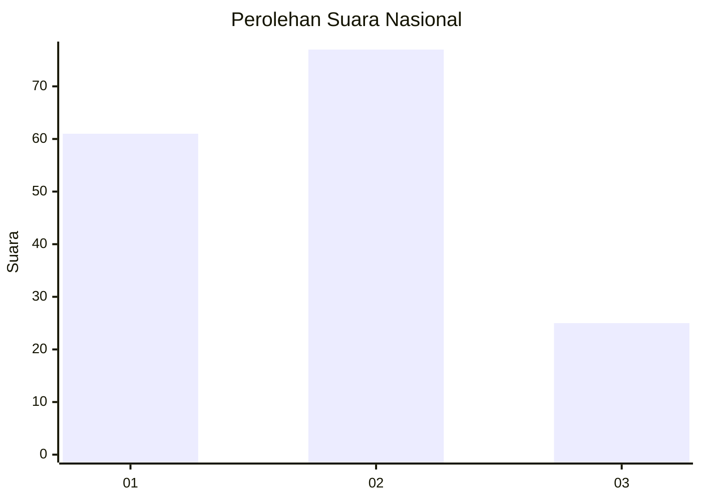
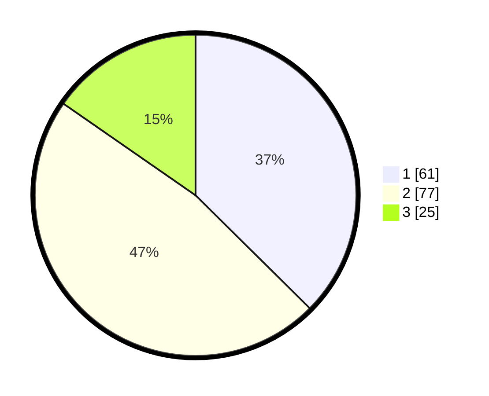

# Hasil

## Grafik

## Tabel

| No.    | Nama Paslon    | Suara | Suara (raw) | Persentase |
|:------ |:-------------- | -----:| -----------:| ----------:|
| 100025 | ANIES MUHAIMIN | 61    | [61][p-1]   | 37,42      |
| 100026 | PRABOWO GIBRAN | 77    | [77][p-2]   | 47,24      |
| 100027 | GANJAR MAHFUD  | 25    | [25][p-3]   | 15,34      |

[p-1]: https://github.com/gigit-pemilu/pemilu-2024/blob/main/pilpres/hitung-suara/sub/31-dki-jakarta/sub/74-jakarta-selatan/sub/04-pasar-minggu/sub/1004-ragunan/sub/124-tps/sub/paslon-1.txt
[p-2]: https://github.com/gigit-pemilu/pemilu-2024/blob/main/pilpres/hitung-suara/sub/31-dki-jakarta/sub/74-jakarta-selatan/sub/04-pasar-minggu/sub/1004-ragunan/sub/124-tps/sub/paslon-2.txt
[p-3]: https://github.com/gigit-pemilu/pemilu-2024/blob/main/pilpres/hitung-suara/sub/31-dki-jakarta/sub/74-jakarta-selatan/sub/04-pasar-minggu/sub/1004-ragunan/sub/124-tps/sub/paslon-3.txt

## Foto C Plano

https://sirekap-obj-formc.kpu.go.id/e361/pemilu/ppwp/31/74/04/10/04/3174041004124-20240214-191640--3f1d607f-85e3-414c-a857-56f1d81dbd31.jpg

https://sirekap-obj-formc.kpu.go.id/e361/pemilu/ppwp/31/74/04/10/04/3174041004124-20240214-190251--2f63fb87-0377-4568-b643-208d811c1299.jpg

https://sirekap-obj-formc.kpu.go.id/e361/pemilu/ppwp/31/74/04/10/04/3174041004124-20240214-191750--3eb14161-042f-43de-ad9f-e215492d5f1a.jpg

## Metadata

| Key        | Value               |
| ---------- | ------------------- |
| Time Stamp | 2024-02-25 15:00:00 |

