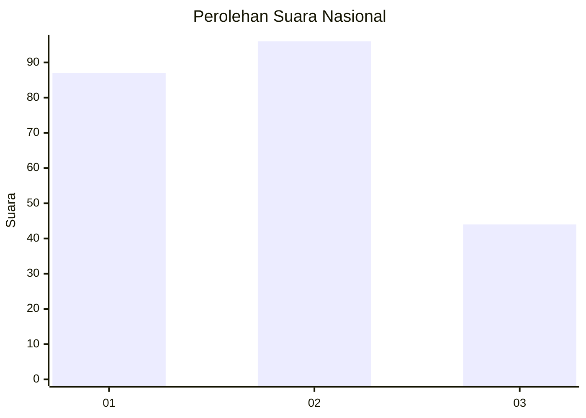
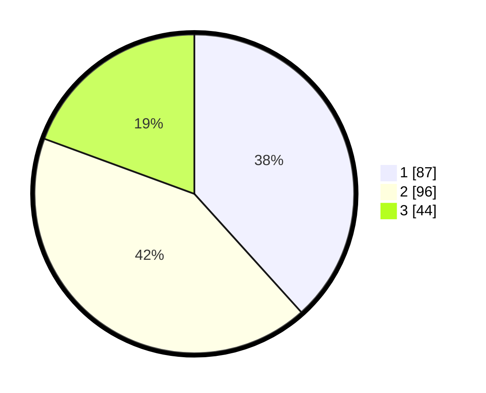

# Hasil

## Grafik

## Tabel

| No.    | Nama Paslon    | Suara | Suara (raw) | Persentase |
|:------ |:-------------- | -----:| -----------:| ----------:|
| 100025 | ANIES MUHAIMIN | 87    | [87][p-1]   | 38,33      |
| 100026 | PRABOWO GIBRAN | 96    | [96][p-2]   | 42,29      |
| 100027 | GANJAR MAHFUD  | 44    | [44][p-3]   | 19,38      |

[p-1]: https://github.com/gigit-pemilu/pemilu-2024/blob/main/pilpres/hitung-suara/sub/31-dki-jakarta/sub/74-jakarta-selatan/sub/04-pasar-minggu/sub/1005-pejaten-timur/sub/014-tps/sub/paslon-1.txt
[p-2]: https://github.com/gigit-pemilu/pemilu-2024/blob/main/pilpres/hitung-suara/sub/31-dki-jakarta/sub/74-jakarta-selatan/sub/04-pasar-minggu/sub/1005-pejaten-timur/sub/014-tps/sub/paslon-2.txt
[p-3]: https://github.com/gigit-pemilu/pemilu-2024/blob/main/pilpres/hitung-suara/sub/31-dki-jakarta/sub/74-jakarta-selatan/sub/04-pasar-minggu/sub/1005-pejaten-timur/sub/014-tps/sub/paslon-3.txt

## Foto C Plano

https://sirekap-obj-formc.kpu.go.id/7de0/pemilu/ppwp/31/74/04/10/05/3174041005014-20240214-230045--555db08a-108a-425a-9a0e-2fa013534e65.jpg

https://sirekap-obj-formc.kpu.go.id/7de0/pemilu/ppwp/31/74/04/10/05/3174041005014-20240214-230127--2a0574b7-b64a-4fa5-9463-0e98f721ca3d.jpg

https://sirekap-obj-formc.kpu.go.id/7de0/pemilu/ppwp/31/74/04/10/05/3174041005014-20240214-230200--283c15c9-73c1-442d-aefa-3bf3be956c58.jpg

## Metadata

| Key        | Value               |
| ---------- | ------------------- |
| Time Stamp | 2024-02-25 00:00:00 |

