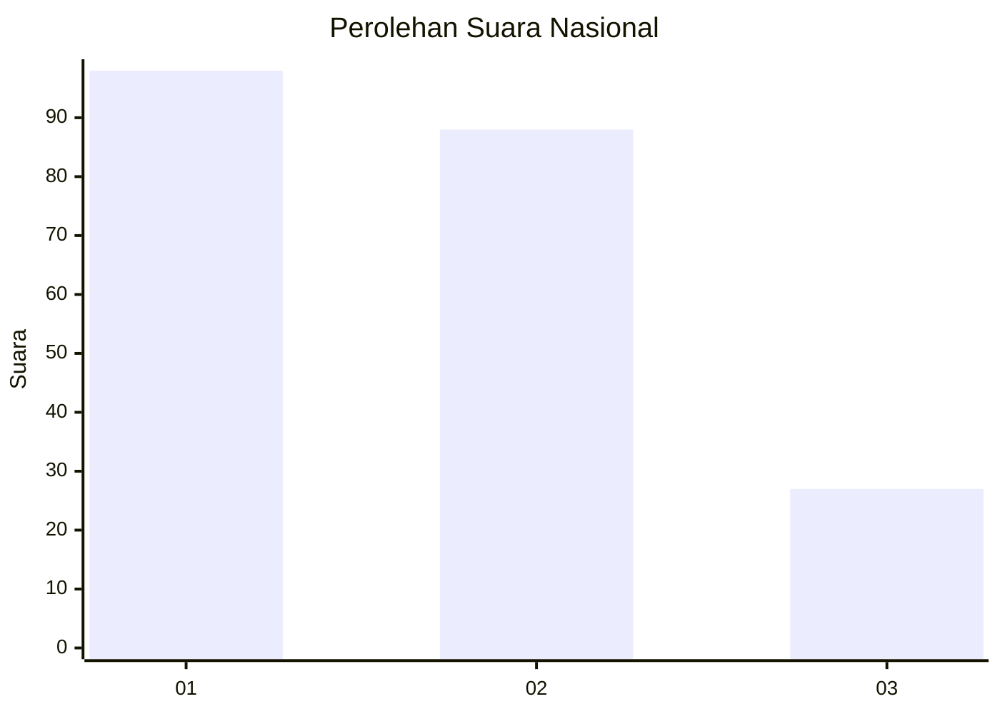
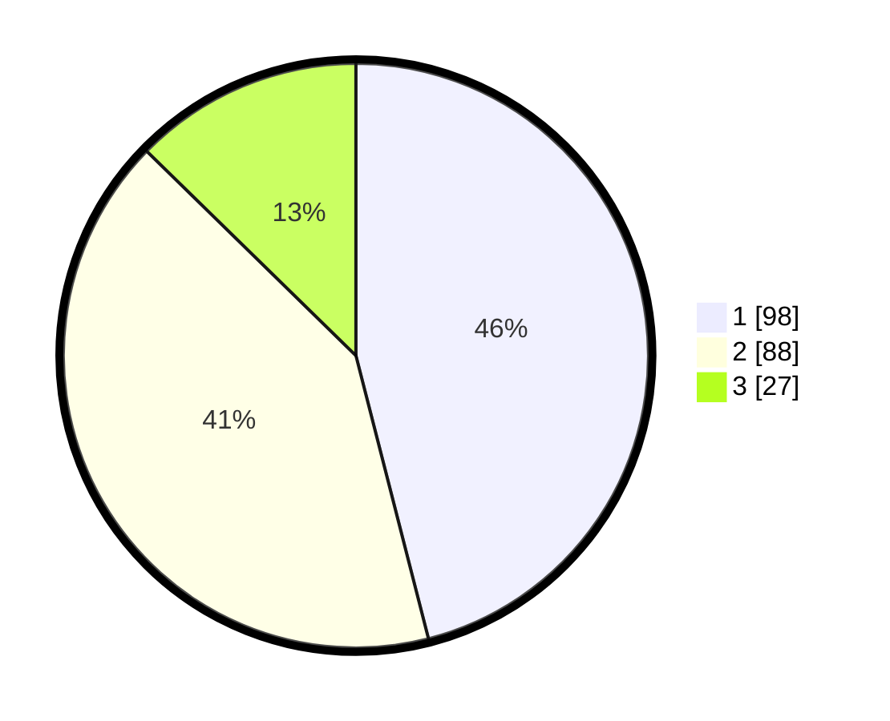

# Hasil

## Grafik

## Tabel

| No.    | Nama Paslon    | Suara | Suara (raw) | Persentase |
|:------ |:-------------- | -----:| -----------:| ----------:|
| 100025 | ANIES MUHAIMIN | 98    | [98][p-1]   | 46,01      |
| 100026 | PRABOWO GIBRAN | 88    | [88][p-2]   | 41,31      |
| 100027 | GANJAR MAHFUD  | 27    | [27][p-3]   | 12,68      |

[p-1]: https://github.com/gigit-pemilu/pemilu-2024/blob/main/pilpres/hitung-suara/sub/31-dki-jakarta/sub/74-jakarta-selatan/sub/04-pasar-minggu/sub/1005-pejaten-timur/sub/015-tps/sub/paslon-1.txt
[p-2]: https://github.com/gigit-pemilu/pemilu-2024/blob/main/pilpres/hitung-suara/sub/31-dki-jakarta/sub/74-jakarta-selatan/sub/04-pasar-minggu/sub/1005-pejaten-timur/sub/015-tps/sub/paslon-2.txt
[p-3]: https://github.com/gigit-pemilu/pemilu-2024/blob/main/pilpres/hitung-suara/sub/31-dki-jakarta/sub/74-jakarta-selatan/sub/04-pasar-minggu/sub/1005-pejaten-timur/sub/015-tps/sub/paslon-3.txt

## Foto C Plano

https://sirekap-obj-formc.kpu.go.id/bae9/pemilu/ppwp/31/74/04/10/05/3174041005015-20240214-220757--075232f5-0543-49fe-a3dc-3363062da25e.jpg

https://sirekap-obj-formc.kpu.go.id/bae9/pemilu/ppwp/31/74/04/10/05/3174041005015-20240214-220831--536a1264-e37a-4b8b-941b-cc61837bb852.jpg

https://sirekap-obj-formc.kpu.go.id/bae9/pemilu/ppwp/31/74/04/10/05/3174041005015-20240214-220936--4d7516c8-67cb-4938-924f-c1bb69b0f322.jpg

## Metadata

| Key        | Value               |
| ---------- | ------------------- |
| Time Stamp | 2024-02-25 10:00:00 |

