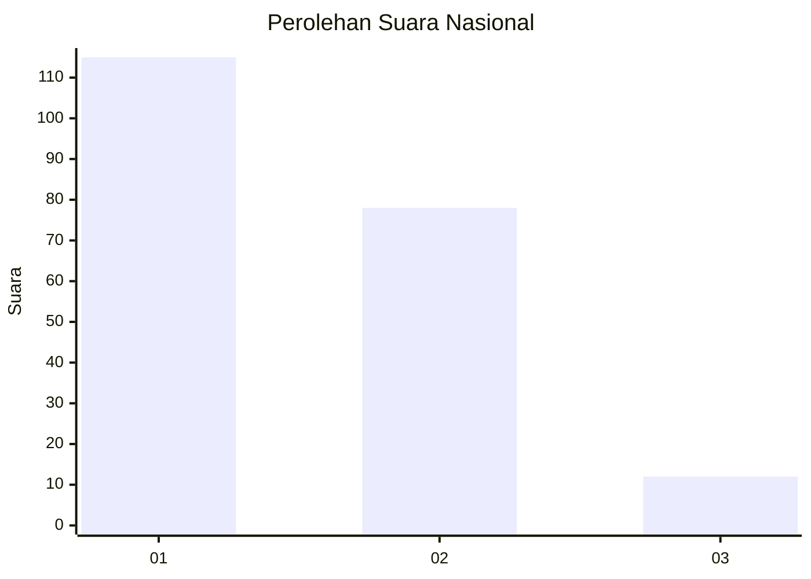
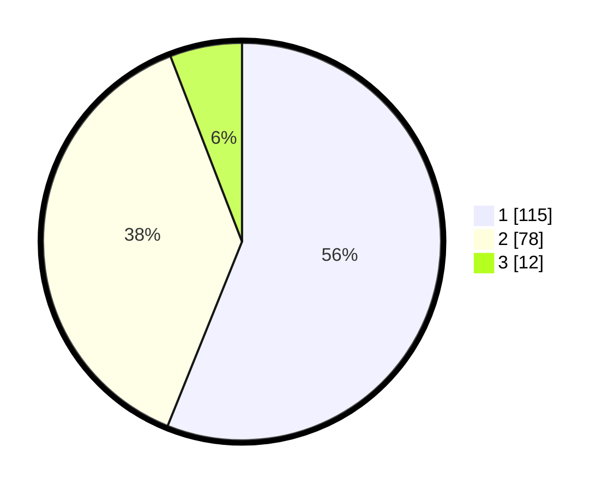

# Hasil

## Grafik

## Tabel

| No.    | Nama Paslon    | Suara | Suara (raw) | Persentase |
|:------ |:-------------- | -----:| -----------:| ----------:|
| 100025 | ANIES MUHAIMIN | 115   | [115][p-1]  | 56,10      |
| 100026 | PRABOWO GIBRAN | 78    | [78][p-2]   | 38,05      |
| 100027 | GANJAR MAHFUD  | 12    | [12][p-3]   | 5,85       |

[p-1]: https://github.com/gigit-pemilu/pemilu-2024/blob/main/pilpres/hitung-suara/sub/31-dki-jakarta/sub/74-jakarta-selatan/sub/04-pasar-minggu/sub/1005-pejaten-timur/sub/028-tps/sub/paslon-1.txt
[p-2]: https://github.com/gigit-pemilu/pemilu-2024/blob/main/pilpres/hitung-suara/sub/31-dki-jakarta/sub/74-jakarta-selatan/sub/04-pasar-minggu/sub/1005-pejaten-timur/sub/028-tps/sub/paslon-2.txt
[p-3]: https://github.com/gigit-pemilu/pemilu-2024/blob/main/pilpres/hitung-suara/sub/31-dki-jakarta/sub/74-jakarta-selatan/sub/04-pasar-minggu/sub/1005-pejaten-timur/sub/028-tps/sub/paslon-3.txt

## Foto C Plano

https://sirekap-obj-formc.kpu.go.id/a6a2/pemilu/ppwp/31/74/04/10/05/3174041005028-20240215-220234--d1a10f60-2f03-4278-a43f-1f1ca2adfd01.jpg

https://sirekap-obj-formc.kpu.go.id/a6a2/pemilu/ppwp/31/74/04/10/05/3174041005028-20240215-220239--f2e785cc-6a7f-4287-93a2-358261f2730b.jpg

https://sirekap-obj-formc.kpu.go.id/a6a2/pemilu/ppwp/31/74/04/10/05/3174041005028-20240215-220244--74813221-6d9d-4824-a2de-ef86c7967eff.jpg

## Metadata

| Key        | Value               |
| ---------- | ------------------- |
| Time Stamp | 2024-02-24 22:31:28 |

