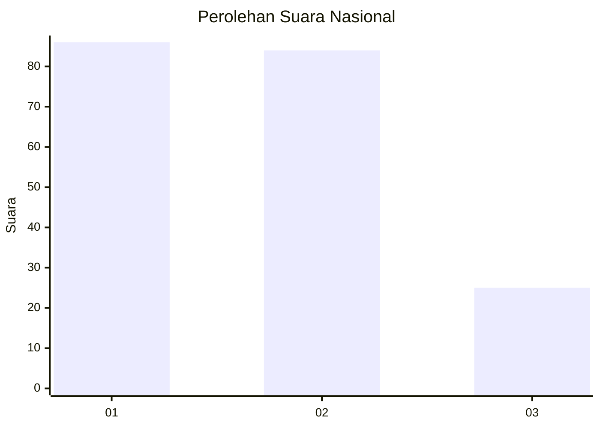
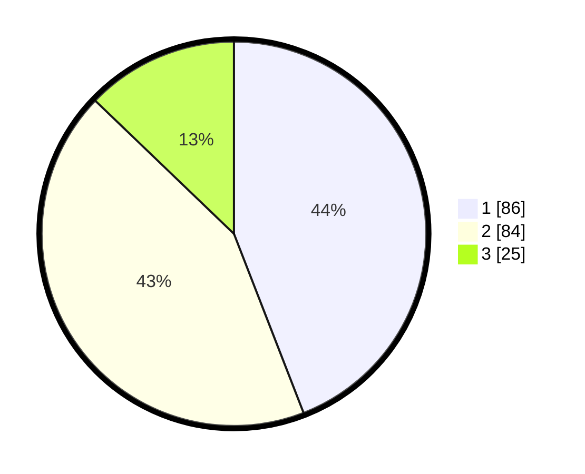

# Hasil

## Grafik

## Tabel

| No.    | Nama Paslon    | Suara | Suara (raw) | Persentase |
|:------ |:-------------- | -----:| -----------:| ----------:|
| 100025 | ANIES MUHAIMIN | 86    | [86][p-1]   | 44,10      |
| 100026 | PRABOWO GIBRAN | 84    | [84][p-2]   | 43,08      |
| 100027 | GANJAR MAHFUD  | 25    | [25][p-3]   | 12,82      |

[p-1]: https://github.com/gigit-pemilu/pemilu-2024/blob/main/pilpres/hitung-suara/sub/31-dki-jakarta/sub/74-jakarta-selatan/sub/04-pasar-minggu/sub/1005-pejaten-timur/sub/030-tps/sub/paslon-1.txt
[p-2]: https://github.com/gigit-pemilu/pemilu-2024/blob/main/pilpres/hitung-suara/sub/31-dki-jakarta/sub/74-jakarta-selatan/sub/04-pasar-minggu/sub/1005-pejaten-timur/sub/030-tps/sub/paslon-2.txt
[p-3]: https://github.com/gigit-pemilu/pemilu-2024/blob/main/pilpres/hitung-suara/sub/31-dki-jakarta/sub/74-jakarta-selatan/sub/04-pasar-minggu/sub/1005-pejaten-timur/sub/030-tps/sub/paslon-3.txt

## Foto C Plano

https://sirekap-obj-formc.kpu.go.id/7d95/pemilu/ppwp/31/74/04/10/05/3174041005030-20240214-215505--164bf567-03e8-4464-bd7d-35071dee0a24.jpg

https://sirekap-obj-formc.kpu.go.id/7d95/pemilu/ppwp/31/74/04/10/05/3174041005030-20240214-190300--0bd2a5b8-dc64-4d82-99c7-17688bef6b30.jpg

https://sirekap-obj-formc.kpu.go.id/7d95/pemilu/ppwp/31/74/04/10/05/3174041005030-20240214-215214--f1d50298-dc85-43d0-bd89-dd03aac8d792.jpg

## Metadata

| Key        | Value               |
| ---------- | ------------------- |
| Time Stamp | 2024-02-24 22:31:28 |

