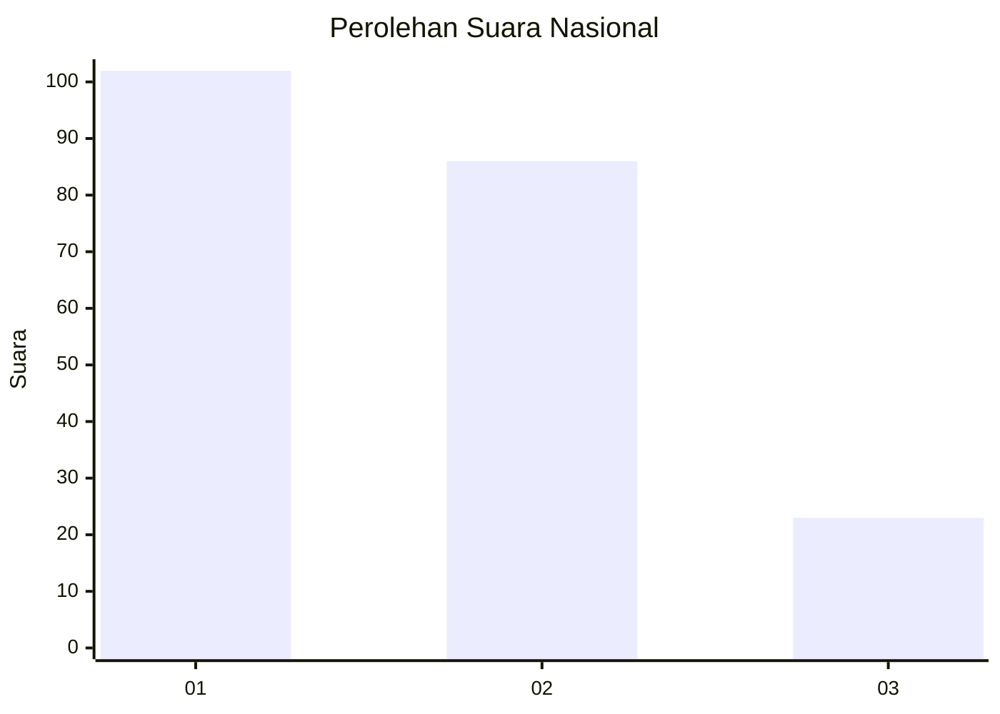
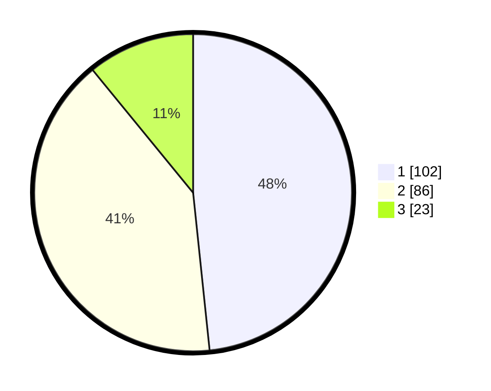

# Hasil

## Grafik

## Tabel

| No.    | Nama Paslon    | Suara | Suara (raw) | Persentase |
|:------ |:-------------- | -----:| -----------:| ----------:|
| 100025 | ANIES MUHAIMIN | 102   | [102][p-1]  | 48,34      |
| 100026 | PRABOWO GIBRAN | 86    | [86][p-2]   | 40,76      |
| 100027 | GANJAR MAHFUD  | 23    | [23][p-3]   | 10,90      |

[p-1]: https://github.com/gigit-pemilu/pemilu-2024/blob/main/pilpres/hitung-suara/sub/31-dki-jakarta/sub/74-jakarta-selatan/sub/04-pasar-minggu/sub/1005-pejaten-timur/sub/032-tps/sub/paslon-1.txt
[p-2]: https://github.com/gigit-pemilu/pemilu-2024/blob/main/pilpres/hitung-suara/sub/31-dki-jakarta/sub/74-jakarta-selatan/sub/04-pasar-minggu/sub/1005-pejaten-timur/sub/032-tps/sub/paslon-2.txt
[p-3]: https://github.com/gigit-pemilu/pemilu-2024/blob/main/pilpres/hitung-suara/sub/31-dki-jakarta/sub/74-jakarta-selatan/sub/04-pasar-minggu/sub/1005-pejaten-timur/sub/032-tps/sub/paslon-3.txt

## Foto C Plano

https://sirekap-obj-formc.kpu.go.id/b8a1/pemilu/ppwp/31/74/04/10/05/3174041005032-20240214-215713--1339f403-5ba7-4f2b-bce6-30cf0a5ef471.jpg

https://sirekap-obj-formc.kpu.go.id/b8a1/pemilu/ppwp/31/74/04/10/05/3174041005032-20240214-215736--0190a05b-e497-407a-bbbb-7b100ffee5ec.jpg

https://sirekap-obj-formc.kpu.go.id/b8a1/pemilu/ppwp/31/74/04/10/05/3174041005032-20240214-215748--eee45aa1-543b-40dd-8542-9d9a3f93458a.jpg

## Metadata

| Key        | Value               |
| ---------- | ------------------- |
| Time Stamp | 2024-02-24 22:31:28 |

