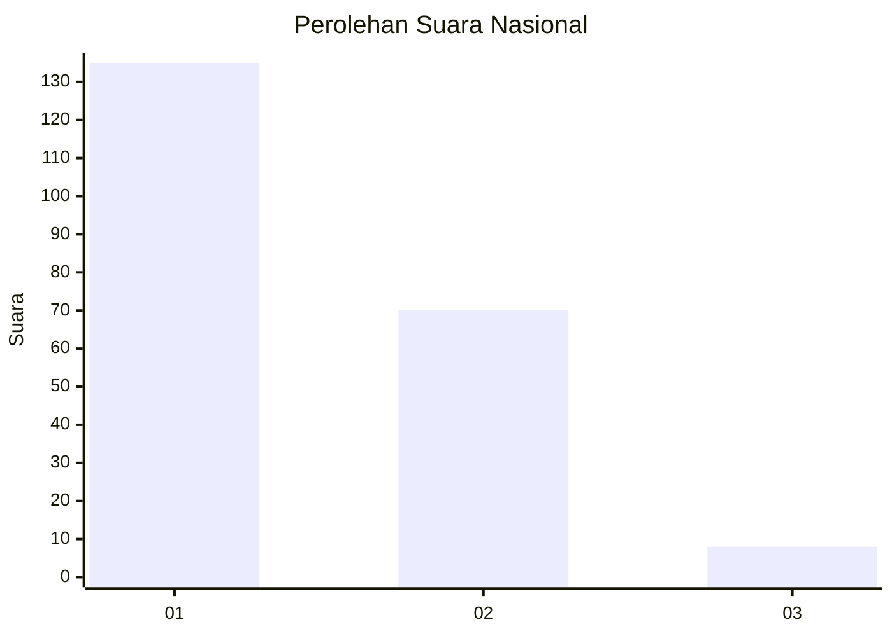
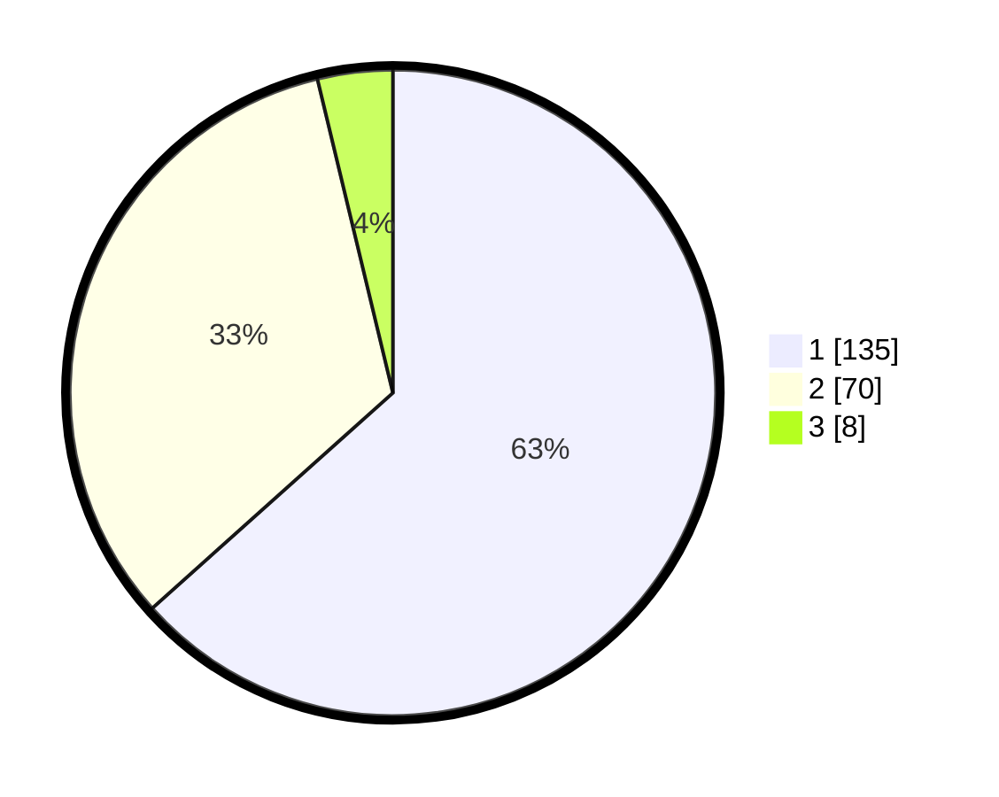

# Hasil

## Grafik

## Tabel

| No.    | Nama Paslon    | Suara | Suara (raw) | Persentase |
|:------ |:-------------- | -----:| -----------:| ----------:|
| 100025 | ANIES MUHAIMIN | 135   | [135][p-1]  | 63,38      |
| 100026 | PRABOWO GIBRAN | 70    | [70][p-2]   | 32,86      |
| 100027 | GANJAR MAHFUD  | 8     | [8][p-3]    | 3,76       |

[p-1]: https://github.com/gigit-pemilu/pemilu-2024/blob/main/pilpres/hitung-suara/sub/31-dki-jakarta/sub/74-jakarta-selatan/sub/04-pasar-minggu/sub/1005-pejaten-timur/sub/049-tps/sub/paslon-1.txt
[p-2]: https://github.com/gigit-pemilu/pemilu-2024/blob/main/pilpres/hitung-suara/sub/31-dki-jakarta/sub/74-jakarta-selatan/sub/04-pasar-minggu/sub/1005-pejaten-timur/sub/049-tps/sub/paslon-2.txt
[p-3]: https://github.com/gigit-pemilu/pemilu-2024/blob/main/pilpres/hitung-suara/sub/31-dki-jakarta/sub/74-jakarta-selatan/sub/04-pasar-minggu/sub/1005-pejaten-timur/sub/049-tps/sub/paslon-3.txt

## Foto C Plano

https://sirekap-obj-formc.kpu.go.id/792e/pemilu/ppwp/31/74/04/10/05/3174041005049-20240214-160126--d6fbaab9-6538-4591-9505-004dce97b4dc.jpg

https://sirekap-obj-formc.kpu.go.id/792e/pemilu/ppwp/31/74/04/10/05/3174041005049-20240215-210421--a9d5a386-59cb-49b8-bd0b-4bec81bd0c48.jpg

https://sirekap-obj-formc.kpu.go.id/792e/pemilu/ppwp/31/74/04/10/05/3174041005049-20240214-155623--6f9bde3c-f727-49fa-bf6a-ee64ac89409f.jpg

## Metadata

| Key        | Value               |
| ---------- | ------------------- |
| Time Stamp | 2024-02-25 11:00:00 |

