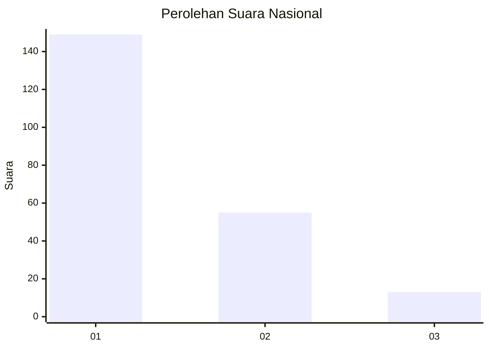
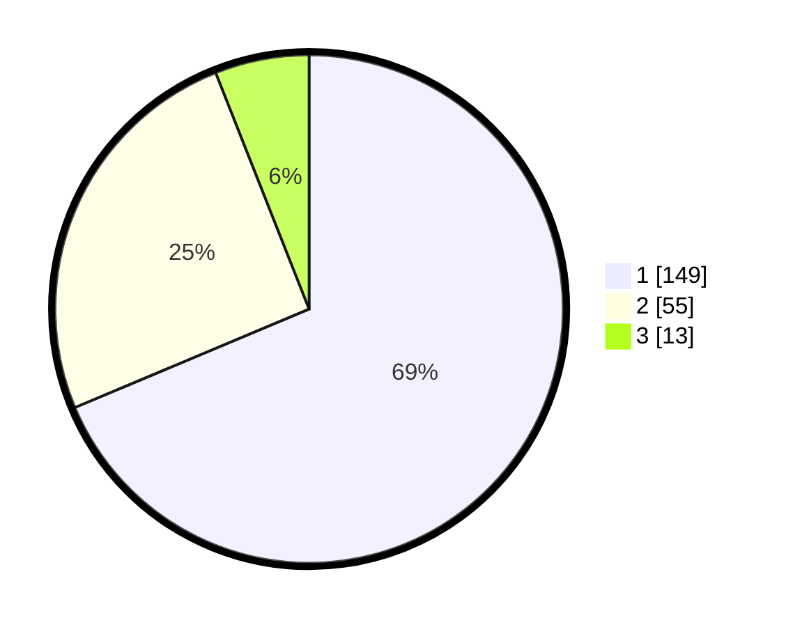

# Hasil

## Grafik

## Tabel

| No.    | Nama Paslon    | Suara | Suara (raw) | Persentase |
|:------ |:-------------- | -----:| -----------:| ----------:|
| 100025 | ANIES MUHAIMIN | 149   | [149][p-1]  | 68,66      |
| 100026 | PRABOWO GIBRAN | 55    | [55][p-2]   | 25,35      |
| 100027 | GANJAR MAHFUD  | 13    | [13][p-3]   | 5,99       |

[p-1]: https://github.com/gigit-pemilu/pemilu-2024/blob/main/pilpres/hitung-suara/sub/31-dki-jakarta/sub/74-jakarta-selatan/sub/04-pasar-minggu/sub/1005-pejaten-timur/sub/050-tps/sub/paslon-1.txt
[p-2]: https://github.com/gigit-pemilu/pemilu-2024/blob/main/pilpres/hitung-suara/sub/31-dki-jakarta/sub/74-jakarta-selatan/sub/04-pasar-minggu/sub/1005-pejaten-timur/sub/050-tps/sub/paslon-2.txt
[p-3]: https://github.com/gigit-pemilu/pemilu-2024/blob/main/pilpres/hitung-suara/sub/31-dki-jakarta/sub/74-jakarta-selatan/sub/04-pasar-minggu/sub/1005-pejaten-timur/sub/050-tps/sub/paslon-3.txt

## Foto C Plano

https://sirekap-obj-formc.kpu.go.id/7ae9/pemilu/ppwp/31/74/04/10/05/3174041005050-20240215-014721--beee0f1f-c194-46af-a2bb-8c31825c8b07.jpg

https://sirekap-obj-formc.kpu.go.id/7ae9/pemilu/ppwp/31/74/04/10/05/3174041005050-20240215-014806--7a3989eb-a6e9-4537-8f27-b1ffef3dd4a6.jpg

https://sirekap-obj-formc.kpu.go.id/7ae9/pemilu/ppwp/31/74/04/10/05/3174041005050-20240215-015349--3b7e0a62-b310-41b9-bb47-8f4bb382fba9.jpg

## Metadata

| Key        | Value               |
| ---------- | ------------------- |
| Time Stamp | 2024-02-25 10:00:00 |

