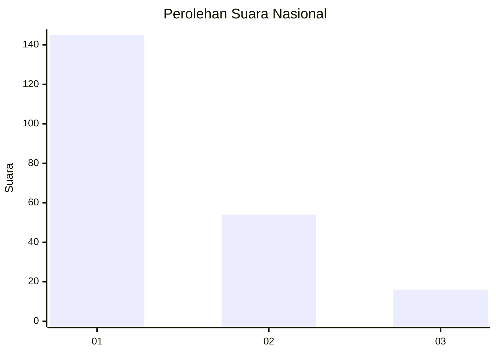
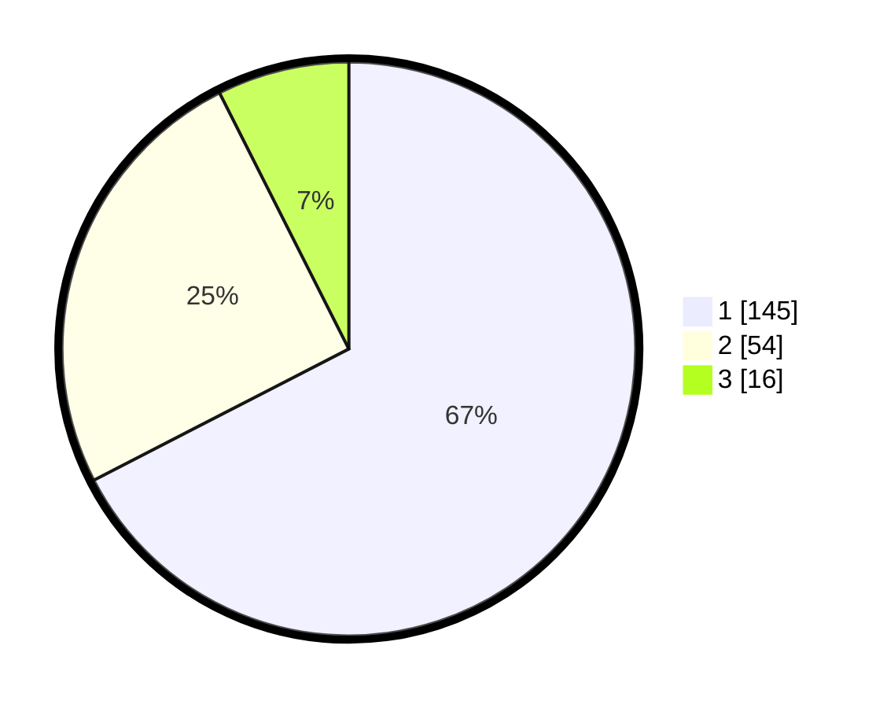

# Hasil

## Grafik

## Tabel

| No.    | Nama Paslon    | Suara | Suara (raw) | Persentase |
|:------ |:-------------- | -----:| -----------:| ----------:|
| 100025 | ANIES MUHAIMIN | 145   | [145][p-1]  | 67,44      |
| 100026 | PRABOWO GIBRAN | 54    | [54][p-2]   | 25,12      |
| 100027 | GANJAR MAHFUD  | 16    | [16][p-3]   | 7,44       |

[p-1]: https://github.com/gigit-pemilu/pemilu-2024/blob/main/pilpres/hitung-suara/sub/31-dki-jakarta/sub/74-jakarta-selatan/sub/04-pasar-minggu/sub/1005-pejaten-timur/sub/052-tps/sub/paslon-1.txt
[p-2]: https://github.com/gigit-pemilu/pemilu-2024/blob/main/pilpres/hitung-suara/sub/31-dki-jakarta/sub/74-jakarta-selatan/sub/04-pasar-minggu/sub/1005-pejaten-timur/sub/052-tps/sub/paslon-2.txt
[p-3]: https://github.com/gigit-pemilu/pemilu-2024/blob/main/pilpres/hitung-suara/sub/31-dki-jakarta/sub/74-jakarta-selatan/sub/04-pasar-minggu/sub/1005-pejaten-timur/sub/052-tps/sub/paslon-3.txt

## Foto C Plano

https://sirekap-obj-formc.kpu.go.id/cb3b/pemilu/ppwp/31/74/04/10/05/3174041005052-20240214-220409--5f84c803-887e-4d1a-8bd9-5a1475b74d28.jpg

https://sirekap-obj-formc.kpu.go.id/cb3b/pemilu/ppwp/31/74/04/10/05/3174041005052-20240214-220413--7c3c2fdb-39df-44f9-a414-6cf1c3717af1.jpg

https://sirekap-obj-formc.kpu.go.id/cb3b/pemilu/ppwp/31/74/04/10/05/3174041005052-20240214-220417--f9989a7e-7104-4b8d-8628-39ea9d9394e9.jpg

## Metadata

| Key        | Value               |
| ---------- | ------------------- |
| Time Stamp | 2024-02-25 11:00:00 |

