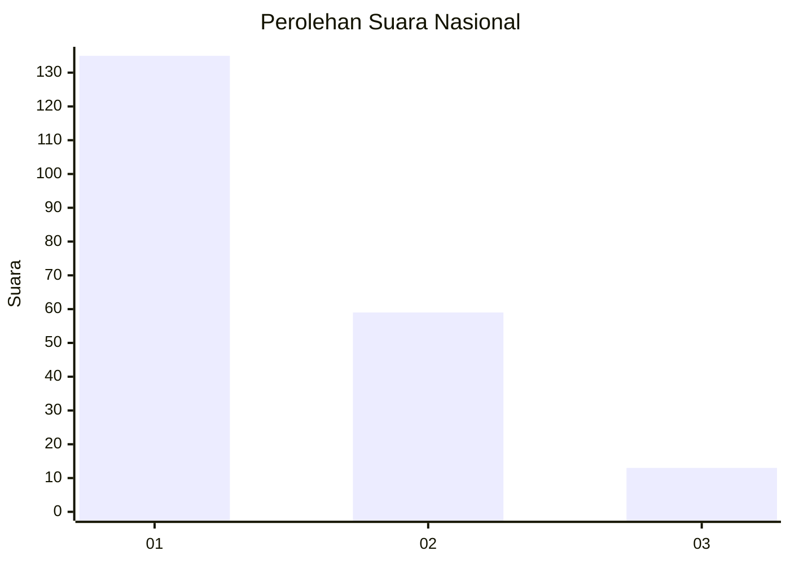
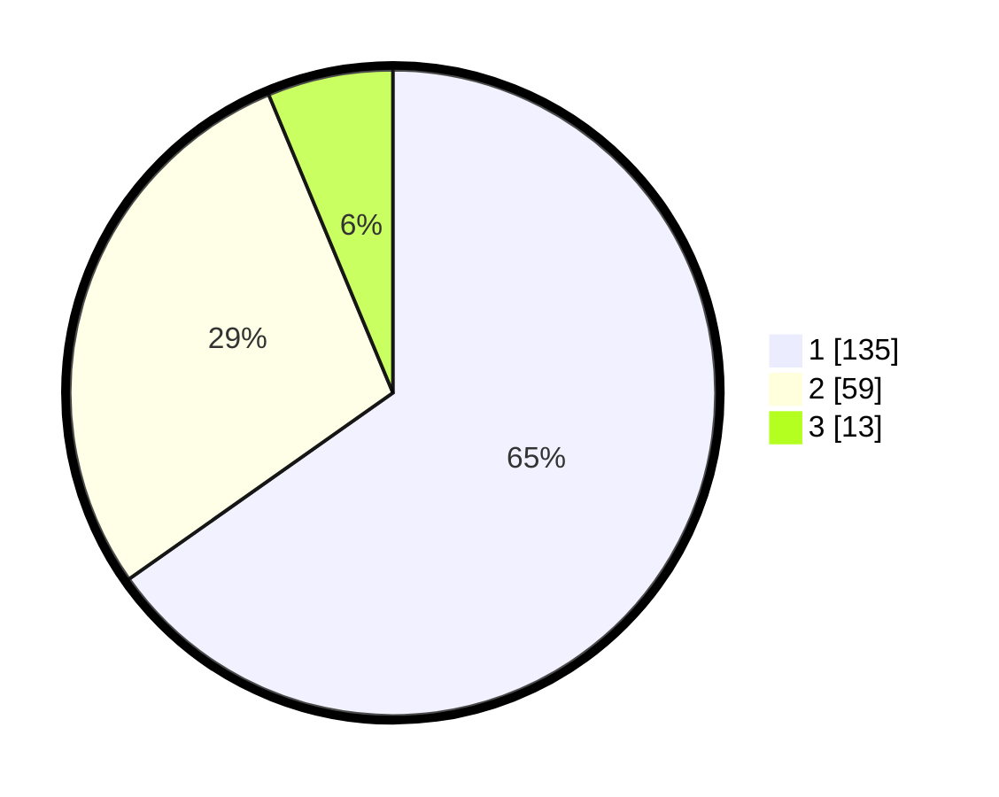

# Hasil

## Grafik

## Tabel

| No.    | Nama Paslon    | Suara | Suara (raw) | Persentase |
|:------ |:-------------- | -----:| -----------:| ----------:|
| 100025 | ANIES MUHAIMIN | 135   | [135][p-1]  | 65,22      |
| 100026 | PRABOWO GIBRAN | 59    | [59][p-2]   | 28,50      |
| 100027 | GANJAR MAHFUD  | 13    | [13][p-3]   | 6,28       |

[p-1]: https://github.com/gigit-pemilu/pemilu-2024/blob/main/pilpres/hitung-suara/sub/31-dki-jakarta/sub/74-jakarta-selatan/sub/04-pasar-minggu/sub/1005-pejaten-timur/sub/057-tps/sub/paslon-1.txt
[p-2]: https://github.com/gigit-pemilu/pemilu-2024/blob/main/pilpres/hitung-suara/sub/31-dki-jakarta/sub/74-jakarta-selatan/sub/04-pasar-minggu/sub/1005-pejaten-timur/sub/057-tps/sub/paslon-2.txt
[p-3]: https://github.com/gigit-pemilu/pemilu-2024/blob/main/pilpres/hitung-suara/sub/31-dki-jakarta/sub/74-jakarta-selatan/sub/04-pasar-minggu/sub/1005-pejaten-timur/sub/057-tps/sub/paslon-3.txt

## Foto C Plano

https://sirekap-obj-formc.kpu.go.id/b2dd/pemilu/ppwp/31/74/04/10/05/3174041005057-20240214-215247--64e8e941-62be-45cc-abce-b8704aedb9d5.jpg

https://sirekap-obj-formc.kpu.go.id/b2dd/pemilu/ppwp/31/74/04/10/05/3174041005057-20240214-215446--c3844183-31a6-4520-a0c7-57496b15e7f3.jpg

https://sirekap-obj-formc.kpu.go.id/b2dd/pemilu/ppwp/31/74/04/10/05/3174041005057-20240214-215558--94c2a79a-377a-4318-b3f9-b0095a912518.jpg

## Metadata

| Key        | Value               |
| ---------- | ------------------- |
| Time Stamp | 2024-02-24 22:31:28 |

