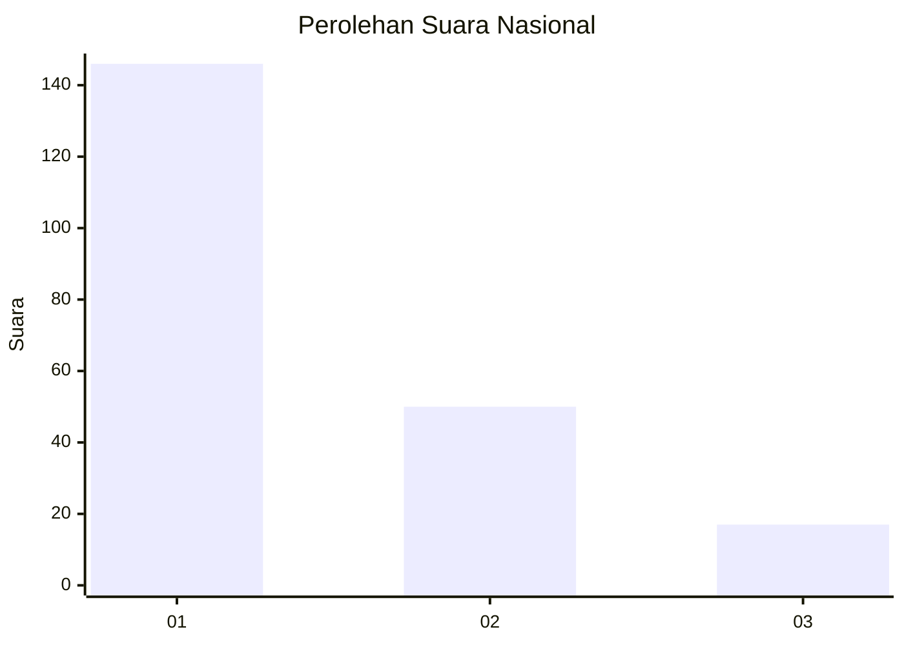
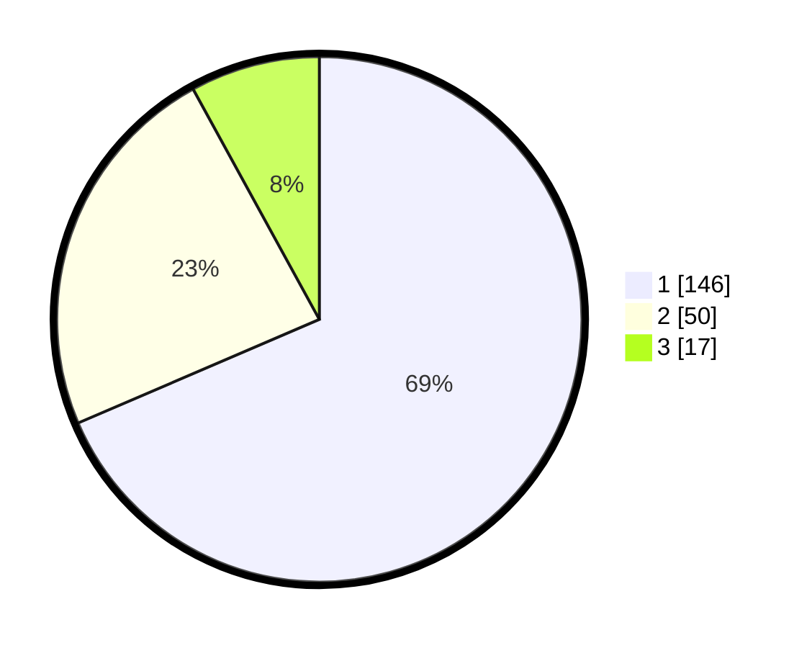

# Hasil

## Grafik

## Tabel

| No.    | Nama Paslon    | Suara | Suara (raw) | Persentase |
|:------ |:-------------- | -----:| -----------:| ----------:|
| 100025 | ANIES MUHAIMIN | 146   | [146][p-1]  | 68,54      |
| 100026 | PRABOWO GIBRAN | 50    | [50][p-2]   | 23,47      |
| 100027 | GANJAR MAHFUD  | 17    | [17][p-3]   | 7,98       |

[p-1]: https://github.com/gigit-pemilu/pemilu-2024/blob/main/pilpres/hitung-suara/sub/31-dki-jakarta/sub/74-jakarta-selatan/sub/04-pasar-minggu/sub/1005-pejaten-timur/sub/067-tps/sub/paslon-1.txt
[p-2]: https://github.com/gigit-pemilu/pemilu-2024/blob/main/pilpres/hitung-suara/sub/31-dki-jakarta/sub/74-jakarta-selatan/sub/04-pasar-minggu/sub/1005-pejaten-timur/sub/067-tps/sub/paslon-2.txt
[p-3]: https://github.com/gigit-pemilu/pemilu-2024/blob/main/pilpres/hitung-suara/sub/31-dki-jakarta/sub/74-jakarta-selatan/sub/04-pasar-minggu/sub/1005-pejaten-timur/sub/067-tps/sub/paslon-3.txt

## Foto C Plano

https://sirekap-obj-formc.kpu.go.id/f54f/pemilu/ppwp/31/74/04/10/05/3174041005067-20240215-020825--74d00b4b-02cf-4e14-9acb-6ba70ba78635.jpg

https://sirekap-obj-formc.kpu.go.id/f54f/pemilu/ppwp/31/74/04/10/05/3174041005067-20240215-020906--9de97e32-aa7c-4b57-833d-94d6bde9e268.jpg

https://sirekap-obj-formc.kpu.go.id/f54f/pemilu/ppwp/31/74/04/10/05/3174041005067-20240215-020948--a7cf5e5a-2f3d-4ecf-b8c5-feb225b41ba5.jpg

## Metadata

| Key        | Value               |
| ---------- | ------------------- |
| Time Stamp | 2024-02-24 22:31:28 |

