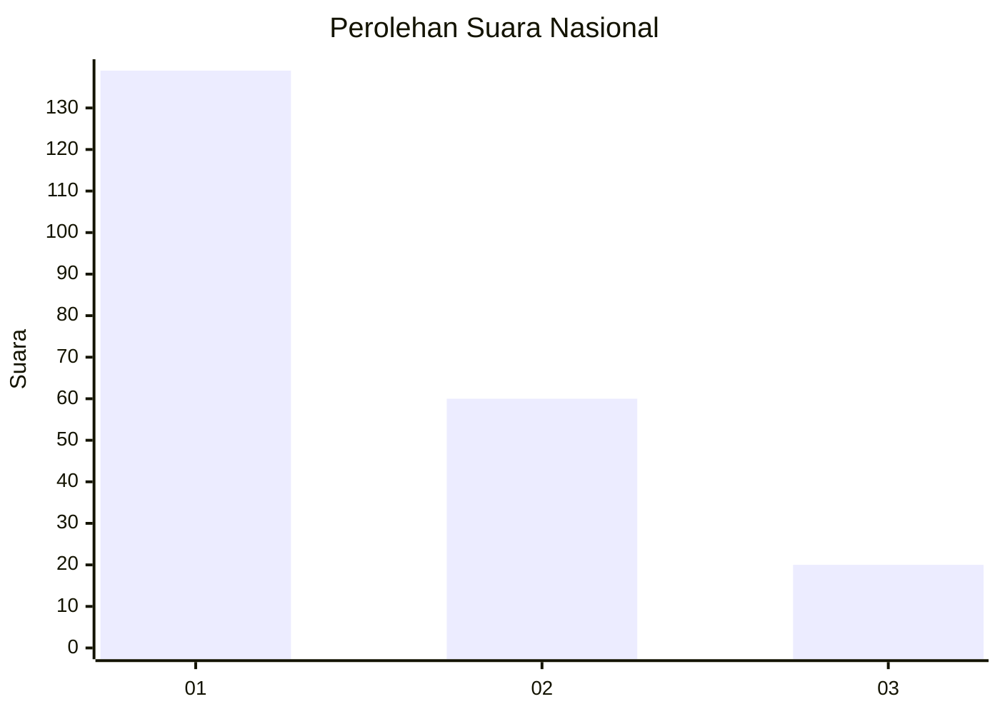
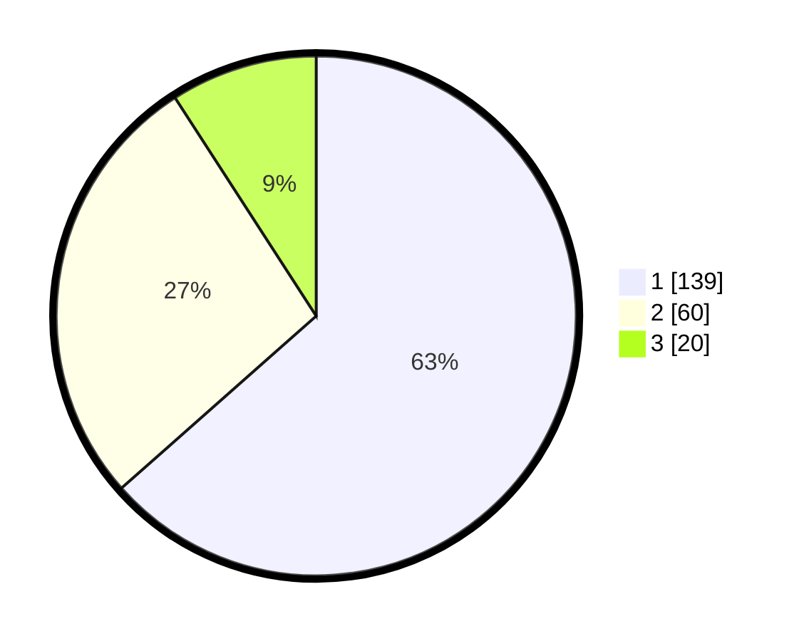

# Hasil

## Grafik

## Tabel

| No.    | Nama Paslon    | Suara | Suara (raw) | Persentase |
|:------ |:-------------- | -----:| -----------:| ----------:|
| 100025 | ANIES MUHAIMIN | 139   | [139][p-1]  | 63,47      |
| 100026 | PRABOWO GIBRAN | 60    | [60][p-2]   | 27,40      |
| 100027 | GANJAR MAHFUD  | 20    | [20][p-3]   | 9,13       |

[p-1]: https://github.com/gigit-pemilu/pemilu-2024/blob/main/pilpres/hitung-suara/sub/31-dki-jakarta/sub/74-jakarta-selatan/sub/04-pasar-minggu/sub/1005-pejaten-timur/sub/068-tps/sub/paslon-1.txt
[p-2]: https://github.com/gigit-pemilu/pemilu-2024/blob/main/pilpres/hitung-suara/sub/31-dki-jakarta/sub/74-jakarta-selatan/sub/04-pasar-minggu/sub/1005-pejaten-timur/sub/068-tps/sub/paslon-2.txt
[p-3]: https://github.com/gigit-pemilu/pemilu-2024/blob/main/pilpres/hitung-suara/sub/31-dki-jakarta/sub/74-jakarta-selatan/sub/04-pasar-minggu/sub/1005-pejaten-timur/sub/068-tps/sub/paslon-3.txt

## Foto C Plano

https://sirekap-obj-formc.kpu.go.id/6682/pemilu/ppwp/31/74/04/10/05/3174041005068-20240214-215741--73a4d6d8-a221-4a09-871c-a30f910f9fa1.jpg

https://sirekap-obj-formc.kpu.go.id/6682/pemilu/ppwp/31/74/04/10/05/3174041005068-20240214-215901--a58d0d4a-33fd-4d49-8c9e-a207e44659fc.jpg

https://sirekap-obj-formc.kpu.go.id/6682/pemilu/ppwp/31/74/04/10/05/3174041005068-20240214-220007--2c65f484-d917-433a-a959-1fbbdd398852.jpg

## Metadata

| Key        | Value               |
| ---------- | ------------------- |
| Time Stamp | 2024-02-24 22:31:28 |

