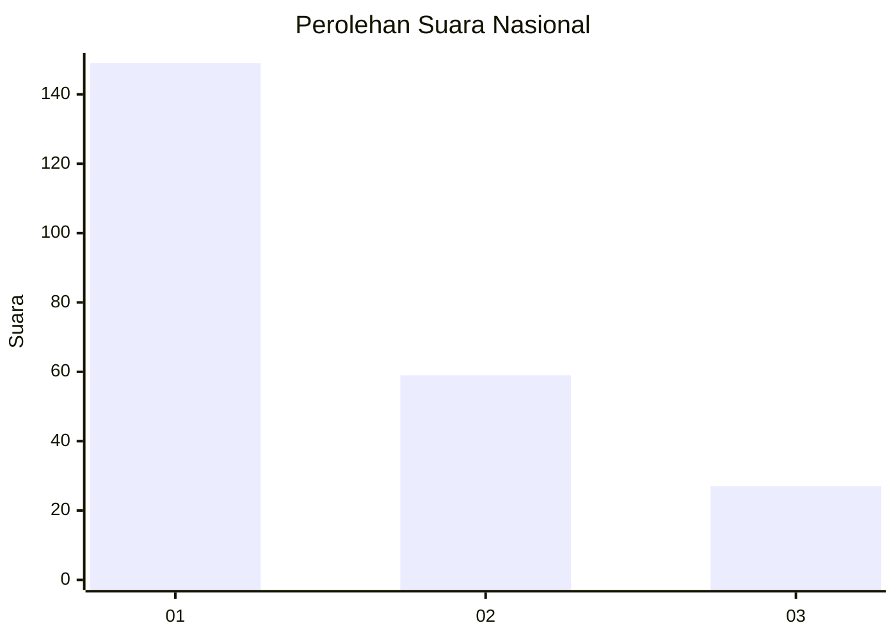
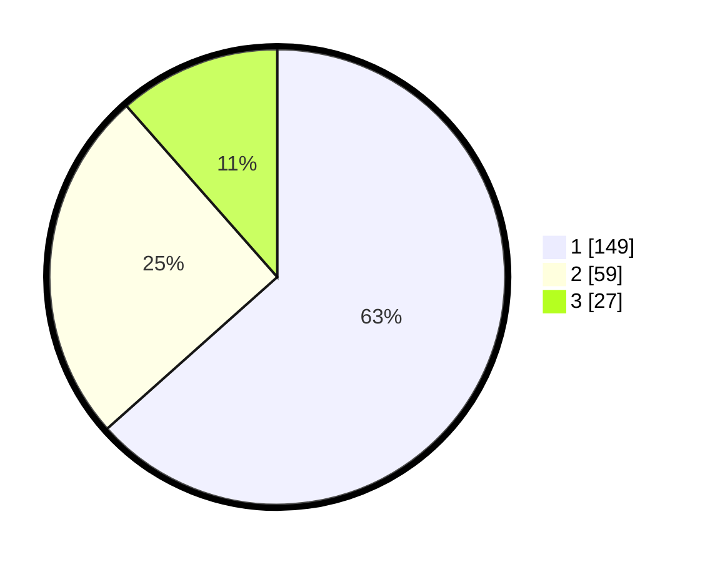

# Hasil

## Grafik

## Tabel

| No.    | Nama Paslon    | Suara | Suara (raw) | Persentase |
|:------ |:-------------- | -----:| -----------:| ----------:|
| 100025 | ANIES MUHAIMIN | 149   | [149][p-1]  | 63,40      |
| 100026 | PRABOWO GIBRAN | 59    | [59][p-2]   | 25,11      |
| 100027 | GANJAR MAHFUD  | 27    | [27][p-3]   | 11,49      |

[p-1]: https://github.com/gigit-pemilu/pemilu-2024/blob/main/pilpres/hitung-suara/sub/31-dki-jakarta/sub/74-jakarta-selatan/sub/04-pasar-minggu/sub/1005-pejaten-timur/sub/083-tps/sub/paslon-1.txt
[p-2]: https://github.com/gigit-pemilu/pemilu-2024/blob/main/pilpres/hitung-suara/sub/31-dki-jakarta/sub/74-jakarta-selatan/sub/04-pasar-minggu/sub/1005-pejaten-timur/sub/083-tps/sub/paslon-2.txt
[p-3]: https://github.com/gigit-pemilu/pemilu-2024/blob/main/pilpres/hitung-suara/sub/31-dki-jakarta/sub/74-jakarta-selatan/sub/04-pasar-minggu/sub/1005-pejaten-timur/sub/083-tps/sub/paslon-3.txt

## Foto C Plano

https://sirekap-obj-formc.kpu.go.id/57db/pemilu/ppwp/31/74/04/10/05/3174041005083-20240215-000104--655057a8-6e63-44c3-becf-ac834b746743.jpg

https://sirekap-obj-formc.kpu.go.id/57db/pemilu/ppwp/31/74/04/10/05/3174041005083-20240215-000213--6b5ad5f1-8cc5-48d1-9db0-d991a10c07a9.jpg

https://sirekap-obj-formc.kpu.go.id/57db/pemilu/ppwp/31/74/04/10/05/3174041005083-20240215-000310--512a32f7-6481-44dc-8ab3-a9dce67d1b2c.jpg

## Metadata

| Key        | Value               |
| ---------- | ------------------- |
| Time Stamp | 2024-02-25 21:00:00 |

