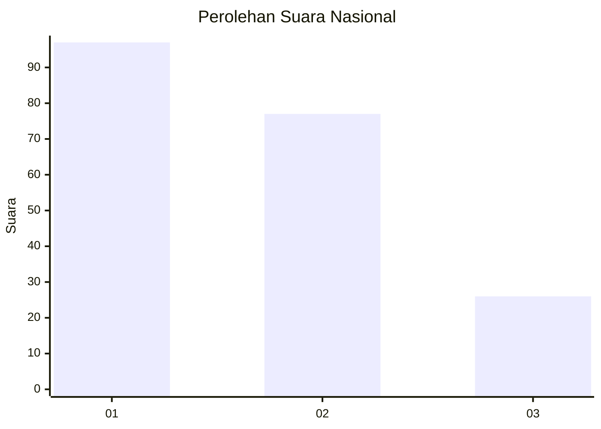
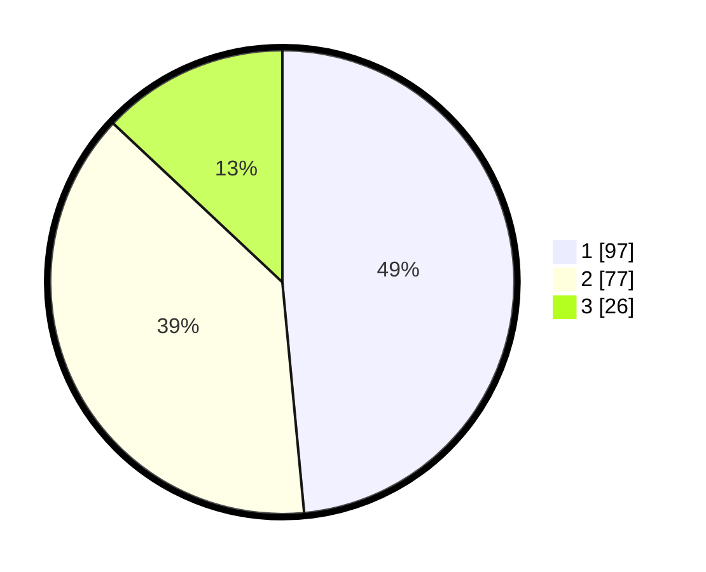

# Hasil

## Grafik

## Tabel

| No.    | Nama Paslon    | Suara | Suara (raw) | Persentase |
|:------ |:-------------- | -----:| -----------:| ----------:|
| 100025 | ANIES MUHAIMIN | 97    | [97][p-1]   | 48,50      |
| 100026 | PRABOWO GIBRAN | 77    | [77][p-2]   | 38,50      |
| 100027 | GANJAR MAHFUD  | 26    | [26][p-3]   | 13,00      |

[p-1]: https://github.com/gigit-pemilu/pemilu-2024/blob/main/pilpres/hitung-suara/sub/31-dki-jakarta/sub/74-jakarta-selatan/sub/04-pasar-minggu/sub/1005-pejaten-timur/sub/089-tps/sub/paslon-1.txt
[p-2]: https://github.com/gigit-pemilu/pemilu-2024/blob/main/pilpres/hitung-suara/sub/31-dki-jakarta/sub/74-jakarta-selatan/sub/04-pasar-minggu/sub/1005-pejaten-timur/sub/089-tps/sub/paslon-2.txt
[p-3]: https://github.com/gigit-pemilu/pemilu-2024/blob/main/pilpres/hitung-suara/sub/31-dki-jakarta/sub/74-jakarta-selatan/sub/04-pasar-minggu/sub/1005-pejaten-timur/sub/089-tps/sub/paslon-3.txt

## Foto C Plano

https://sirekap-obj-formc.kpu.go.id/bd0a/pemilu/ppwp/31/74/04/10/05/3174041005089-20240215-032017--af211ba3-9ad5-4523-bdbd-f34f33b6dc94.jpg

https://sirekap-obj-formc.kpu.go.id/bd0a/pemilu/ppwp/31/74/04/10/05/3174041005089-20240215-013607--f11a28d8-c892-4b8a-938b-35914a8215bb.jpg

https://sirekap-obj-formc.kpu.go.id/bd0a/pemilu/ppwp/31/74/04/10/05/3174041005089-20240215-013705--ff61e5da-415c-46c0-b9cb-ba5426436930.jpg

## Metadata

| Key        | Value               |
| ---------- | ------------------- |
| Time Stamp | 2024-02-15 12:00:28 |

