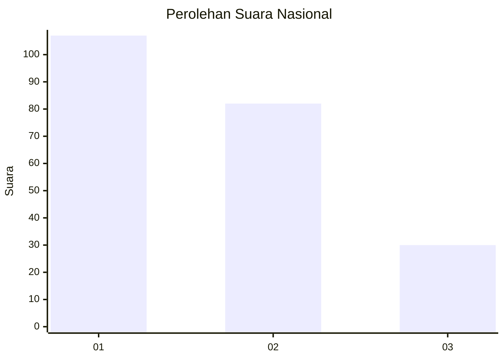
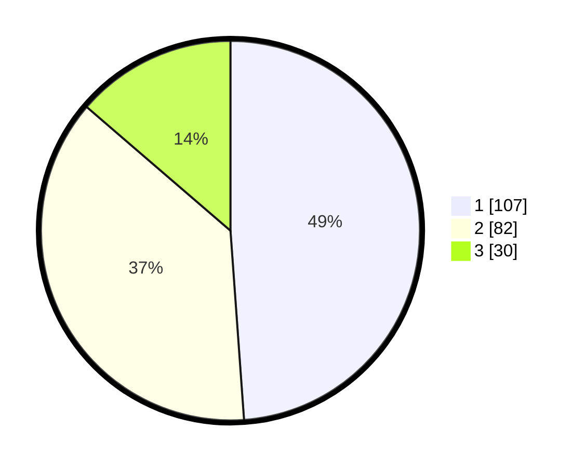

# Hasil

## Grafik

## Tabel

| No.    | Nama Paslon    | Suara | Suara (raw) | Persentase |
|:------ |:-------------- | -----:| -----------:| ----------:|
| 100025 | ANIES MUHAIMIN | 107   | [107][p-1]  | 48,86      |
| 100026 | PRABOWO GIBRAN | 82    | [82][p-2]   | 37,44      |
| 100027 | GANJAR MAHFUD  | 30    | [30][p-3]   | 13,70      |

[p-1]: https://github.com/gigit-pemilu/pemilu-2024/blob/main/pilpres/hitung-suara/sub/31-dki-jakarta/sub/74-jakarta-selatan/sub/04-pasar-minggu/sub/1005-pejaten-timur/sub/115-tps/sub/paslon-1.txt
[p-2]: https://github.com/gigit-pemilu/pemilu-2024/blob/main/pilpres/hitung-suara/sub/31-dki-jakarta/sub/74-jakarta-selatan/sub/04-pasar-minggu/sub/1005-pejaten-timur/sub/115-tps/sub/paslon-2.txt
[p-3]: https://github.com/gigit-pemilu/pemilu-2024/blob/main/pilpres/hitung-suara/sub/31-dki-jakarta/sub/74-jakarta-selatan/sub/04-pasar-minggu/sub/1005-pejaten-timur/sub/115-tps/sub/paslon-3.txt

## Foto C Plano

https://sirekap-obj-formc.kpu.go.id/3a7e/pemilu/ppwp/31/74/04/10/05/3174041005115-20240215-013710--cec38ac3-b46c-49bc-b8ae-9335a9e662db.jpg

https://sirekap-obj-formc.kpu.go.id/3a7e/pemilu/ppwp/31/74/04/10/05/3174041005115-20240215-013923--2d952054-de28-4533-9a0b-feafbf922546.jpg

https://sirekap-obj-formc.kpu.go.id/3a7e/pemilu/ppwp/31/74/04/10/05/3174041005115-20240215-014019--33898739-f190-4a8c-a7e9-504a00ba3a2c.jpg

## Metadata

| Key        | Value               |
| ---------- | ------------------- |
| Time Stamp | 2024-02-24 22:31:28 |

