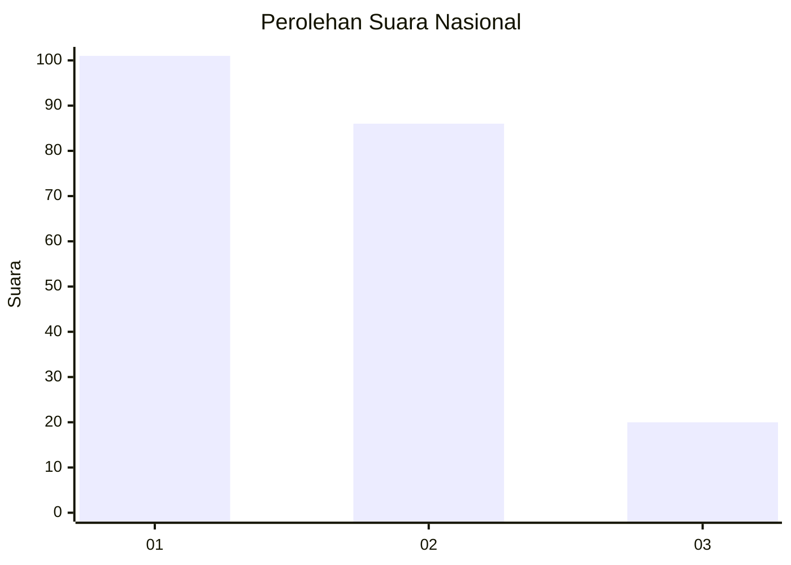
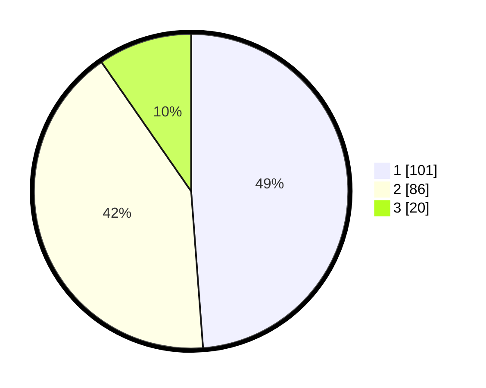

# Hasil

## Grafik

## Tabel

| No.    | Nama Paslon    | Suara | Suara (raw) | Persentase |
|:------ |:-------------- | -----:| -----------:| ----------:|
| 100025 | ANIES MUHAIMIN | 101   | [101][p-1]  | 48,79      |
| 100026 | PRABOWO GIBRAN | 86    | [86][p-2]   | 41,55      |
| 100027 | GANJAR MAHFUD  | 20    | [20][p-3]   | 9,66       |

[p-1]: https://github.com/gigit-pemilu/pemilu-2024/blob/main/pilpres/hitung-suara/sub/31-dki-jakarta/sub/74-jakarta-selatan/sub/04-pasar-minggu/sub/1005-pejaten-timur/sub/148-tps/sub/paslon-1.txt
[p-2]: https://github.com/gigit-pemilu/pemilu-2024/blob/main/pilpres/hitung-suara/sub/31-dki-jakarta/sub/74-jakarta-selatan/sub/04-pasar-minggu/sub/1005-pejaten-timur/sub/148-tps/sub/paslon-2.txt
[p-3]: https://github.com/gigit-pemilu/pemilu-2024/blob/main/pilpres/hitung-suara/sub/31-dki-jakarta/sub/74-jakarta-selatan/sub/04-pasar-minggu/sub/1005-pejaten-timur/sub/148-tps/sub/paslon-3.txt

## Foto C Plano

https://sirekap-obj-formc.kpu.go.id/9344/pemilu/ppwp/31/74/04/10/05/3174041005148-20240215-001042--24e3bc95-2b8e-42ed-ab41-3190bc38497c.jpg

https://sirekap-obj-formc.kpu.go.id/9344/pemilu/ppwp/31/74/04/10/05/3174041005148-20240215-001048--9b5af189-7a63-4d76-8327-0f14f7839978.jpg

https://sirekap-obj-formc.kpu.go.id/9344/pemilu/ppwp/31/74/04/10/05/3174041005148-20240215-001101--b5dc0fe1-6725-49bd-806f-1b079430038d.jpg

## Metadata

| Key        | Value               |
| ---------- | ------------------- |
| Time Stamp | 2024-02-24 22:31:28 |

