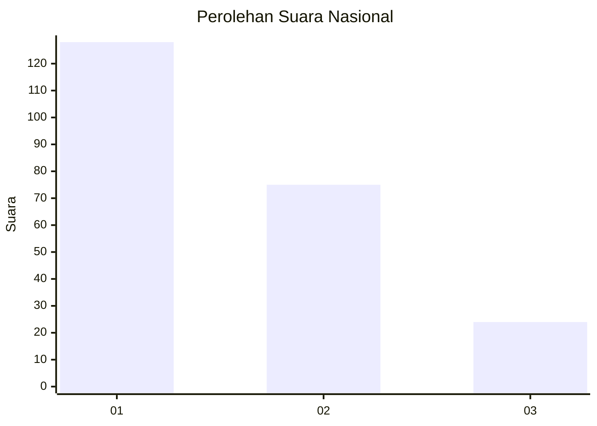
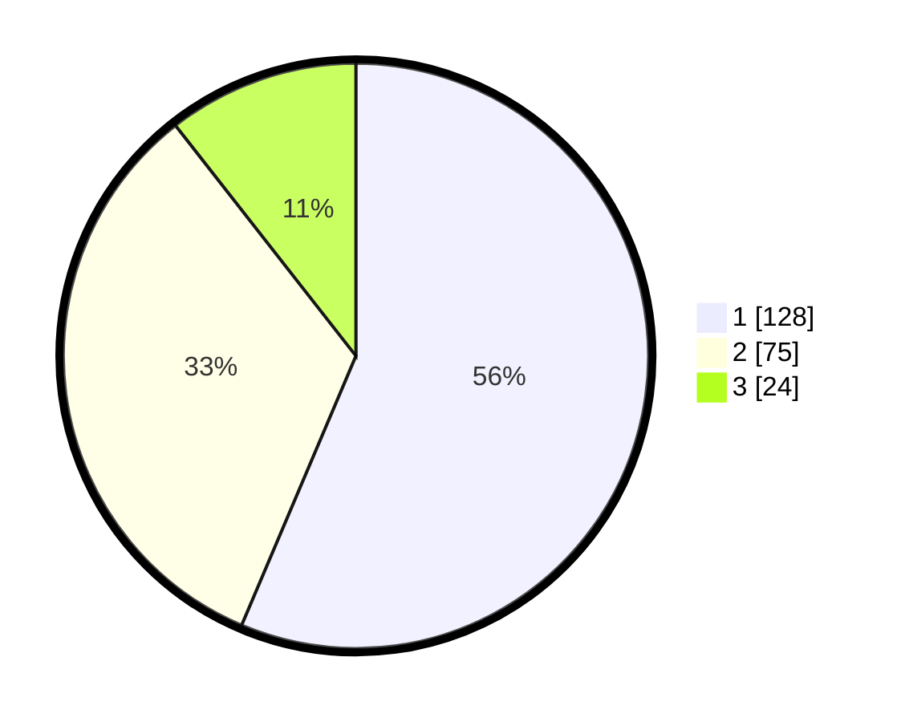

# Hasil

## Grafik

## Tabel

| No.    | Nama Paslon    | Suara | Suara (raw) | Persentase |
|:------ |:-------------- | -----:| -----------:| ----------:|
| 100025 | ANIES MUHAIMIN | 128   | [128][p-1]  | 56,39      |
| 100026 | PRABOWO GIBRAN | 75    | [75][p-2]   | 33,04      |
| 100027 | GANJAR MAHFUD  | 24    | [24][p-3]   | 10,57      |

[p-1]: https://github.com/gigit-pemilu/pemilu-2024/blob/main/pilpres/hitung-suara/sub/31-dki-jakarta/sub/74-jakarta-selatan/sub/04-pasar-minggu/sub/1005-pejaten-timur/sub/149-tps/sub/paslon-1.txt
[p-2]: https://github.com/gigit-pemilu/pemilu-2024/blob/main/pilpres/hitung-suara/sub/31-dki-jakarta/sub/74-jakarta-selatan/sub/04-pasar-minggu/sub/1005-pejaten-timur/sub/149-tps/sub/paslon-2.txt
[p-3]: https://github.com/gigit-pemilu/pemilu-2024/blob/main/pilpres/hitung-suara/sub/31-dki-jakarta/sub/74-jakarta-selatan/sub/04-pasar-minggu/sub/1005-pejaten-timur/sub/149-tps/sub/paslon-3.txt

## Foto C Plano

https://sirekap-obj-formc.kpu.go.id/0d89/pemilu/ppwp/31/74/04/10/05/3174041005149-20240214-194649--a51531f0-dea9-4fba-bdfe-e0c81c11a4ca.jpg

https://sirekap-obj-formc.kpu.go.id/0d89/pemilu/ppwp/31/74/04/10/05/3174041005149-20240214-195201--116f9b78-fd80-47e4-9ee3-3b2522fcbcb2.jpg

https://sirekap-obj-formc.kpu.go.id/0d89/pemilu/ppwp/31/74/04/10/05/3174041005149-20240214-193021--0a08514f-7d5b-40ee-8544-7ca6285a0141.jpg

## Metadata

| Key        | Value               |
| ---------- | ------------------- |
| Time Stamp | 2024-02-25 15:00:00 |

