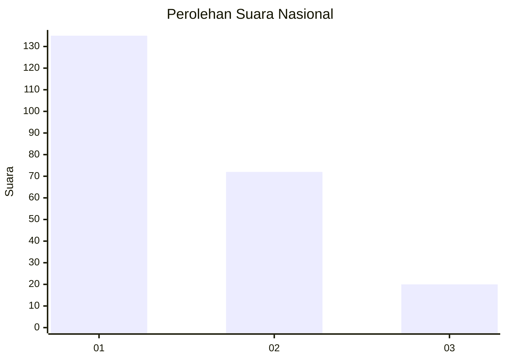
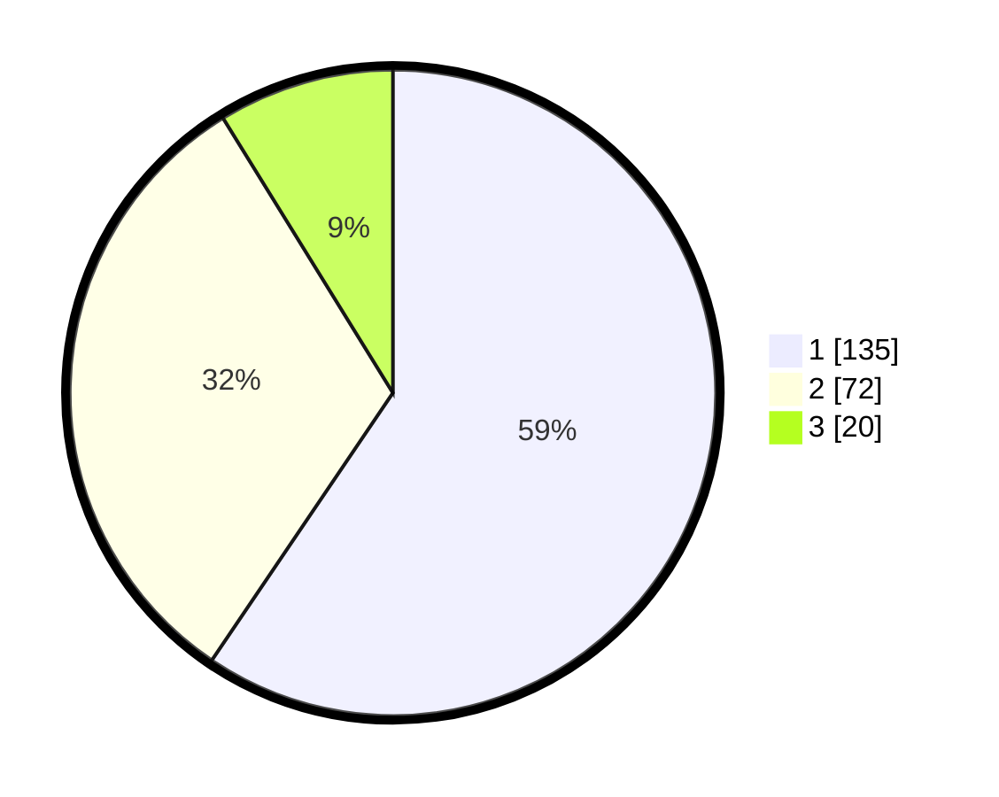

# Hasil

## Grafik

## Tabel

| No.    | Nama Paslon    | Suara | Suara (raw) | Persentase |
|:------ |:-------------- | -----:| -----------:| ----------:|
| 100025 | ANIES MUHAIMIN | 135   | [135][p-1]  | 59,47      |
| 100026 | PRABOWO GIBRAN | 72    | [72][p-2]   | 31,72      |
| 100027 | GANJAR MAHFUD  | 20    | [20][p-3]   | 8,81       |

[p-1]: https://github.com/gigit-pemilu/pemilu-2024/blob/main/pilpres/hitung-suara/sub/31-dki-jakarta/sub/74-jakarta-selatan/sub/04-pasar-minggu/sub/1005-pejaten-timur/sub/152-tps/sub/paslon-1.txt
[p-2]: https://github.com/gigit-pemilu/pemilu-2024/blob/main/pilpres/hitung-suara/sub/31-dki-jakarta/sub/74-jakarta-selatan/sub/04-pasar-minggu/sub/1005-pejaten-timur/sub/152-tps/sub/paslon-2.txt
[p-3]: https://github.com/gigit-pemilu/pemilu-2024/blob/main/pilpres/hitung-suara/sub/31-dki-jakarta/sub/74-jakarta-selatan/sub/04-pasar-minggu/sub/1005-pejaten-timur/sub/152-tps/sub/paslon-3.txt

## Foto C Plano

https://sirekap-obj-formc.kpu.go.id/5f17/pemilu/ppwp/31/74/04/10/05/3174041005152-20240214-232739--0a5625ca-377d-4656-8281-2c2d5d15f6a9.jpg

https://sirekap-obj-formc.kpu.go.id/5f17/pemilu/ppwp/31/74/04/10/05/3174041005152-20240214-232855--5ba1a14a-8979-48b1-adc1-654eef80387b.jpg

https://sirekap-obj-formc.kpu.go.id/5f17/pemilu/ppwp/31/74/04/10/05/3174041005152-20240214-232913--e16e5183-23f8-488b-831f-5de5cde8f4fa.jpg

## Metadata

| Key        | Value               |
| ---------- | ------------------- |
| Time Stamp | 2024-02-24 22:31:28 |

