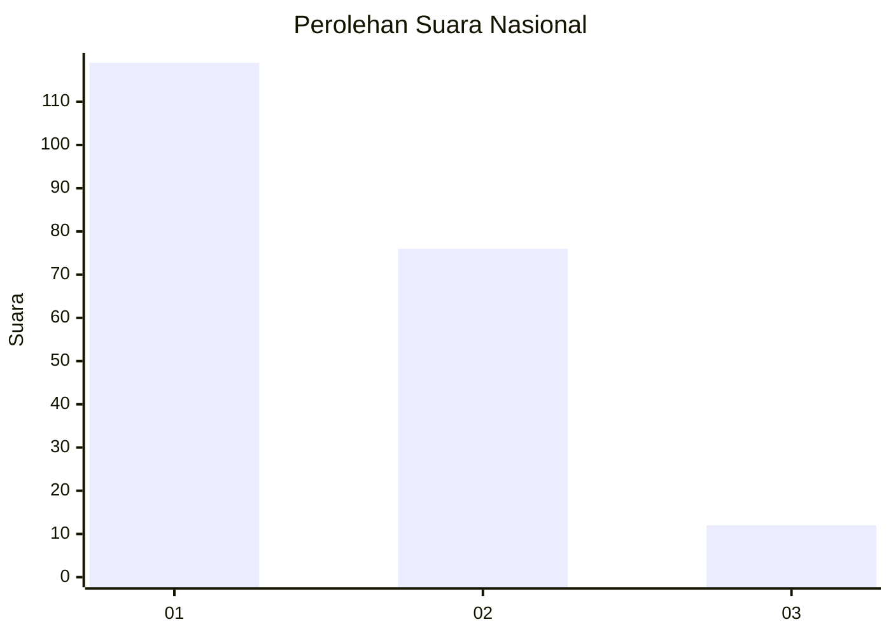
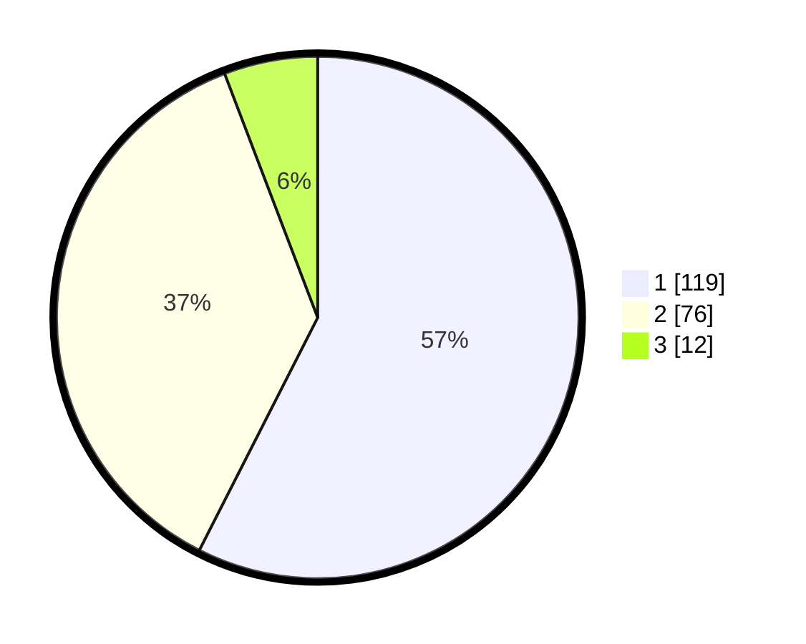

# Hasil

## Grafik

## Tabel

| No.    | Nama Paslon    | Suara | Suara (raw) | Persentase |
|:------ |:-------------- | -----:| -----------:| ----------:|
| 100025 | ANIES MUHAIMIN | 119   | [119][p-1]  | 57,49      |
| 100026 | PRABOWO GIBRAN | 76    | [76][p-2]   | 36,71      |
| 100027 | GANJAR MAHFUD  | 12    | [12][p-3]   | 5,80       |

[p-1]: https://github.com/gigit-pemilu/pemilu-2024/blob/main/pilpres/hitung-suara/sub/31-dki-jakarta/sub/74-jakarta-selatan/sub/04-pasar-minggu/sub/1005-pejaten-timur/sub/154-tps/sub/paslon-1.txt
[p-2]: https://github.com/gigit-pemilu/pemilu-2024/blob/main/pilpres/hitung-suara/sub/31-dki-jakarta/sub/74-jakarta-selatan/sub/04-pasar-minggu/sub/1005-pejaten-timur/sub/154-tps/sub/paslon-2.txt
[p-3]: https://github.com/gigit-pemilu/pemilu-2024/blob/main/pilpres/hitung-suara/sub/31-dki-jakarta/sub/74-jakarta-selatan/sub/04-pasar-minggu/sub/1005-pejaten-timur/sub/154-tps/sub/paslon-3.txt

## Foto C Plano

https://sirekap-obj-formc.kpu.go.id/5a18/pemilu/ppwp/31/74/04/10/05/3174041005154-20240215-002848--117b2898-8eaa-4ed9-b415-6c5d9a14da5d.jpg

https://sirekap-obj-formc.kpu.go.id/5a18/pemilu/ppwp/31/74/04/10/05/3174041005154-20240214-222536--f52d396f-f8ed-4f68-95e7-445cccf34b08.jpg

https://sirekap-obj-formc.kpu.go.id/5a18/pemilu/ppwp/31/74/04/10/05/3174041005154-20240214-222633--67360803-54e9-4ee3-a5b7-c0bbb0a87cce.jpg

## Metadata

| Key        | Value               |
| ---------- | ------------------- |
| Time Stamp | 2024-02-24 22:31:28 |

