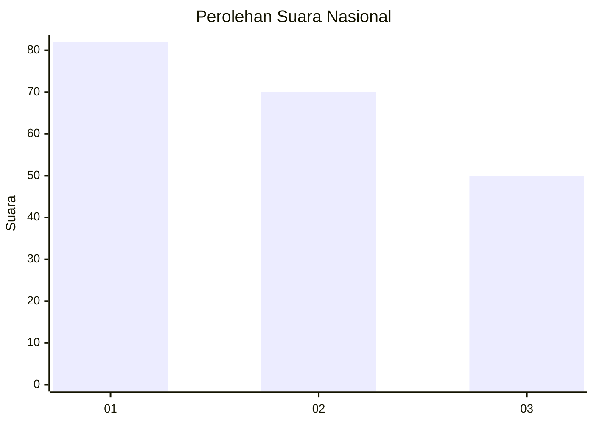
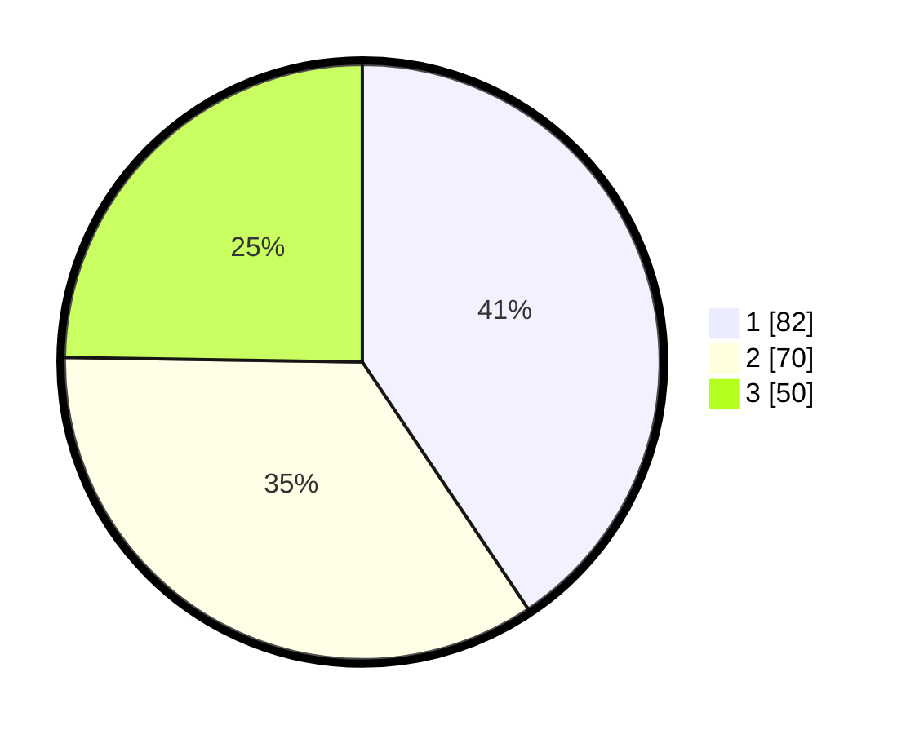

# Hasil

## Grafik

## Tabel

| No.    | Nama Paslon    | Suara | Suara (raw) | Persentase |
|:------ |:-------------- | -----:| -----------:| ----------:|
| 100025 | ANIES MUHAIMIN | 82    | [82][p-1]   | 40,59      |
| 100026 | PRABOWO GIBRAN | 70    | [70][p-2]   | 34,65      |
| 100027 | GANJAR MAHFUD  | 50    | [50][p-3]   | 24,75      |

[p-1]: https://github.com/gigit-pemilu/pemilu-2024/blob/main/pilpres/hitung-suara/sub/31-dki-jakarta/sub/74-jakarta-selatan/sub/04-pasar-minggu/sub/1005-pejaten-timur/sub/170-tps/sub/paslon-1.txt
[p-2]: https://github.com/gigit-pemilu/pemilu-2024/blob/main/pilpres/hitung-suara/sub/31-dki-jakarta/sub/74-jakarta-selatan/sub/04-pasar-minggu/sub/1005-pejaten-timur/sub/170-tps/sub/paslon-2.txt
[p-3]: https://github.com/gigit-pemilu/pemilu-2024/blob/main/pilpres/hitung-suara/sub/31-dki-jakarta/sub/74-jakarta-selatan/sub/04-pasar-minggu/sub/1005-pejaten-timur/sub/170-tps/sub/paslon-3.txt

## Foto C Plano

https://sirekap-obj-formc.kpu.go.id/dd85/pemilu/ppwp/31/74/04/10/05/3174041005170-20240215-002501--8431a3bf-6a25-43b7-bc16-f1ff660c7750.jpg

https://sirekap-obj-formc.kpu.go.id/dd85/pemilu/ppwp/31/74/04/10/05/3174041005170-20240215-002556--96cf570c-b962-42f6-aacb-28d44b5abe0e.jpg

https://sirekap-obj-formc.kpu.go.id/dd85/pemilu/ppwp/31/74/04/10/05/3174041005170-20240215-002658--3c2a2912-1638-4c91-858f-d4ae2aff4ce2.jpg

## Metadata

| Key        | Value               |
| ---------- | ------------------- |
| Time Stamp | 2024-02-24 22:31:28 |

