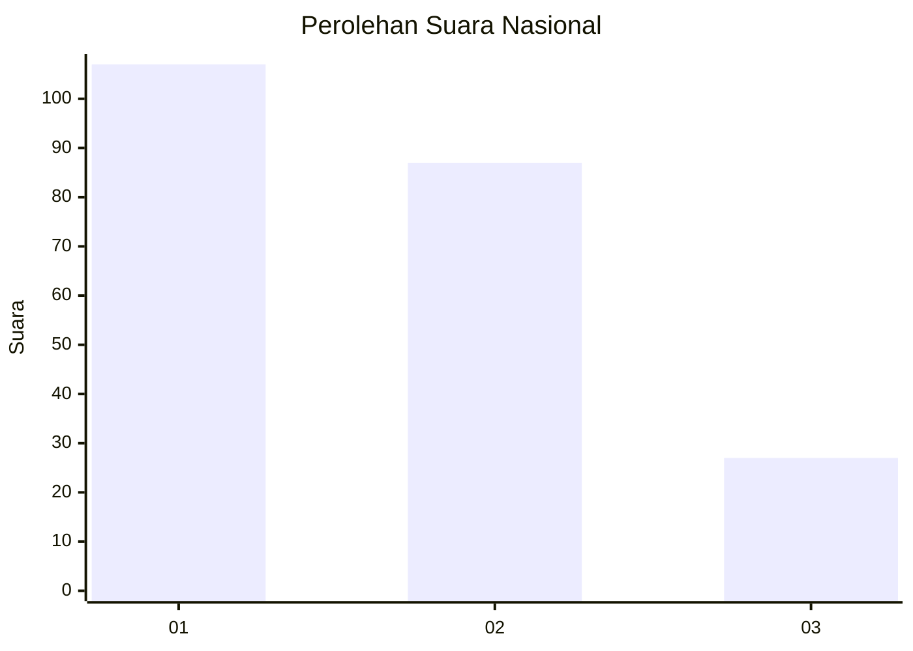
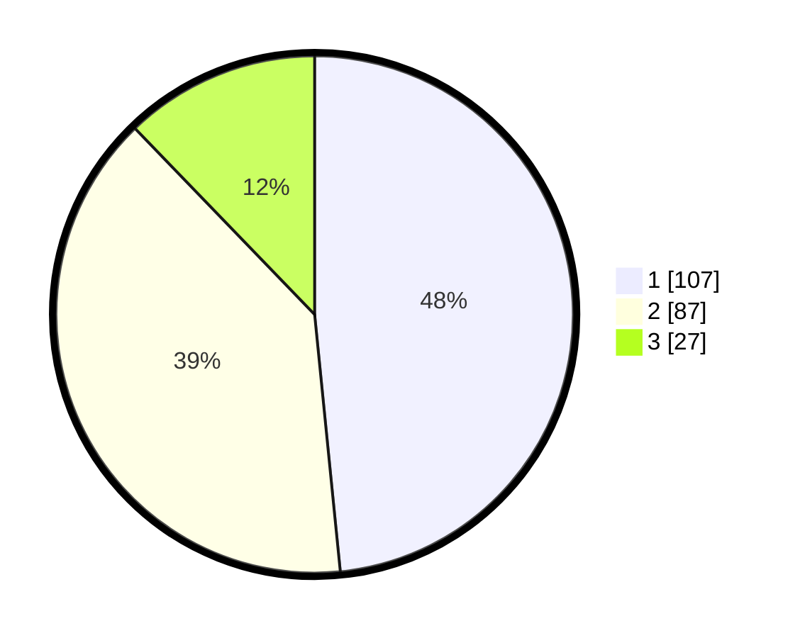

# Hasil

## Grafik

## Tabel

| No.    | Nama Paslon    | Suara | Suara (raw) | Persentase |
|:------ |:-------------- | -----:| -----------:| ----------:|
| 100025 | ANIES MUHAIMIN | 107   | [107][p-1]  | 48,42      |
| 100026 | PRABOWO GIBRAN | 87    | [87][p-2]   | 39,37      |
| 100027 | GANJAR MAHFUD  | 27    | [27][p-3]   | 12,22      |

[p-1]: https://github.com/gigit-pemilu/pemilu-2024/blob/main/pilpres/hitung-suara/sub/31-dki-jakarta/sub/74-jakarta-selatan/sub/04-pasar-minggu/sub/1005-pejaten-timur/sub/186-tps/sub/paslon-1.txt
[p-2]: https://github.com/gigit-pemilu/pemilu-2024/blob/main/pilpres/hitung-suara/sub/31-dki-jakarta/sub/74-jakarta-selatan/sub/04-pasar-minggu/sub/1005-pejaten-timur/sub/186-tps/sub/paslon-2.txt
[p-3]: https://github.com/gigit-pemilu/pemilu-2024/blob/main/pilpres/hitung-suara/sub/31-dki-jakarta/sub/74-jakarta-selatan/sub/04-pasar-minggu/sub/1005-pejaten-timur/sub/186-tps/sub/paslon-3.txt

## Foto C Plano

https://sirekap-obj-formc.kpu.go.id/4cc7/pemilu/ppwp/31/74/04/10/05/3174041005186-20240214-203209--79edb4f1-bfa1-48ca-a71d-819669498146.jpg

https://sirekap-obj-formc.kpu.go.id/4cc7/pemilu/ppwp/31/74/04/10/05/3174041005186-20240214-203536--30b5ca97-6162-49f8-b6dd-496af74f0f31.jpg

https://sirekap-obj-formc.kpu.go.id/4cc7/pemilu/ppwp/31/74/04/10/05/3174041005186-20240215-012426--d9f7a5e5-1881-498b-8390-5b1f54287248.jpg

## Metadata

| Key        | Value               |
| ---------- | ------------------- |
| Time Stamp | 2024-02-15 15:00:29 |

